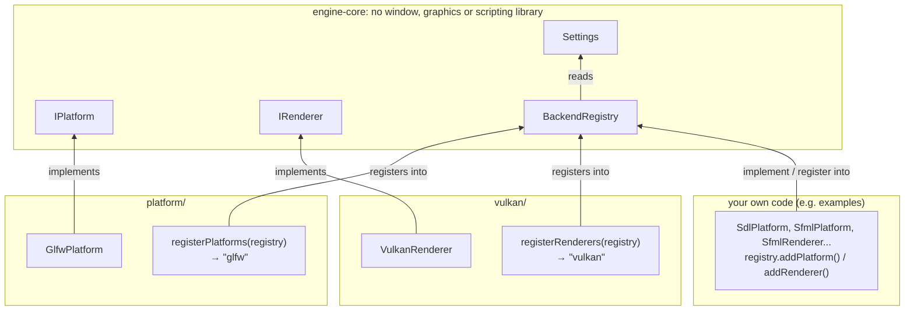
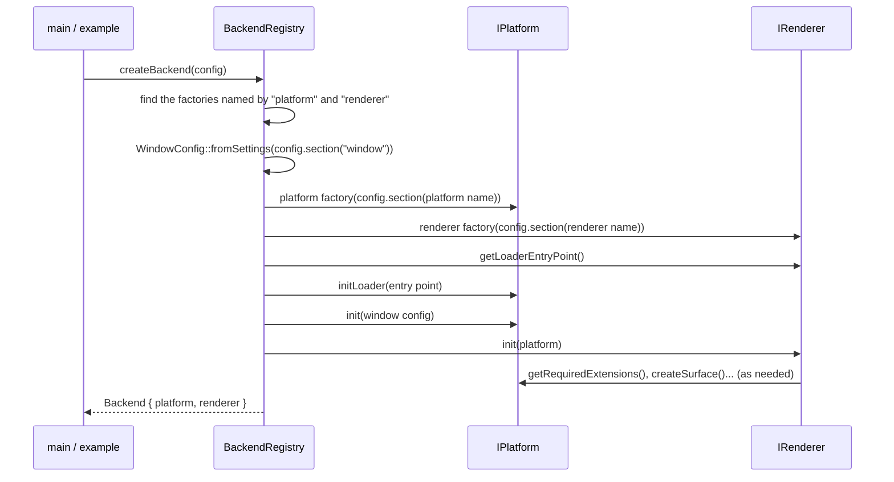

# Backends

How the engine gets a window and a renderer without knowing which libraries provide them.

The engine never talks to GLFW, Vulkan, SDL or SFML. It talks to two interfaces, **`IPlatform`** (the window and
the input devices) and **`IRenderer`** (2D drawing). Implementations of both are registered by name in a
**`BackendRegistry`**, and a **`Settings`** object, the configuration, picks the pair to start and sets it up.

Runnable examples:

| Example | Shows |
|---|---|
| [`examples/graphic/render/vulkan/VulkanInstance`](../examples/graphic/render/vulkan/VulkanInstance/src/main.cpp) | The engine's backends: `glfw` + `vulkan` |
| [`examples/graphic/platform/sdl/SdlVulkanWindow`](../examples/graphic/platform/sdl/SdlVulkanWindow/src/main.cpp) | Your own platform (`sdl`) with the engine's renderer |
| [`examples/graphic/sfml/SfmlWindow`](../examples/graphic/sfml/SfmlWindow/src/main.cpp) | Your own platform and renderer (`sfml` + `sfml`) |

## Architecture



Dependencies keep pointing towards `engine-core` (see `AGENTS.md`): the interfaces, `Settings` and the registry live
there, and know nothing of any library. Only the code that registers the backends (`main.cpp`, an example) names
the modules.

| File | Role |
|---|---|
| [`engine/platform/IPlatform.hpp`](../src/rtype/engine/platform/IPlatform.hpp) | The window and its events |
| [`engine/platform/WindowConfig.hpp`](../src/rtype/engine/platform/WindowConfig.hpp) | How the window is created, read from the `window` settings |
| [`engine/graphics/IRenderer.hpp`](../src/rtype/engine/graphics/IRenderer.hpp) | Textures, camera, sprites and rectangles |
| [`engine/config/Settings.hpp`](../src/rtype/engine/config/Settings.hpp) | The configuration |
| [`engine/backend/BackendRegistry.hpp`](../src/rtype/engine/backend/BackendRegistry.hpp) | Backends by name, and the start-up sequence |
| [`platform/PlatformRegistration.hpp`](../src/rtype/platform/PlatformRegistration.hpp) | Registers `glfw` |
| [`vulkan/RendererRegistration.hpp`](../src/rtype/vulkan/RendererRegistration.hpp) | Registers `vulkan` |

## Usage

```cpp
// 1. Every module registers its backends.
rtype::engine::backend::BackendRegistry registry;
rtype::platform::registerPlatforms(registry);   // "glfw"
rtype::vulkan::registerRenderers(registry);     // "vulkan"

// 2. The configuration picks the pair and sets it up.
rtype::engine::config::Settings config;
config.set("platform", "glfw");
config.set("renderer", "vulkan");
config.set("window.title", "R-Type");
config.set("window.size", std::vector<double>{1280, 720});
config.set("vulkan.debugging", true);

// 3. Start them, then only use the interfaces.
const rtype::engine::backend::Backend backend = registry.createBackend(config);
while (backend.platform->isOpen()) {
    for (const auto& event : backend.platform->pollEvents()) { /* ... */ }
    backend.renderer->beginFrame(color);
    backend.renderer->draw(sprite);
    backend.renderer->endFrame();
}
```

`Backend` owns both. Its renderer is destroyed before its platform, since it may hold resources tied to the window
(a Vulkan surface).

## The interfaces

### `IPlatform`

The window, and every native event translated into an engine `Event` (see [`Input.md`](Input.md)): the engine,
`Input` included, never sees the windowing library.

| Function | Role |
|---|---|
| `init(WindowConfig)` | Creates the window. Called once, by the registry. |
| `pollEvents()` | Every event since the previous call. Once per frame. |
| `isOpen()`, `close()` | Window state. |
| `getFramebufferSize()`, `getTitle()`, `setTitle()`, `setSize()` | Window properties. |
| `setCursorLocked()`, `getTime()` | Cursor capture, seconds since `init()` (delta time). |

### `IRenderer`

2D only, at the level every 2D library offers (SFML, SDL, raylib, Vulkan...): how shapes reach the screen is up to
the backend.

| Function | Role |
|---|---|
| `init(IPlatform&)` | Attaches to the window. Called once, by the registry, after `IPlatform::init()`. |
| `resize(size)` | Called on every `Resized` event. |
| `createTexture(desc, pixels)`, `destroy(id)` | Textures from RGBA pixels, referred to by `TextureId`. |
| `beginFrame(clearColor)`, `endFrame()` | One frame. |
| `setCamera(camera)`, `draw(Sprite)`, `draw(RectShape)` | Drawing, between `beginFrame()` and `endFrame()`. |

Conventions, the ones of those libraries: world units with X to the right and Y down, angles in radians and
clockwise on screen, shapes drawn in call order (the last one on top). Until `setCamera()` is called, a frame shows
the world in window pixels, origin at the top-left corner.

Resources are **handles**: a `TextureId` is an index and a generation, a plain value to store in sprites and ECS
components. The renderer keeps the real texture in a table, and bumps the generation of a slot when it frees it, so
an id used after `destroy()` is detected instead of reaching the next texture of the slot (see `SfmlRenderer` for an
implementation).

### How a renderer attaches to its platform

Libraries split the window and the rendering differently, so `IRenderer::init()` receives the whole platform and
takes what it needs. Two ways exist today:

| Way | Used by | How |
|---|---|---|
| **Optional functions of `IPlatform`** | `vulkan` with `glfw` or `sdl` | The renderer calls `getRequiredExtensions()` and `createSurface()`; the platform implements them with its library (`glfwCreateWindowSurface`, `SDL_Vulkan_CreateSurface`). |
| **Shared window** | `sfml` with `sfml` | The renderer `dynamic_cast`s the platform to the concrete class it is paired with, and draws into its window (`sf::RenderWindow`). |

The optional functions have a default implementation, so a platform only overrides what its renderers need:

| `IPlatform` | Default | `GlfwPlatform` |
|---|---|---|
| `initLoader(ProcAddress)` | does nothing | `glfwInitVulkanLoader`: GLFW uses the renderer's Vulkan loader, so the process has one |
| `getRequiredExtensions()` | none | `glfwGetRequiredInstanceExtensions` |
| `createSurface(instance)` | throws `UnsupportedFeatureException` | `glfwCreateWindowSurface` |

And on the renderer side, `IRenderer::getLoaderEntryPoint()` (default: null) gives the entry point `initLoader()`
receives: `vkGetInstanceProcAddr` for `VulkanRenderer`.

A platform and a renderer that do not fit are not checked up front: the renderer's `init()` throws, with a message
saying why (`createSurface()` throws `UnsupportedFeatureException`, `SfmlRenderer` throws if the platform is not an
`SfmlPlatform`).

## Start-up sequence

`BackendRegistry::createBackend(config)` runs it, so every pair starts the same way:



The order matters: the loader must be set before the window exists (GLFW reads it in `glfwInit()`), and the renderer
attaches to a window that already exists. Everything that can be checked without opening a window (the names, the
`window` settings, each backend's settings) is checked before `init()`.

## Settings

The configuration, independent of where it comes from: filled in code for now, read from a config file later.

It is **flat**: nested tables become dotted keys. The values are booleans, numbers, strings, lists of numbers and
lists of strings.

```
platform        = "glfw"
renderer        = "vulkan"
window.title    = "R-Type"
window.size     = { 1280, 720 }
vulkan.layers   = { "VK_LAYER_KHRONOS_validation" }
vulkan.debugging = true
```

| Function | Role |
|---|---|
| `set(key, value)` | Sets a value. |
| `has(key)` | True if the key has a value. |
| `section(prefix)` | The keys under `prefix.`, without the prefix: `section("window")` turns `window.title` into `title`. |
| `getBool`, `getNumber`, `getString`, `getNumberList`, `getStringList` | Typed reads with a fallback for a missing key; a value of another type throws `SettingsException`. |
| `checkKeys(allowed, context)` | Throws `SettingsException` on the first key not in `allowed`: a typo is reported instead of silently ignored. |

Each part of the engine reads **its own section** and turns it into **its own typed configuration**:

| Section | Read by | Keys |
|---|---|---|
| (root) | `BackendRegistry` | `platform`, `renderer` (names, required) |
| `window` | `WindowConfig::fromSettings()` | `size` ({width, height}), `title`, `resizable`, `fullscreen` |
| `glfw` | the `glfw` factory | none |
| `vulkan` | the `vulkan` factory → `VulkanRenderer::Config` | `engineName`, `layers`, `extraExtensions`, `debugging`, `minSeverity` (`"verbose"`, `"info"`, `"warning"`, `"error"`) |

Every key is optional except `platform` and `renderer`; a missing one keeps the default of the typed
configuration. The typed configurations stay usable on their own, for code that builds a backend by hand.

## Errors

Everything is reported by exceptions, before a window opens whenever possible:

| Exception | When |
|---|---|
| `BackendException` | `platform` or `renderer` missing, or not registered (the message lists the registered names). |
| `SettingsException` | An unknown key, a value of the wrong type, an invalid value (`window.size`, `vulkan.minSeverity`). |
| `UnsupportedFeatureException` | The renderer does not fit the platform, or a function is not implemented yet (`VulkanRenderer` drawing). |
| Others (`std::runtime_error`...) | The backend itself fails: a missing Vulkan layer, a window that cannot be created... |

## Adding a backend

A backend can live in an engine module or in your own code, as the SDL and SFML examples do. In both cases:

1. **Implement the interface.** `class MyPlatform final : public rtype::engine::platform::IPlatform`, or `IRenderer`.
   Override the optional functions your pairs need.
2. **Register it under a name**, with a factory that receives its own section of the settings:

   ```cpp
   registry.addPlatform("sdl", [](const Settings& settings) -> std::unique_ptr<IPlatform> {
       settings.checkKeys({}, "sdl");  // no setting: reject anything
       return std::make_unique<SdlPlatform>();
   });
   ```

   A backend with settings reads them in its factory, into its own typed configuration
   (see [`RendererRegistration.cpp`](../src/rtype/vulkan/RendererRegistration.cpp)).
3. **Choose it** in the configuration: `config.set("platform", "sdl")`.

In an engine module, put the registration in a `registerPlatforms()` / `registerRenderers()` function, exported with
the module's `RTYPE_<LIB>_API` macro if it is a shared library. Self-registration through global variables does not
work: the linker drops the unreferenced objects of static libraries.
