# Input

How keyboard, mouse and gamepad input goes from the OS to the game.

The game never talks to a device or to GLFW. The **platform** turns native input into engine **events**, and **`Input`** turns those events into named **actions** (`"move"`, `"fire"`...) that gameplay code, ECS systems and Lua scripts read.

A runnable example lives in [`examples/platform/BasicGLFWWindow`](../examples/platform/BasicGLFWWindow/src/main.cpp).

## Architecture

```mermaid
---
config:
  layout: elk
---
flowchart LR
 subgraph GLFW["GLFW (external library)"]
        OS["OS: keyboard, mouse, window"]
        PE["glfwPollEvents()"]
        GS["glfwGetGamepadState()"]
  end
 subgraph PLATFORM["platform/ (the only module that includes GLFW)"]
    direction TB
        CB["WindowCallbacks<br> <strong>onKey, onMouseButton, onCursorPos,<br>onScroll, onChar, onFocus, onResize, onClose </strong>"]
        PG["WindowGamepad: <strong>pollGamepad()</strong><br>compares with the previous frame,<br>emits only the changes"]
        MAP["GlfwMapping<br> <strong>GLFW_KEY_W → Key::kW</strong><br>axes: Y up, triggers 0..1"]
        Q["_events<br>std::vector&lt;engine::Event&gt;"]
        POLL["Window::pollEvents()"]
  end
 subgraph BUTTONS["Buttons: ButtonStates&lt;T&gt;"]
    direction TB
        kKeys["<strong>_keys</strong><br>ButtonStates&lt;Key&gt;"]
        MBTN["<strong>_mouseButtons</strong><br>ButtonStates&lt;MouseButton&gt;"]
        GBTN["<strong>_gamepadButtons</strong><br>ButtonStates&lt;GamepadButton&gt;"]
        BITS["Each one holds 3 bitsets<br><strong>_down</strong>: held right now<br><strong>_tapped</strong>: pressed since last frame<br><strong>_frame</strong>: snapshot read this frame"]
        kKeys ~~~ BITS
        MBTN ~~~ BITS
        GBTN ~~~ BITS
  end
 subgraph MOUSE["Mouse"]
    direction TB
        MPOS["<strong>_mousePosition</strong><br>last cursor position"]
        MDEL["<strong>_pendingMouseDelta</strong> → <strong>_mouseDelta</strong><br>summed MouseMoved deltas"]
        MSCR["<strong>_pendingScroll</strong> → <strong>_scroll</strong><br>summed MouseScrolled offsets"]
  end
 subgraph PAD["Gamepad"]
    direction TB
        AXES["<strong>_gamepadAxes</strong><br>raw values, no deadzone"]
        CONN["<strong>_gamepadConnected</strong>"]
  end
 subgraph LIVE["Live state (updated by events at any time)"]
    direction TB
        BUTTONS
        MOUSE
        PAD
  end
 subgraph UP["update(): once per frame"]
    direction TB
        U1["<strong>1. Freeze buttons</strong><br>beginFrame() on the 3 ButtonStates<br>_frame = _down | _tapped<br>_tapped.reset()"]
        U2["<strong>2. Freeze mouse</strong><br>_mouseDelta = _pendingMouseDelta<br>_scroll = _pendingScroll<br>pending values reset to 0"]
        U3["<strong>3. Evaluate every action</strong><br>for each action → its bindings"]
        U1 --> U2 --> U3
  end
 subgraph INPUT["Input"]
    direction TB
        HE["handleEvent(event)<br>std::visit → onEvent(...)"]
        LIVE
        UP
  end
 subgraph ACTIONS["Actions"]
    direction TB
        BIND["Bindings of an action<br>Control::key(Key::kW), gamepadAxis(kLeftX), mouseDeltaX()…"]
        READ["read(Control)<br>reads the frozen values, applies scale + deadzone"]
        BEST["The binding with the largest<br>magnitude wins"]
        ACT["InputAction::update(value)<br>held = magnitude ≥ pressPoint"]
  end
 subgraph ENGINE["engine/ (no external library except glm)"]
    direction TB
        EV["<strong>engine::Event</strong><br>std::variant: KeyPressed, MouseMoved,<br>GamepadAxisMoved, Resized…"]
        INPUT
        ACTIONS
  end
 subgraph GAME["Game / ECS systems / Lua scripts"]
        RAW["Raw events<br>Escape, Resized, TextEntered"]
        USE["Actions<br>isPressed(), isHeld(), isReleased()<br>readAxis(), readVector()"]
  end
    OS --> PE
    CB --> MAP
    PG --> MAP
    MAP --> Q
    Q --> POLL
    PE -- callbacks --> CB
    GS -- full state --> PG
    HE -- "Key / MouseButton / GamepadButton<br>Pressed, Released" --> BUTTONS
    HE -- "MouseMoved, MouseScrolled" --> MOUSE
    HE -- "GamepadAxisMoved<br>GamepadConnected / Disconnected" --> PAD
    BUTTONS --> U1
    MOUSE --> U2
    U3 --> BIND
    BIND --> READ
    READ --> BEST
    BEST --> ACT
    EV --> HE
    POLL -- vector&lt;Event&gt; --> EV
    EV -. std::get_if .-> RAW
    ACT --> USE

    style EV fill:#FFE0B2
```



### Modules

| Module | Role | Depends on |
| --- | --- | --- |
| `engine/` (`engine-core`) | `Key`, `Event`, `Control`, `InputAction`, `Input`, `ButtonStates`. Pure logic, testable without a window. | glm only |
| `platform/` | `Window`: GLFW callbacks and gamepad polling, translated into engine events. | `engine-core`, GLFW |
| `vulkan/`, `luau/` | Rendering and scripting. They read input through the engine, never through GLFW. | `engine-core` |
| `engine/main.cpp` (`engine`) | The executable: creates the window and feeds its events to `Input`. | everything above |

**Rule:** GLFW never leaves `platform/`. No public header outside it includes `<GLFW/glfw3.h>` or uses a `GLFW_*` code. `Window::getNativeHandle()` exists only for integrations that need the raw handle (Vulkan surface, ImGui backend).

### Files

| File | Content |
| --- | --- |
| [`engine/input/Key.hpp`](../src/rtype/engine/input/Key.hpp) | `Key`, `MouseButton`, `GamepadButton`, `GamepadAxis`, `Mods` |
| [`engine/event/Event.hpp`](../src/rtype/engine/event/Event.hpp) | Every event type and the `engine::Event` variant |
| [`engine/input/Control.hpp`](../src/rtype/engine/input/Control.hpp) | One physical control read as a float |
| [`engine/input/InputAction.hpp`](../src/rtype/engine/input/InputAction.hpp) | A named action and its bindings |
| [`engine/input/Input.hpp`](../src/rtype/engine/input/Input.hpp) | Input state and the action registry |
| [`engine/input/ButtonStates.hpp`](../src/rtype/engine/input/ButtonStates.hpp) | Held / tapped / snapshot state of a family of buttons |
| [`platform/Window.hpp`](../src/rtype/platform/Window.hpp) | The window, source of every event |
| [`platform/WindowCallbacks.cpp`](../src/rtype/platform/WindowCallbacks.cpp) | GLFW callbacks → events |
| [`platform/WindowGamepad.cpp`](../src/rtype/platform/WindowGamepad.cpp) | Gamepad polling → events |
| [`platform/GlfwMapping.cpp`](../src/rtype/platform/GlfwMapping.cpp) | GLFW codes ↔ engine types, the only place that knows both |

## Usage

### 1. Declare the actions once

```cpp
using namespace rtype::engine::input;

Input input;

auto& move = input.addAction("move", ActionType::kVector2)
                 .bindVector(Control::key(Key::kW), Control::key(Key::kS), Control::key(Key::kA), Control::key(Key::kD))
                 .bindVector(Control::gamepadAxis(GamepadAxis::kLeftX), Control::gamepadAxis(GamepadAxis::kLeftY));

auto& fire = input.addAction("fire", ActionType::kButton)
                 .bind(Control::key(Key::kSpace))
                 .bind(Control::mouseButton(MouseButton::kLeft))
                 .bind(Control::gamepadButton(GamepadButton::kSouth));
```

`addAction()` returns a reference that stays valid until the action is removed, so it can be kept. Actions can also be fetched later by name with `getAction("fire")`.

### 2. Run the frame loop

```cpp
rtype::platform::Window window(800, 600, "R-Type");

while (window.isOpen()) {
    for (const auto& event : window.pollEvents()) {
        input.handleEvent(event);  // feed every event
    }
    input.update();                // then once per frame

    if (fire.isPressed()) { shoot(); }
    player.velocity = move.readVector() * speed;
}
```

The order matters: **every** event of the frame goes through `handleEvent()`, **then** `update()` is called once. Actions read before `update()` still hold the previous frame's values.

### 3. Read raw events when an action does not fit

Actions are for gameplay. One-off things (closing, resizing, typing text) read the events directly:

```cpp
for (const auto& event : window.pollEvents()) {
    input.handleEvent(event);
    if (const auto* key = std::get_if<rtype::engine::event::KeyPressed>(&event); key && key->key == Key::kEscape) {
        window.close();
    } else if (const auto* text = std::get_if<rtype::engine::event::TextEntered>(&event)) {
        chat.append(text->codepoint);
    }
}
```

## Actions

### Types

| `ActionType` | Produces | Read with |
| --- | --- | --- |
| `kButton` | on / off | `isPressed()`, `isHeld()`, `isReleased()` |
| `kAxis` | one float | `readAxis()` |
| `kVector2` | a 2D vector | `readVector()` |

Every action also supports `isPressed()` / `isHeld()` / `isReleased()`: it is held while the magnitude of its value is at least its press point (`0.5` by default, change it with `setPressPoint()`).

| Method | True when |
| --- | --- |
| `isPressed()` | only on the frame the action starts being held |
| `isHeld()` | every frame the action is held |
| `isReleased()` | only on the frame the action stops being held |

### Bindings

An action has any number of bindings, from any device. Each frame every binding is evaluated and **the one with the largest magnitude wins**, so the keyboard, the mouse and a gamepad can drive the same action without adding up.

| Method | Use |
| --- | --- |
| `bind(control)` | A single control. For a `kVector2` action it drives X. |
| `bindAxis(negative, positive)` | Two buttons into one axis: `A` / `D` → -1 / +1. |
| `bindVector(up, down, left, right)` | Four buttons into a vector (WASD, arrows, d-pad). Diagonals are normalized to length 1. |
| `bindVector(x, y)` | Two analog controls into a vector (stick, mouse delta). |

### Controls

| Factory | Value |
| --- | --- |
| `Control::key(Key::kW)` | 0 or 1 |
| `Control::mouseButton(MouseButton::kLeft)` | 0 or 1 |
| `Control::mouseDeltaX(sensitivity)` / `mouseDeltaY(...)` | pixels moved since the previous frame |
| `Control::mouseScrollX(scale)` / `mouseScrollY(...)` | wheel steps since the previous frame |
| `Control::gamepadButton(GamepadButton::kSouth)` | 0 or 1 |
| `Control::gamepadAxis(GamepadAxis::kLeftX, scale)` | [-1, 1] for sticks, [0, 1] for triggers, after deadzone |

`control.inverted()` returns the same control with its value negated. The optional `scale` / `sensitivity` multiplies the raw value.

## Conventions

- **Keys are physical positions**, named after the US QWERTY layout: `Key::kW` is the key right of Tab on every layout (Z on AZERTY). WASD bindings therefore land on ZQSD for French players without any setting. Use `TextEntered` to read the characters actually typed.
- **Every Y axis is up-positive**: "up" on WASD, on a stick and on the mouse all give +Y. `MouseMoved::delta` itself stays in screen space (Y down), the flip happens in `Control::mouseDeltaY`.
- **Triggers read [0, 1]**, sticks read [-1, 1]. The platform converts GLFW's raw values before sending the event.
- **Deadzone**: stick values below it read 0, the rest is rescaled to keep the full range. Defaults to `0.15`, set with `Input::setDeadzone()` (clamped to [0, 0.99]). Events carry raw values, the deadzone is applied only when reading.
- **Gamepad buttons are named by position**: `kSouth` is A on Xbox, Cross on PlayStation, B on Nintendo.
- **Modifiers** come with key and mouse button events as a struct: `if (event.mods.control)`.

## Events

| Event | Sent when | Used by `Input` |
| --- | --- | --- |
| `Closed` | the user asks to close the window | no |
| `Resized` | the framebuffer size changes | no |
| `FocusChanged` | the window gains or loses focus | yes: releases everything on focus loss |
| `KeyPressed` / `KeyReleased` | a key changes state (`repeat` for OS auto-repeat) | yes |
| `TextEntered` | a character is typed, layout applied | no |
| `MouseMoved` | the cursor moves (`position` and `delta`) | yes |
| `MouseButtonPressed` / `MouseButtonReleased` | a mouse button changes state | yes |
| `MouseScrolled` | the wheel or touchpad scrolls | yes |
| `GamepadConnected` / `GamepadDisconnected` | the first gamepad appears or leaves | yes |
| `GamepadButtonPressed` / `GamepadButtonReleased` | a gamepad button changes state | yes |
| `GamepadAxisMoved` | a stick or trigger value changes | yes |

## Behaviour worth knowing

### The frame snapshot

`Input` keeps a **live state** that events update at any time, and a **snapshot** taken once at the start of `update()`. Every action reads the snapshot, never the live state. This gives two guarantees:

1. **Consistency**: all actions see exactly the same input during a frame, even if events keep arriving.
2. **No missed taps**: a key pressed and released between two frames still counts as held for one frame.

For buttons, the snapshot is `_frame = _down | _tapped`. For example, a very fast tap on Space:

| Moment | `_down` | `_tapped` | `_frame` (what actions read) |
| --- | --- | --- | --- |
| `KeyPressed(Space)` | 1 | 1 | unchanged |
| `KeyReleased(Space)` | 0 | 1 | unchanged |
| `update()`, frame N | 0 | 0 (reset) | **1** |
| `update()`, frame N+1 | 0 | 0 | 0 |

`fire.isPressed()` is true on frame N and `fire.isReleased()` on frame N+1.

For the mouse, `MouseMoved` deltas and `MouseScrolled` offsets are summed during the frame, then frozen and reset by `update()`: each frame reads the total movement since the previous one.

### Focus loss

Release events are not received while the window is unfocused, so keys would stay stuck after an Alt-Tab. On `FocusChanged{false}`, `Input` releases every key and mouse button.

### Gamepad

GLFW has no gamepad callbacks, only `glfwGetGamepadState()`. `Window::pollEvents()` therefore reads the first connected gamepad every frame, compares it with the previous frame and sends events only for what changed. On disconnection it releases every button and axis first, then sends `GamepadDisconnected`, so nothing stays stuck.

### Cursor lock

`window.setCursorLocked(true)` hides and locks the cursor for an FPS-style camera. Mouse deltas keep flowing (with raw mouse motion when the OS supports it), and the first delta after the change does not jump.

## Extending

### Adding a key

1. Add the value to `Key` in [`Key.hpp`](../src/rtype/engine/input/Key.hpp), before `kCount`.
2. Add its GLFW pair to the `kKeys` table in [`GlfwMapping.cpp`](../src/rtype/platform/GlfwMapping.cpp).

A `static_assert` fails the build if a `Key` has no GLFW mapping, so step 2 cannot be forgotten.

### Adding an event

1. Add the struct in [`Event.hpp`](../src/rtype/engine/event/Event.hpp) and add it to the `Event` variant.
2. Emit it from the platform (a callback in `WindowCallbacks.cpp`, or polling).
3. If `Input` needs it, add an `onEvent()` overload in `Input.hpp` / `Input.cpp`. Events without an overload are ignored automatically.

## Limitations

- **One gamepad**: only the first connected gamepad is reported. Local multiplayer will need a gamepad id in the events.
- **macOS**: controllers natively handled by Apple's GameController framework (e.g. Switch Pro Controller) are detected by GLFW but never send updates, so they read as idle.
- **Stick noise**: axis events are sent on any change, so a resting stick may send a `GamepadAxisMoved` almost every frame. It is harmless since the deadzone is applied when reading.
- **Bindings are code**: they are declared in C++ for now. Loading them from a config file would let players remap their keys without recompiling.
