# Vulkan

The `render-vulkan` target (`src/rtype/render/vulkan/`, namespace `rtype::render::vulkan`) is the Vulkan renderer:

- **`VulkanRenderer`**: implements `IRenderer`. Skeleton for now: `init()` creates the instance, the debug messenger
  and the window surface; drawing throws `UnsupportedFeatureException` until it is implemented. Registered as
  `"vulkan"` by `registerRenderer()`.
- **`core::Instance`**: the `VkInstance`, with its extensions and layers.
- **`core::DebugMessenger`**: prints the validation layer messages to stderr.

A runnable example lives in [`examples/graphic/render/vulkan/VulkanInstance`](../examples/graphic/render/vulkan/VulkanInstance/src/main.cpp).
[`examples/graphic/platform/sdl/SdlVulkanWindow`](../examples/graphic/platform/sdl/SdlVulkanWindow/src/SdlPlatform.hpp)
runs the same renderer on a platform written with SDL3 inside the example: a model for plugging another windowing
library into the engine.

## Setup

### macOS

macOS has no native Vulkan driver: Vulkan runs on top of Metal through **MoltenVK**. Install it with Homebrew,
along with the loader and the validation layers:

```sh
brew install molten-vk vulkan-loader vulkan-validationlayers
```

- `vulkan-loader` is **required**: on macOS the `render-vulkan` target links Homebrew's loader, the only one that finds
  Homebrew's MoltenVK and layers. The build stops with an explicit message if it is missing.
- `vulkan-validationlayers` is only needed to enable `VK_LAYER_KHRONOS_validation` (debug builds).

### Linux / Windows

The loader comes from xmake, and the driver from your GPU vendor. For the validation layers, install
`vulkan-validationlayers` (Linux package manager) or the [Vulkan SDK](https://vulkan.lunarg.com/) (Windows).

## Usage

The engine does not create `VulkanRenderer` itself: the `render-vulkan` target registers it under the name `"vulkan"`, and
the configuration picks it (see [`Backend.md`](Backend.md)):

```cpp
rtype::engine::backend::BackendRegistry registry;
rtype::platform::glfw::registerPlatform(registry);   // "glfw"
rtype::render::vulkan::registerRenderer(registry);  // "vulkan"

rtype::engine::config::Settings config;
config.set("platform", "glfw");
config.set("renderer", "vulkan");
config.set("vulkan.layers", std::vector<std::string>{"VK_LAYER_KHRONOS_validation"});  // debug builds
config.set("vulkan.debugging", true);

const rtype::engine::backend::Backend backend = registry.createBackend(config);
```

The `vulkan` settings fill a `VulkanRenderer::Config`: `engineName`, `layers`, `extraExtensions`, `debugging` (the
DebugMessenger), `minSeverity` and `preferredDeviceType` (the type of GPU favored when several are suitable,
`"discrete_gpu"` by default). No layer is enabled by default.

`VulkanRenderer` needs a platform that implements
[`IVulkanSurfaceSource`](../src/rtype/interop/vulkan/IVulkanSurfaceSource.hpp) (`GlfwPlatform` does):

1. `setup()`, before the window exists: `initLoader()`, so GLFW uses the renderer's Vulkan loader (one loader per
   process). A platform without `IVulkanSurfaceSource` throws `UnsupportedFeatureException` here.
2. `init()`, once the window exists: the instance with `getRequiredExtensions()` (plus the layers and the messenger),
   then the window surface with `createSurface()`.

On macOS, `Instance` also enables `VK_KHR_portability_enumeration`, which MoltenVK requires.

## Run the example

```sh
xmake f -m debug --VulkanInstance=y   # debug: validation enabled (release: -m release, no validation)
xmake build VulkanInstance
xmake run VulkanInstance              # "Vulkan instance and window surface created."
```

The validation layer stays silent while there is nothing to report. To check that it is loaded:

```sh
VK_LOADER_DEBUG=layer xmake run VulkanInstance   # look for: Insert instance layer "VK_LAYER_KHRONOS_validation"
```

## Roadmap

What a complete Vulkan renderer needs, from the instance (done) to the per-frame loop.

```mermaid
%%{init: {'flowchart': {'nodeSpacing': 45, 'rankSpacing': 70, 'curve': 'basis', 'wrappingWidth': 220}}}%%
flowchart TB
  classDef must fill:#1f6feb,stroke:#0b3d91,color:#fff,stroke-width:2px
  classDef opt fill:#6e7681,stroke:#30363d,color:#fff
  classDef d2 fill:#2da44e,stroke:#116329,color:#fff
  classDef d3 fill:#d97706,stroke:#7c2d12,color:#fff
  classDef adv fill:#8250df,stroke:#4c2889,color:#fff
  classDef dbg fill:#cf222e,stroke:#82071e,color:#fff
  classDef dec fill:#facc15,stroke:#854d0e,color:#000,stroke-width:2px

  %% =========================================================
  %% LEGEND
  %% =========================================================
  subgraph LEGEND["LEGEND"]
    direction LR
    LG1["Required"]:::must
    LG2["Optional"]:::opt
    LG3["2D specific"]:::d2
    LG4["3D specific"]:::d3
    LG5["Advanced"]:::adv
    LG6["Debug / validation"]:::dbg
    LG7{"Decision"}:::dec
  end

  %% =========================================================
  %% ROW 1 - FOUNDATION
  %% =========================================================
  subgraph ROW1["ROW 1 - FOUNDATION"]
    direction LR

    subgraph PH0["0. Project setup"]
      direction TB
      A1["Windowing<br/>GLFW / SDL3 / native"]:::must
      A2["Vulkan SDK + loader<br/>volk optional"]:::must
      A3["Helper libs<br/>VMA, glm, stb_image,<br/>cgltf / assimp, ImGui"]:::opt
      A4["Shader compiler<br/>glslang / shaderc /<br/>DXC / slangc"]:::must
      A5["CMake<br/>+ shader build step"]:::must
      A1 --> A2 --> A3 --> A4 --> A5
    end

    subgraph PH1["1. Instance"]
      direction TB
      B1["VkApplicationInfo<br/>apiVersion 1.3+"]:::must
      B2["Instance extensions<br/>surface, platform surface,<br/>debug_utils"]:::must
      B3["MoltenVK / macOS<br/>portability_enumeration"]:::opt
      B4["Validation layer"]:::dbg
      B5["vkCreateInstance"]:::must
      B6["Debug messenger"]:::dbg
      B1 --> B2 --> B3 --> B4 --> B5 --> B6
    end

    subgraph PH2["2. Surface"]
      direction TB
      C1["VkSurfaceKHR<br/>from window"]:::must
      C2["Headless alternative<br/>render to image<br/>+ readback"]:::opt
      C1 -.- C2
    end

    subgraph PH3["3. Physical device"]
      direction TB
      D1["vkEnumerate<br/>PhysicalDevices"]:::must
      D2["Queue families<br/>graphics, present,<br/>compute, transfer"]:::must
      D3["Device extensions<br/>swapchain,<br/>portability_subset"]:::must
      D4["Features<br/>dynamicRendering, sync2,<br/>timeline, anisotropy,<br/>BDA, descriptorIndexing"]:::must
      D5["Limits<br/>sizes, alignments,<br/>MSAA counts"]:::must
      D6["Score + pick GPU"]:::opt
      D1 --> D2 --> D3 --> D4 --> D5 --> D6
    end

    subgraph PH4["4. Logical device"]
      direction TB
      E1["Queue create infos<br/>one per unique family"]:::must
      E2["Feature pNext chain<br/>1.1 / 1.2 / 1.3"]:::must
      E3["vkCreateDevice"]:::must
      E4["vkGetDeviceQueue"]:::must
      E1 --> E2 --> E3 --> E4
    end

    subgraph PH5["5. Memory"]
      direction TB
      F1["VMA allocator<br/>or manual sub-alloc"]:::must
      F2["Memory types<br/>DEVICE_LOCAL,<br/>HOST_VISIBLE,<br/>HOST_COHERENT"]:::must
      F3["Unified memory<br/>Apple Silicon / ReBAR"]:::opt
      F1 --> F2 --> F3
    end

    PH0 --> PH1 --> PH2 --> PH3 --> PH4 --> PH5
  end

  %% =========================================================
  %% ROW 2 - PRESENTATION AND SYNC
  %% =========================================================
  subgraph ROW2["ROW 2 - PRESENTATION AND SYNCHRONIZATION"]
    direction LR

    subgraph PH6["6. Swapchain"]
      direction TB
      G1["Query capabilities,<br/>formats, present modes"]:::must
      G2["Format SRGB<br/>+ color space"]:::must
      G3["Present mode<br/>FIFO / MAILBOX /<br/>IMMEDIATE"]:::must
      G4["Extent, image count,<br/>usage, transform"]:::must
      G5["vkCreateSwapchainKHR"]:::must
      G6["Images + image views"]:::must
      G7["Recreate on resize /<br/>OUT_OF_DATE /<br/>minimized"]:::must
      G1 --> G2 --> G3 --> G4 --> G5 --> G6 --> G7
    end

    subgraph PH7["7. Render targets"]
      direction TB
      H1["Depth<br/>D32 / D24S8"]:::d3
      H2["2D: depth optional<br/>z-order via layers"]:::d2
      H3["MSAA color<br/>+ resolve"]:::opt
      H4["HDR RGBA16F"]:::adv
      H5["G-Buffer"]:::adv
      H1 --> H2 --> H3 --> H4 --> H5
    end

    subgraph PH8["8. Rendering model"]
      direction TB
      I0{"Which model?"}:::dec
      I1["Dynamic rendering<br/>vkCmdBeginRendering"]:::must
      I2["Classic render pass<br/>+ subpasses<br/>+ framebuffer"]:::opt
      I3["Attachments<br/>load / store ops,<br/>clear, resolve"]:::must
      I0 --> I1 --> I3
      I0 --> I2 --> I3
    end

    subgraph PH9["9. Commands and sync"]
      direction TB
      J1["Command pools<br/>per thread / frame"]:::must
      J2["Command buffers<br/>primary + secondary"]:::must
      J3["Frames in flight<br/>2 or 3"]:::must
      J4["Semaphores<br/>imageAvailable,<br/>renderFinished"]:::must
      J5["Fences"]:::must
      J6["Timeline semaphores<br/>+ Synchronization2"]:::adv
      J1 --> J2 --> J3 --> J4 --> J5 --> J6
    end

    PH6 --> PH7 --> PH8 --> PH9
  end

  %% =========================================================
  %% ROW 3 - RESOURCES AND PIPELINES
  %% =========================================================
  subgraph ROW3["ROW 3 - GPU RESOURCES AND PIPELINES"]
    direction LR

    subgraph PH10["10. Shaders"]
      direction TB
      K1["Write GLSL /<br/>HLSL / Slang"]:::must
      K2["Compile to SPIR-V"]:::must
      K3["VkShaderModule"]:::must
      K4["Specialization<br/>constants"]:::opt
      K5["Reflection<br/>SPIRV-Reflect"]:::opt
      K6["Hot reload"]:::opt
      K1 --> K2 --> K3 --> K4 --> K5 --> K6
    end

    subgraph PH11A["11a. Buffers"]
      direction TB
      L1["Staging buffer"]:::must
      L2["Copy to DEVICE_LOCAL"]:::must
      L3["Vertex + index"]:::must
      L4["Uniform per frame<br/>std140"]:::must
      L5["SSBO std430<br/>device address"]:::adv
      L6["Indirect buffers<br/>query pools"]:::adv
      L1 --> L2 --> L3 --> L4 --> L5 --> L6
    end

    subgraph PH11B["11b. Images"]
      direction TB
      M1["VkImage + memory<br/>+ view"]:::must
      M2["Layout transitions<br/>barriers"]:::must
      M3["Mipmaps"]:::d3
      M4["Samplers"]:::must
      M5["Arrays, cubemaps, 3D,<br/>BCn / ASTC / ETC2"]:::adv
      M1 --> M2 --> M3 --> M4 --> M5
    end

    subgraph PH12["12. Descriptors"]
      direction TB
      N1["Set layouts"]:::must
      N2["Descriptor pool"]:::must
      N3["Allocate + update"]:::must
      N4["Push constants"]:::must
      N5["Sets per frequency<br/>global / material / object"]:::opt
      N6["Bindless"]:::adv
      N1 --> N2 --> N3 --> N4 --> N5 --> N6
    end

    subgraph PH13["13. Graphics pipeline"]
      direction TB
      O1["Pipeline layout"]:::must
      O2["Shader stages<br/>+ vertex input<br/>2D: pos uv color<br/>3D: pos normal tangent uv"]:::must
      O3["Input assembly<br/>+ dynamic viewport /<br/>scissor"]:::must
      O4["Rasterization<br/>+ multisample"]:::must
      O5["Depth / stencil<br/>+ color blend"]:::must
      O6["Create + pipeline cache"]:::must
      O7["Variants: opaque,<br/>transparent, shadow,<br/>skybox, sprite, UI"]:::must
      O1 --> O2 --> O3 --> O4 --> O5 --> O6 --> O7
    end

    subgraph PH14["14. Other pipelines"]
      direction TB
      P1["Compute<br/>culling, particles,<br/>skinning, post"]:::adv
      P2["Mesh + task shaders"]:::adv
      P3["Ray tracing<br/>BLAS, TLAS, SBT"]:::adv
      P1 --> P2 --> P3
    end

    PH10 --> PH11A --> PH11B --> PH12 --> PH13 --> PH14
  end

  %% =========================================================
  %% ROW 4 - CONTENT AND PASSES
  %% =========================================================
  subgraph ROW4["ROW 4 - CONTENT AND MULTI-PASS"]
    direction LR

    subgraph PH15A["15a. 2D content"]
      direction TB
      Q1["Ortho camera"]:::d2
      Q2["Sprite batching<br/>instancing + atlas"]:::d2
      Q3["Tilemap"]:::d2
      Q4["Text<br/>SDF / MSDF"]:::d2
      Q5["UI<br/>ImGui or custom"]:::d2
      Q6["Layer sort<br/>+ alpha blend"]:::d2
      Q7["Particles, 2D lights,<br/>post effects"]:::d2
      Q1 --> Q2 --> Q3 --> Q4 --> Q5 --> Q6 --> Q7
    end

    subgraph PH15B["15b. 3D content"]
      direction TB
      R1["Model loading<br/>glTF / OBJ / FBX"]:::d3
      R2["Perspective camera<br/>flip Y, depth 0..1"]:::d3
      R3["Transforms<br/>+ PBR materials"]:::d3
      R4["Lights<br/>dir, point, spot, IBL"]:::d3
      R5["Shadows CSM + PCF<br/>+ skybox"]:::d3
      R6["Instancing, culling,<br/>LOD, animation"]:::d3
      R7["Transparency<br/>sort or OIT"]:::d3
      R1 --> R2 --> R3 --> R4 --> R5 --> R6 --> R7
    end

    subgraph PH16["16. Multi-pass architecture (render graph)"]
      direction LR
      S1["Render graph<br/>passes + deps"]:::adv
      S2["Shadow"]:::d3
      S3["Geometry /<br/>G-Buffer"]:::must
      S4["Lighting<br/>deferred / Forward+"]:::d3
      S5["Transparent"]:::must
      S6["Post-process<br/>tonemap, bloom,<br/>SSAO, TAA"]:::adv
      S7["UI overlay"]:::must
      S1 --> S2 --> S3 --> S4 --> S5 --> S6 --> S7
    end

    PH15A --> PH16
    PH15B --> PH16
  end

  %% =========================================================
  %% ROW 5 - PER-FRAME LOOP
  %% =========================================================
  subgraph ROW5["ROW 5 - PER-FRAME RENDER LOOP"]
    direction LR
    T1["Poll events<br/>delta time"]:::must
    T2["Wait fence"]:::must
    T3["Acquire<br/>next image"]:::must
    T4{"Acquire<br/>result?"}:::dec
    TR["Recreate swapchain<br/>+ render targets<br/>see phase 6"]:::dbg
    T5["Reset fence<br/>+ cmd buffer"]:::must
    T6["Update<br/>UBO / SSBO"]:::must
    T7["Begin cmd<br/>buffer"]:::must
    T8["Barrier to<br/>COLOR_ATTACHMENT"]:::must
    T9["Begin<br/>rendering"]:::must
    T10["Bind pipeline,<br/>descriptors,<br/>buffers"]:::must
    T11["Draw /<br/>DrawIndexed /<br/>Indirect /<br/>Dispatch"]:::must
    T12["End<br/>rendering"]:::must
    T13["Barrier to<br/>PRESENT_SRC"]:::must
    T14["End cmd<br/>buffer"]:::must
    T15["Queue submit<br/>wait / signal<br/>+ fence"]:::must
    T16["Queue<br/>present"]:::must
    T17{"Present<br/>result?"}:::dec
    T18["Next frame<br/>index"]:::must
    T19{"Window<br/>closed?"}:::dec
    TQ["Exit loop<br/>go to cleanup"]:::dbg

    T1 --> T2 --> T3 --> T4
    T4 -- "SUCCESS" --> T5
    T4 -- "OUT_OF_DATE" --> TR
    T5 --> T6 --> T7 --> T8 --> T9 --> T10 --> T11 --> T12 --> T13 --> T14 --> T15 --> T16 --> T17
    T17 -- "OUT_OF_DATE /<br/>SUBOPTIMAL" --> TR
    T17 -- "SUCCESS" --> T18 --> T19
    T19 -- "yes" --> TQ
    T19 -- "no" --> T1
    TR --> T1
  end

  %% =========================================================
  %% ROW 6 - QUALITY AND LIFECYCLE
  %% =========================================================
  subgraph ROW6["ROW 6 - PERFORMANCE, DEBUG AND CLEANUP"]
    direction LR

    subgraph PH18["18. Performance"]
      direction TB
      U1["Per-thread<br/>command pools"]:::adv
      U2["Async transfer<br/>queue"]:::adv
      U3["Async compute<br/>queue"]:::adv
      U4["Pipeline cache<br/>on disk"]:::adv
      U5["Ring buffers<br/>persistent mapping"]:::adv
      U1 --> U2 --> U3 --> U4 --> U5
    end

    subgraph PH19["19. Debug and profiling"]
      direction TB
      V1["Validation<br/>+ sync validation"]:::dbg
      V2["Object names<br/>+ labels"]:::dbg
      V3["RenderDoc / Nsight /<br/>Xcode GPU capture"]:::dbg
      V4["Timestamp queries"]:::dbg
      V5["Device lost<br/>handling"]:::dbg
      V1 --> V2 --> V3 --> V4 --> V5
    end

    subgraph PH20["20. Cleanup (reverse order)"]
      direction TB
      W1["vkDeviceWaitIdle"]:::must
      W2["Pipelines, layouts,<br/>descriptors, shaders"]:::must
      W3["Buffers, images,<br/>samplers, allocator"]:::must
      W4["Sync objects,<br/>command pools"]:::must
      W5["Swapchain + views"]:::must
      W6["Device, surface,<br/>messenger, instance"]:::must
      W7["Window"]:::must
      W1 --> W2 --> W3 --> W4 --> W5 --> W6 --> W7
    end

    PH18 --> PH19 --> PH20
  end

  %% =========================================================
  %% GLOBAL FLOW (row to row only, keeps rows horizontal)
  %% =========================================================
  LEGEND ~~~ ROW1
  ROW1 --> ROW2 --> ROW3 --> ROW4 --> ROW5 --> ROW6
```


