# ECS Design Proposal

This document proposes the Entity Component System of the R-Type engine. It explains each part of an
ECS, lists what existing ECSs do for that part, and picks what fits our requirements. Nothing here is
implemented yet: every snippet is illustrative and open to discussion.

The design builds on what already exists in the repository:

- **Ethan's engine layer** (`feat/engine/graphic-implementation`): `IPlatform`, `IRenderer`,
  `BackendRegistry`, `Settings`, `Event`, `Input` / `InputAction`, `Handle<Tag>` / `Resource<Tag, Owner>`,
  `IAudio`, `Camera`, `Sprite`, `Texture`.
- **Charles's Luau layer** (`feat/luau/result-and-error`, `docs/luau/api_proposal.md`): `Runtime`,
  `Result<T>` / `Error`, `generateTypes()`, handles, and the gtest setup in `tests/`.

> Snippets omit the Epitech header, the rule-of-five members and most `[[nodiscard]]`/`noexcept` for
> brevity. The real code follows every rule in `CLAUDE.md`.

**Feature docs:** each part of the ECS has its own concept doc in [`features/`](features/README.md).

## Contents

- [Requirements](#requirements)
- [Principles](#principles)
- [Overview](#overview)
- [The ECS, Part by Part](#the-ecs-part-by-part)
  - [1. Entity](#1-entity) · [2. Component](#2-component) · [3. Storage](#3-storage) ·
    [4. World](#4-world) · [5. Query](#5-query) · [6. System](#6-system) ·
    [7. Scheduler](#7-scheduler) · [8. Commands](#8-commands) · [9. Resources](#9-resources) ·
    [10. Events](#10-events) · [11. Change Detection](#11-change-detection) ·
    [12. Hooks & Observers](#12-hooks--observers) · [13. Hierarchy & Relationships](#13-hierarchy--relationships) ·
    [14. Prefabs & Scenes](#14-prefabs--scenes) · [15. Reflection & Serialization](#15-reflection--serialization) ·
    [16. App & Plugins](#16-app--plugins)
- [Feature Catalog](#feature-catalog)
- [Luau Integration](#luau-integration)
- [Networking](#networking)
- [Collisions: From Overlap to Event](#collisions-from-overlap-to-event)
- [The App on Top of the Engine Layer](#the-app-on-top-of-the-engine-layer)
- [Error Handling](#error-handling)
- [Source Layout](#source-layout)
- [Roadmap](#roadmap)
- [Open Questions](#open-questions)
- [References](#references)

## Requirements

| # | Requirement | What it forces on the ECS |
|---|---|---|
| R1 | **Bevy-style engine.** The ECS owns the main loop; window, rendering, input, audio, scripting and networking are plugins. | An `App` with plugins, schedules, resources (including main-thread-only ones), events. |
| R2 | **Luau scripting, Luau-first games.** A component is described by one Luau type ("class"), systems by another; users arrange them in files as they like. Scripts can create components, systems and entities, and **game plugins are written in Luau whenever possible**. | Components registered **at runtime**, a **type-erased** core, dynamic queries, script systems, **Luau plugins**, handles instead of pointers. |
| R3 | **Multiplayer, authoritative server.** Clients send inputs; the server simulates and sends the new state back. | **Reflection** (serialize any component), **change detection** (send only what changed), **stable names** (ids differ between processes), several worlds per process. |
| R4 | **Generic and reusable** beyond R-Type. | No game code in the core, a storage-agnostic API, everything else as plugins. |

The requirements are referenced as **R1–R4** in the rest of the document.

## Principles

- **Components are data, systems are logic.** A component is a plain struct (or a Luau type). It may
  have pure `const` helpers that only read itself (`Health::isDead()`); it never has behavior, side
  effects or access to other entities. All behavior lives in systems.
- **Systems keep no hidden state.** What a system needs to remember goes in a component or a resource.
- **Handles, never pointers, across calls.** Storage moves data around. Anything kept across calls
  (scripts, network, other components) holds an `Entity` or an id and resolves it on every access.
- **Names are the stable identity.** Component, system, event and resource ids are dense numbers local
  to one world. Their **names** are what files, scripts and the network use.
- **The core knows nothing about the engine.** `rtype-ecs` depends on no other project library.
  Rendering, input, scripting and networking connect through plugins.

## Overview

The ECS is split in two layers. The **type-erased core** works with component *ids*, sizes and raw
bytes, which is what makes Luau-defined components possible (R2). The **typed C++ layer** is a thin set
of templates on top (`world.add<Position>(...)`, `Query<Position, const Velocity>`). The `App` and its
plugins sit above both (R1).

**Games are written in Luau first.** A game is a set of **Luau plugins** (components, systems,
prefabs, states), loaded through the engine's `ScriptPlugin`. C++ is used for the engine plugins
(window, rendering, input, audio, networking) and for the gameplay parts that Luau cannot run fast
enough, such as a collision broad phase over thousands of bullets. Both kinds of plugin register into
the same `App` and see the same components, so a Luau system can read a component declared in C++ and
the other way around.

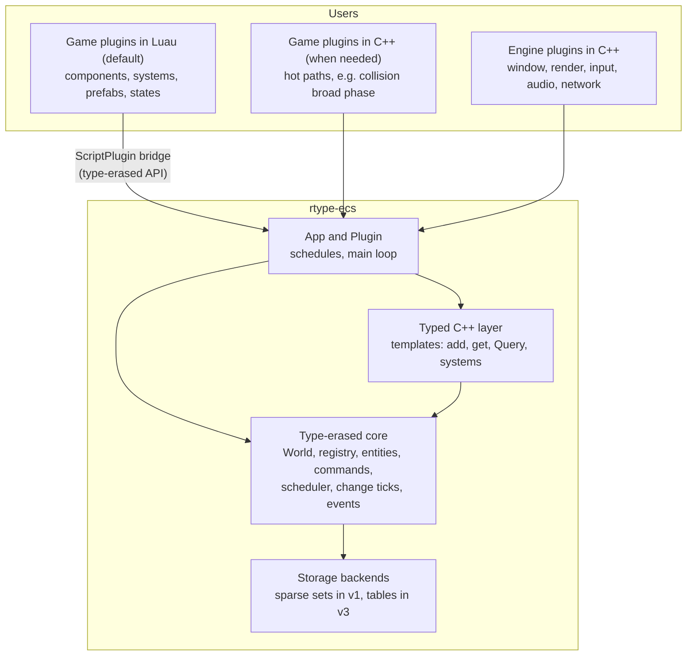

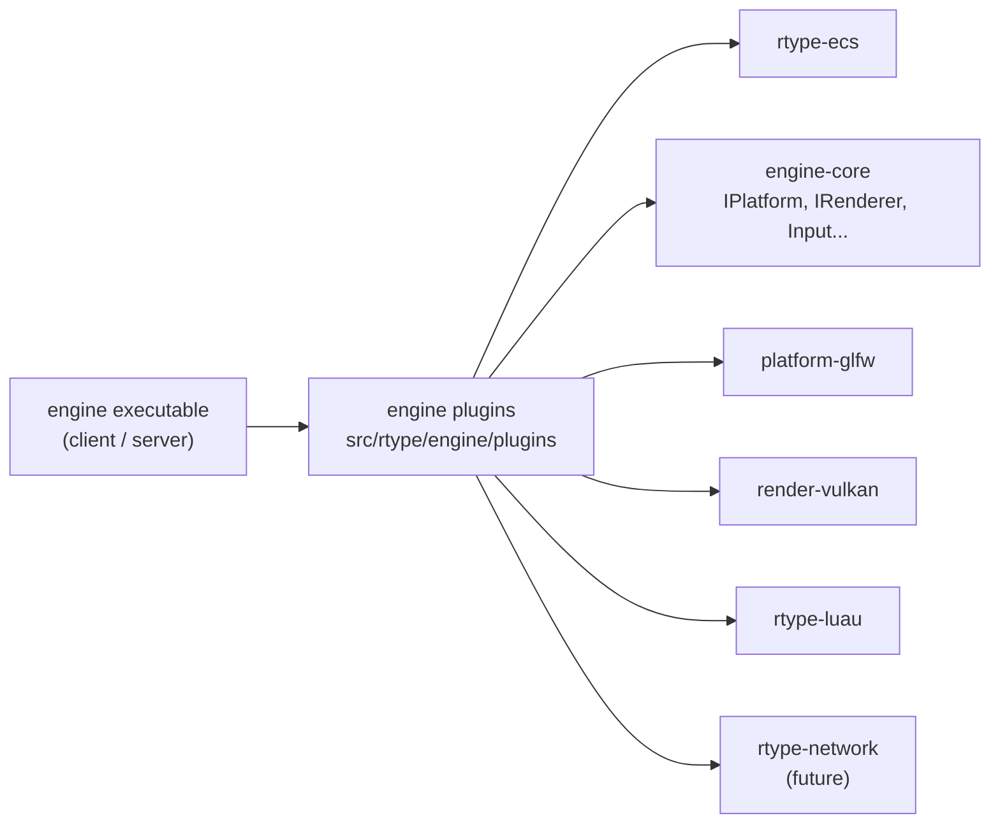

Only the plugins know both the ECS and a backend. `engine-core`, the platforms, the renderers and the
Luau runtime stay usable without the ECS, as they are today.

## The ECS, Part by Part

Each part follows the same outline: **what it is**, **what existing ECSs do**, **our choice** and the
requirements it serves.

### 1. Entity

**What it is.** An identifier with no data and no behavior. Everything about an entity is the set of
components attached to it.

**What exists.**

| Approach | Used by | Trade-off |
|---|---|---|
| Plain integer | early tutorials | A destroyed-then-reused id silently points to a new entity. |
| Index + generation | EnTT, Bevy, flecs, Unity | The generation detects stale handles. The standard choice. |
| Entity = component id too | flecs | Components and relationships are entities themselves; powerful, but complex. |

**Our choice.** 64 bits: a 32-bit index and a 32-bit generation, bumped every time the slot is freed.

| Bits | 63 … 32 | 31 … 0 |
|---|---|---|
| Field | generation | index |

The allocator keeps one generation per slot and a free list of released slots:

| Slot index | 0 | 1 | 2 | 3 |
|---|---|---|---|---|
| Generation | 3 | 1 | 7 | 2 |
| Alive | yes | no (free list: `1`) | yes | yes |

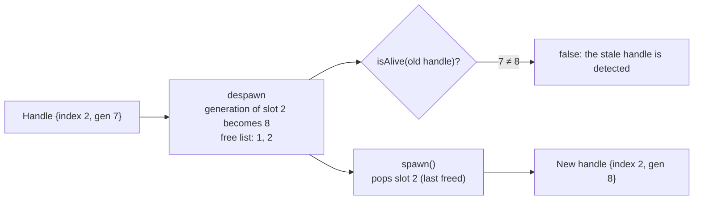

```c++
namespace rtype::ecs {
/// @brief Generational handle to an entity. Trivially copyable, 8 bytes.
class Entity {
  public:
    constexpr Entity(std::uint32_t index, std::uint32_t generation) noexcept;

    [[nodiscard]] constexpr std::uint32_t getIndex() const noexcept;
    [[nodiscard]] constexpr std::uint32_t getGeneration() const noexcept;

    friend constexpr bool operator==(Entity lhs, Entity rhs) noexcept = default;

  private:
    std::uint64_t _bits;  ///< generation << 32 | index.
};
}  // namespace rtype::ecs
```

An `Entity` is **local to one world**. It is never sent over the network: replicated entities carry a
`NetworkId` component instead (see [Networking](#networking)). This is the same generational idea as
Ethan's `Handle<Tag>`; `Entity` stays a separate type so it cannot be confused with a texture handle.

Serves: R2 (scripts hold entities safely), R3 (separate network identity), R4.

**Details:** [`features/01-entity.md`](features/01-entity.md).

### 2. Component

**What it is.** Plain data attached to an entity: `Position`, `Velocity`, `Health`. A component with
no data is a **tag** (`Dead`, `Player`).

**What exists.**

| Approach | Used by | Trade-off |
|---|---|---|
| Compile-time types only | EnTT, Bevy (mostly) | Fast and type-safe, but a script cannot define new components. |
| Runtime registry with descriptors | flecs, Unreal (`UScriptStruct`) | Components can be created at runtime and reflected; needs a type-erased core. |
| Shared components | Unity, Unreal Mass ("shared fragments") | One value shared by a group of entities (an enemy type's config). |

**Our choice.** A **runtime registry** where every component, from C++ or Luau, is described by one
`ComponentInfo`, with a typed C++ layer on top (the flecs model). This is required by R2.

```c++
namespace rtype::ecs {
using ComponentId = std::uint32_t;  ///< Dense index, local to one world.

/// @brief Where a component's data lives. Chosen per component.
enum class StorageKind : std::uint8_t {
    kSparseSet,  ///< One packed pool per component. Cheap add/remove. (v1)
    kTable,      ///< Archetype column. Fast multi-component iteration. (v3)
};

/// @brief Field types understood by reflection, scripting and replication.
enum class FieldType : std::uint8_t {
    kBool,
    kI8, kI16, kI32, kI64,
    kU8, kU16, kU32, kU64,
    kF32, kF64,
    kVec2, kVec3, kVec4,  ///< float vectors, glm layout
    kEntity,              ///< remapped by the network layer, cleared when its target dies
    kAssetId,             ///< stable asset identifier (see Networking)
};

/// @brief On which side of the network the component exists.
enum class Presence : std::uint8_t {
    kBoth,        ///< Server and clients (the default).
    kServerOnly,  ///< Never exists on a client (AI state, secrets).
    kClientOnly,  ///< Never exists on the server (interpolation, effects).
};

/// @brief How the server sends the component to clients.
enum class ReplicationMode : std::uint8_t {
    kNone,         ///< Never sent (the default).
    kEveryChange,  ///< Sent whenever its changed tick is newer than the client's last ack.
    kSpawnOnly,    ///< Sent once at spawn; clients simulate the rest (bullets).
};

struct FieldInfo {
    std::string name;
    FieldType type;
    std::uint32_t offset;    ///< Byte offset inside the component.
    std::uint32_t count{1};  ///< Fixed array length; 1 for scalars.
};

/// @brief Type-erased lifecycle. A null hook means trivial: memcpy / no-op.
struct ComponentHooks {
    void (*construct)(void* dst){nullptr};
    void (*destruct)(void* dst){nullptr};
    void (*move)(void* dst, void* src){nullptr};
    void (*copy)(void* dst, const void* src){nullptr};
};

struct ComponentInfo {
    ComponentId id;
    std::string name;  ///< Stable, unique key: "rtype.Position", "game.Shield".
    std::size_t size;  ///< 0 for tags.
    std::size_t alignment;
    StorageKind storage{StorageKind::kSparseSet};
    Presence presence{Presence::kBoth};
    ReplicationMode replication{ReplicationMode::kNone};
    ComponentHooks hooks;
    std::vector<FieldInfo> fields;
    std::uint64_t layoutHash;  ///< Hash of name + fields, compared over the network.
};
}  // namespace rtype::ecs
```

#### Why two enums instead of bit flags

An earlier version used one bit-flag enum (`kReplicated = 1U << 0U`, `kServerOnly = 1U << 1U`,
`kClientOnly = 1U << 2U`). The shifts were never a performance concern: `1U << 2U` is a constant the
compiler folds, and the flags are read **per component type** (at registration, when building the
network manifest), never per entity. The problems were elsewhere:

| Problem with bit flags | With two enums |
|---|---|
| Invalid combinations are representable: `kServerOnly \| kClientOnly`, or `kReplicated \| kClientOnly` | `Presence` holds exactly one value; the only invalid pair left (`kClientOnly` + replicated) is rejected at registration |
| A single bit cannot express the replication modes (`kEveryChange`, `kSpawnOnly`) | `ReplicationMode` names them |
| `enum class` bit flags need hand-written `operator\|`, `operator&` and casts, which clang-tidy flags | Plain comparisons and `switch` statements, checked for exhaustiveness |
| `std::uint32_t` reserved 29 unused bits | Two `std::uint8_t` |

The part that **is** on a hot path, deciding which pools replication scans each tick, does not read
the enums per entity either: the registry keeps a precomputed list of replicated component ids,
updated on registration, so the replication system loops over that list only.

```c++
app.component<Transform>().replicate(rtype::ecs::ReplicationMode::kEveryChange);
app.component<Bullet>().replicate(rtype::ecs::ReplicationMode::kSpawnOnly);
app.component<Interpolated>().presence(rtype::ecs::Presence::kClientOnly);
```

Hooks only manage the component's **own memory** (a C++ component with a `std::vector` member). They are
null for plain data, and always null for Luau components. Gameplay reactions to "added" or "removed" are
systems, not hooks (see [Hooks & Observers](#12-hooks--observers)).

**C++ components** declare their name and fields once, next to the struct. The name must be explicit:
`typeid(T).name()` differs between Clang and MSVC, and a static counter gives different ids in each
shared library.

```c++
struct Position {
    float x;
    float y;
};

struct Dead {};  // tag

// Specializes rtype::ecs::ComponentTraits<T>: name, name hash and field list (name, type, offset).
RTYPE_ECS_COMPONENT(Position, "rtype.Position", x, y);
RTYPE_ECS_COMPONENT(Dead, "rtype.Dead");

void TransformPlugin::build(rtype::ecs::App& app) {
    app.component<Position>().replicate(rtype::ecs::ReplicationMode::kEveryChange);
    app.component<Dead>();
}
```

`RTYPE_ECS_COMPONENT` stringifies the field names (MSVC needs `/Zc:preprocessor` for the variadic
macro) and can `static_assert(std::is_aggregate_v<T>)`. It can be replaced by C++26 reflection once
Clang, Apple Clang and MSVC all support it, without touching the components.

**Luau components** are declared by a Luau type; see [Luau Integration](#luau-integration).

Serves: R2 (runtime registration), R3 (fields, presence, replication mode, layout hash), R4.

**Details:** [`features/02-component-registry.md`](features/02-component-registry.md).

### 3. Storage

**What it is.** Where component data lives in memory. This is the decision that shapes performance.

**What exists.**

| Model | Used by | Strength | Weakness |
|---|---|---|---|
| Sparse set | EnTT | O(1) add/remove, simple, per-component pools | Multi-component joins do random lookups |
| Archetype tables | Bevy, flecs, Unity DOTS, Unreal Mass | Perfectly linear multi-component iteration | Every add/remove moves the entity's row; many combinations fragment tables |
| Hybrid, chosen per component | Bevy, recent flecs | Each component picks the model that suits it | Two storage paths in the query engine |
| Others | Specs (hierarchical bitsets), tutorials (flat arrays + bitmask) | Fast joins without moving data / simplicity | Less common, memory-hungry for many types |

There is no universally best model: one memory order cannot be contiguous for every combination of
components, so each design chooses which operations it makes cheap.

**Our choice.** **Hybrid as the target, sparse set first.** `StorageKind` is part of `ComponentInfo`
from day one; v1 implements `kSparseSet` only and treats `kTable` as `kSparseSet`. R-Type is
churn-heavy (bullets, tags, script components) with moderate entity counts, where sparse sets win;
tables come in v3 for generic games with large, stable populations.

#### Sparse set (v1)

Each component has a pool: a **paged sparse array** (entity index → dense position, 4096-entry pages
allocated on demand), a **dense entity array**, a **dense data column** of raw bytes, and two **tick
arrays** for [change detection](#11-change-detection).

Example: a `Position` pool holding entities `e3`, `e6` and `e1`.

**Sparse array** (page 0; later pages are not allocated). Indexed by entity index, it gives the
position in the dense arrays:

| Entity index | 0 | 1 | 2 | 3 | 4 | 5 | 6 |
|---|---|---|---|---|---|---|---|
| Dense position | – | 2 | – | 0 | – | – | 1 |

**Dense arrays**, packed and in the same order. They are what systems iterate:

| Dense position | 0 | 1 | 2 |
|---|---|---|---|
| Entity | `e3` | `e6` | `e1` |
| Data (`Position` bytes) | P3 | P6 | P1 |
| Added tick | 12 | 40 | 40 |
| Changed tick | 50 | 41 | 40 |

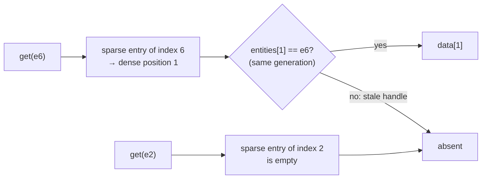

Removal is O(1) **swap-and-pop**: the last element moves into the hole, so the arrays stay packed.

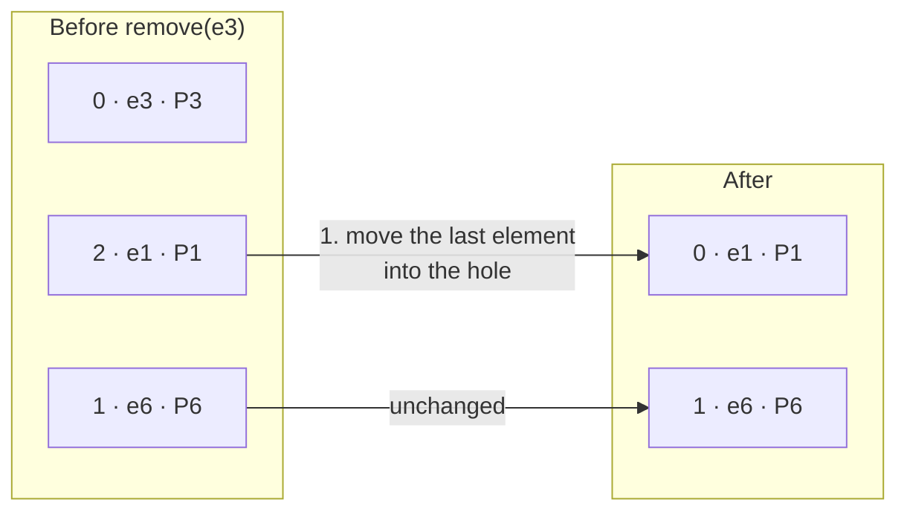

Then:

2. Point the moved entity's sparse entry at its new position (index 1 → 0).
3. Clear the removed entity's entry (index 3 → empty).
4. Shrink every dense array by one; the tick arrays move together with the data.

```c++
namespace rtype::ecs::storage {
/// @brief Type-erased sparse-set pool for one component.
class RTYPE_ECS_API SparseSetStorage {
  public:
    explicit SparseSetStorage(const ComponentInfo& info);

    [[nodiscard]] bool contains(Entity entity) const noexcept;
    [[nodiscard]] void* get(Entity entity) noexcept;  ///< nullptr if absent.
    void* emplace(Entity entity, Tick tick);         ///< Default-constructs the component.
    bool remove(Entity entity) noexcept;              ///< Swap-and-pop. false if absent.

    [[nodiscard]] std::span<const Entity> getEntities() const noexcept;

  private:
    const ComponentInfo* _info;  ///< Owned by the registry, outlives the pool.
    PagedSparseArray _sparse;    ///< Entity index -> dense index.
    std::vector<Entity> _dense;  ///< Entities, packed.
    ByteColumn _data;            ///< Component bytes, aligned, same order as _dense.
    std::vector<Tick> _added;    ///< Tick at which each component was added.
    std::vector<Tick> _changed;  ///< Tick of the last write.
};
}  // namespace rtype::ecs::storage
```

Tags have no data column. **Pointers into a pool are not stable**: any insert can reallocate and any
removal moves an element. Hence [commands](#8-commands) and handles.

#### Archetype tables (v3)

`kTable` components live in one table per distinct *set of table components*, one column per component.

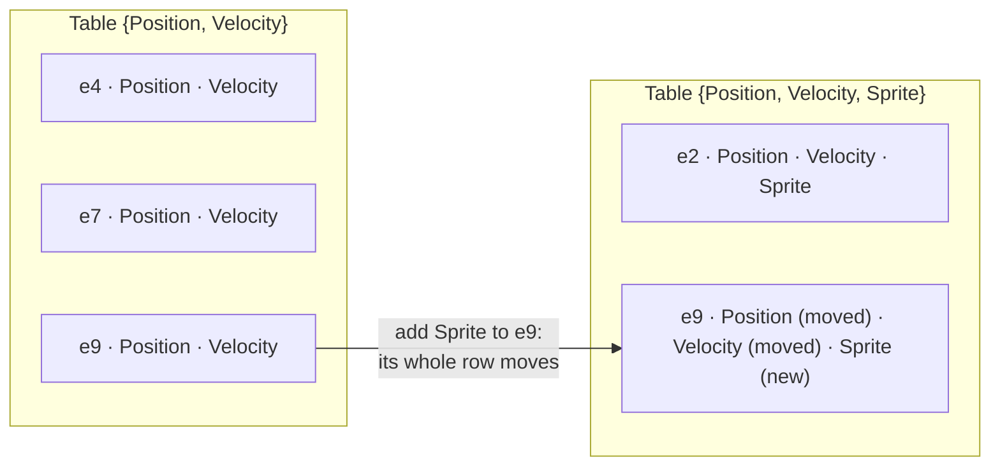

Sparse-set components never take part in the archetype, so toggling a tag or adding a script
component does not move an entity between tables (the same split as Bevy). Each entity slot then
records `{generation, table, row}`.

Serves: R4 (storage-agnostic API), R2 (script components default to sparse sets).

**Details:** [`features/03-sparse-array.md`](features/03-sparse-array.md), [`features/04-pool.md`](features/04-pool.md), [`features/05-archetype-tables.md`](features/05-archetype-tables.md).

### 4. World

**What it is.** The container that owns entities, the component registry, storage, resources, events
and schedules.

**What exists.** EnTT's `registry`, Bevy's `World`, flecs's `world`. Bevy also has *sub-apps* with
their own world (its render world).

**Our choice.** A `World` class with two API surfaces: typed templates and a type-erased, `noexcept`
API by `ComponentId` (used by Luau and the network). **Several worlds per process** are allowed: a
listen server runs a server world and a client world side by side, and tests create as many as they
need. Each world has its own registry, so ids are per world; names are shared.

```c++
rtype::ecs::World world;
const rtype::ecs::Entity ship = world.spawn();
world.add(ship, Position{.x = 10.F, .y = 20.F});

// Type-erased equivalent, used by the Luau bridge and the replication plugin.
const std::optional<rtype::ecs::ComponentId> id = world.findComponent("rtype.Position");
const bool added = world.add(ship, *id, &bytes);
```

Serves: R2, R3 (server + client worlds), R4.

**Details:** [`features/06-world.md`](features/06-world.md).

### 5. Query

**What it is.** "All entities that have these components and match these filters", plus access to the
data. Systems are built on queries.

**What exists.** Typed views (EnTT), queries with access modes and filters (Bevy: `With`, `Without`,
`Added`, `Changed`, `Option`), a query language with variables and relationship traversal (flecs).

**Our choice.** Typed queries for C++, dynamic queries (by `ComponentId`) for Luau, with **one shared
engine** underneath. Non-`const` components yield `Mut<T>`, which records writes.

```c++
void movement(rtype::ecs::Query<Position, const Velocity> query, rtype::ecs::Res<Time> time) {
    for (auto [entity, position, velocity] : query) {
        position->x += velocity.x * time->fixedDelta;
        position->y += velocity.y * time->fixedDelta;
    }
}

rtype::ecs::DynamicQuery shields = world.queryBuilder()
    .write(shieldId)
    .without(deadId)
    .build();
```

| Filter | Matches entities that... |
|---|---|
| `With<T>` / `Without<T>` | have / do not have `T` (data not accessed) |
| `Added<T>` / `Changed<T>` | got / wrote `T` since this system last ran |
| `Optional<T>` | may lack `T`; yields `nullptr` then |

Execution: iterate the **smallest** pool among the required components, and check the others.

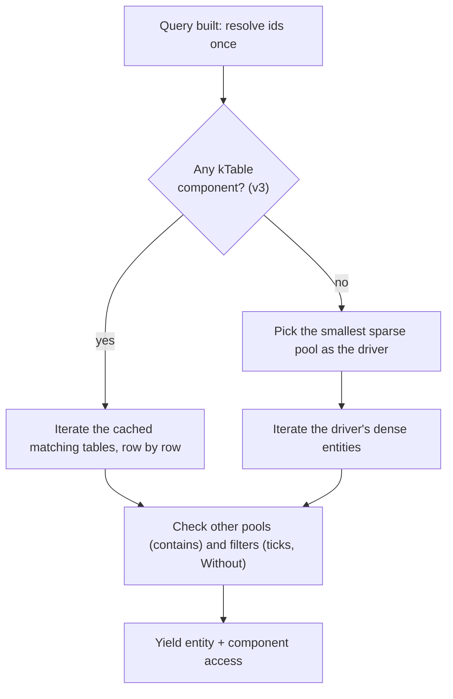

Serves: R2 (dynamic queries), R4.

**Details:** [`features/07-queries.md`](features/07-queries.md).

### 6. System

**What it is.** A function that runs logic over queries, resources and events. Systems hold the logic
that components do not have.

**What exists.**

| Style | Used by | Notes |
|---|---|---|
| Free function, parameters deduced | Bevy | Access is known from the signature, so the scheduler can order and parallelize. |
| Builder with a callback | flecs | `world.system<Position, Velocity>().each(...)` |
| Class with an update method | Unity DOTS (`ISystem`), Unreal Mass (`UMassProcessor`) | Explicit, verbose. |

**Our choice.** Bevy-style functions in C++ and **system classes** in Luau (see
[Luau Integration](#luau-integration)). In both cases a system has a **name**, a **phase**, ordering
constraints and an **access set** (what it reads and writes):

| C++ parameter | Access |
|---|---|
| `Query<A, const B, ...>` | writes `A`, reads `B` |
| `Res<T>` / `ResMut<T>` | reads / writes resource `T` |
| `NonSend<T>` / `NonSendMut<T>` | main-thread resource (see [Resources](#9-resources)) |
| `Commands&` | deferred structural changes |
| `EventReader<T>` / `EventWriter<T>` | reads / writes event queue `T` |

```c++
app.addSystem(rtype::ecs::Phase::kFixedUpdate, "rtype.movement", &movement);
app.addSystem(rtype::ecs::Phase::kFixedUpdate, "rtype.collision", &detectCollisions).after("rtype.movement");
```

Serves: R1, R2, R4 (access sets allow a parallel scheduler later without changing systems).

**Details:** [`features/12-systems.md`](features/12-systems.md).

### 7. Scheduler

**What it is.** Decides when each system runs.

**What exists.** Bevy has schedules (`Startup`, `PreUpdate`, `FixedUpdate`, `Update`, `PostUpdate`),
system sets, `before`/`after`, **run conditions** (`run_if`), **states** (`OnEnter(Menu)`), automatic
parallelism. flecs has pipelines and phases.

**Our choice.**

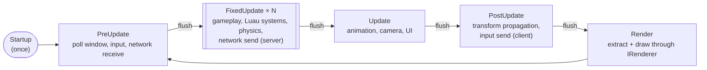

- **Phases** run in order; [commands](#8-commands) are flushed between phases.
- Inside a phase, `before`/`after` constraints are sorted topologically; a cycle is an error when the
  schedule is built.
- **`FixedUpdate`** runs 0..N times per frame from a time accumulator, so the simulation does not depend
  on the frame rate. The server runs only `PreUpdate`, `FixedUpdate` and `PostUpdate` (R3).
- **Run conditions** (v2): `.runIf(&inState<GameState::kPlaying>)`.
- **States** (v2): a `State<T>` resource with `OnEnter` / `OnExit` schedules, for menu → lobby →
  in-game → game over. This is the natural place for multiplayer session flow.
- **Sequential in v1.** Access sets exist from the start, so a parallel scheduler can come later.

Serves: R1, R3 (fixed timestep), R4.

**Details:** [`features/13-scheduler.md`](features/13-scheduler.md).

### 8. Commands

**What it is.** A buffer of structural changes (spawn, despawn, add, remove) applied at the next sync
point, because doing them during iteration would invalidate the pools being read.

**What exists.** Bevy `Commands`, flecs deferred mode, Unity `EntityCommandBuffer`, Unreal Mass command
buffer.

**Our choice.** A `Commands` buffer per system, applied in recording order between phases. `spawn()`
reserves an `Entity` immediately, so it can be stored before the flush.

```c++
void shoot(rtype::ecs::Query<const Position, const Weapon, const PlayerInput> players,
           rtype::ecs::Commands& commands) {
    for (auto [entity, position, weapon, input] : players) {
        if (input.isHeld(Action::kFire)) {
            commands.spawn()
                .add(Position{position.x + 16.F, position.y})
                .add(Velocity{weapon.bulletSpeed, 0.F})
                .add(Bullet{.owner = entity});
        }
    }
}
```

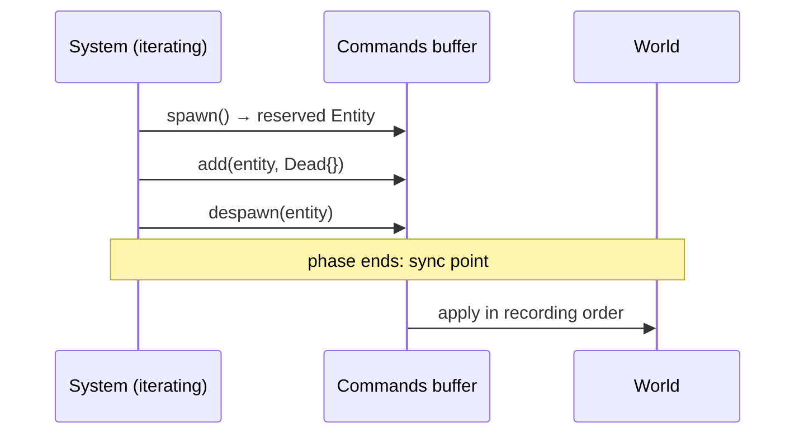

Luau systems spawn and despawn through the same buffer. Serves: R2, R4.

**Details:** [`features/09-commands.md`](features/09-commands.md).

### 9. Resources

**What it is.** Singleton data owned by the world: time, input, configuration, asset storage, the
renderer.

**What exists.** Bevy `Res` / `ResMut`, and `NonSend` for data that must stay on the main thread;
flecs singletons; EnTT context variables.

**Our choice.** Resources are registered by name like components. **Main-thread resources**
(`NonSend<T>`) mark systems that must run on the main thread: GLFW requires its calls there, so the
platform and the renderer are `NonSend`. In the sequential v1 scheduler this is only a marker, but it
keeps the door open for parallelism.

```c++
app.insertResource(Time{.fixedDelta = 1.F / 60.F});
app.insertNonSendResource(std::move(backend));  // Ethan's Backend: platform + renderer
```

Serves: R1, R4.

**Details:** [`features/10-resources.md`](features/10-resources.md).

### 10. Events

**What it is.** Typed messages between systems that should not know about each other: collisions,
window resizes, a player joining.

**What exists.** Bevy events (double-buffered queues, read by `EventReader`), flecs and Bevy
observers/triggers (immediate callbacks).

**Our choice.** Double-buffered `Events<T>`: an event is readable the frame it is sent and the next,
then dropped. Event types are registered by name, so Luau can declare and send its own. Ethan's
`Event` variant is forwarded by the window plugin (one event type per alternative: `event::Resized`,
`event::KeyPressed`...).

```c++
void applyDamage(rtype::ecs::EventReader<Collision> collisions, rtype::ecs::Query<Health> health) {
    for (const Collision& collision : collisions) {
        // ...
    }
}
```

Serves: R1, R2, R4.

**Details:** [`features/11-events.md`](features/11-events.md). For a complete example, including how
the queue works underneath, see [Collisions: From Overlap to Event](#collisions-from-overlap-to-event).

### 11. Change Detection

**What it is.** Knowing which component values were added or written since a given moment.

**What exists.** Bevy's per-component ticks with `Added` / `Changed` filters, flecs change tracking per
table, Unity per-chunk version numbers.

**Our choice.** Per-component `added` and `changed` ticks (Bevy). The world tick advances with each
system run; each system remembers its previous run. `Mut<T>` stamps the changed tick only on a mutable
access, so iterating without writing does not mark everything as changed.

| World tick | 100 | 101 | 102 |
|---|---|---|---|
| System running | `movement` | `collision`, writes `Position` of `e5` | `replication` (its last run was tick 97) |
| `Position` of `e5` | added 40, changed 40 | added 40, **changed 101** | — |

At tick 102, `replication` sees `Changed<Position>` for `e5` because 101 > 97 (its last run).

```c++
template <typename T>
class Mut {
  public:
    [[nodiscard]] const T& get() const noexcept;  ///< Read, does not mark changed.
    [[nodiscard]] T* operator->() noexcept;       ///< Write, marks changed.
    [[nodiscard]] T& operator*() noexcept;        ///< Write, marks changed.

  private:
    T* _value;
    Tick* _changed;
    Tick _currentTick;
};
```

Ticks are 32-bit; the world periodically clamps old ticks to survive wraparound. This is what the
replication plugin uses to send only what changed. Serves: R3 above all.

**Details:** [`features/08-change-detection.md`](features/08-change-detection.md).

### 12. Hooks & Observers

**What it is.** Code that runs when a component is added, removed or changed.

**What exists.** EnTT signals (`on_construct`), Bevy component hooks and observers, flecs observers
(`OnAdd`, `OnRemove`, `OnSet`).

**Our choice.** v1 has only the **memory hooks** of `ComponentHooks`. Gameplay reactions use
`Added<T>` filters or events, which keep all logic in scheduled systems. Observers can come in v3 if a
real need appears. Serves: Principles, R4.

**Details:** [`features/16-hooks-and-observers.md`](features/16-hooks-and-observers.md).

### 13. Hierarchy & Relationships

**What it is.** Links between entities: a ship and its attached force pod, a UI panel and its buttons,
a camera following a player.

**What exists.** Bevy `ChildOf` / `Children` components with transform propagation; flecs
relationships as first-class pairs (`(ChildOf, parent)`, `(Likes, Apples)`), queryable.

**Our choice.** v2: a `Parent` component (`kEntity` field) and a `Children` component, plus a
`PostUpdate` system that computes `GlobalTransform` from `Transform` down the tree. Despawning a parent
despawns its children. General relationships are left for later. Serves: R1, R4.

**Details:** [`features/17-hierarchy.md`](features/17-hierarchy.md).

### 14. Prefabs & Scenes

**What it is.** Templates of entities (an enemy type, a bullet) and whole saved sets of entities (a
level).

**What exists.** flecs prefabs (entities inherited from), Bevy scenes (serialized entity lists), Unity
prefabs, Unreal Mass entity configs.

**Our choice.** v2: a **prefab** is a named list of component values, built from C++ or Luau and
spawned by name (`commands.spawnPrefab("game.Bydo")`). Because it only references components by name,
the server can tell clients "spawn `game.Bydo`" cheaply. Scenes (v3) reuse the reflection serializer.
Serves: R2, R3, R4.

**Details:** [`features/18-prefabs-and-scenes.md`](features/18-prefabs-and-scenes.md).

### 15. Reflection & Serialization

**What it is.** Knowing a component's fields at runtime, and reading or writing them generically.

**What exists.** flecs `meta` addon, Bevy `Reflect` (derive macros), Unreal `UPROPERTY` (header tool),
EnTT `meta`.

**Our choice.** One `FieldInfo` list per component, filled by `RTYPE_ECS_COMPONENT` in C++ and by the
Luau type in scripts. A single serializer walks `FieldInfo`s; it is used by replication (R3), the Luau
bridge to convert tables to bytes (R2), prefabs, scenes and debug inspection (R4).

**Details:** [`features/15-reflection-and-serialization.md`](features/15-reflection-and-serialization.md).

### 16. App & Plugins

**What it is.** The entry point that owns the world, the schedules and the main loop, and the unit of
reuse (a plugin registers components, resources, events and systems).

**What exists.** Bevy `App` + `Plugin` + plugin groups (`DefaultPlugins`, `MinimalPlugins`), flecs
modules, Unreal subsystems.

**Our choice.** Bevy's model.

```c++
namespace rtype::ecs {
/// @brief A reusable bundle of components, resources, events and systems.
class RTYPE_ECS_API Plugin {
  public:
    virtual ~Plugin() = default;
    // copy/move deleted, see CLAUDE.md

    [[nodiscard]] virtual std::string_view getName() const noexcept = 0;
    virtual void build(App& app) = 0;
};
}  // namespace rtype::ecs

int main() {
    rtype::ecs::App app;
    app.addPlugins(rtype::engine::plugins::DefaultPlugins{})  // window, input, render, audio, assets, script
        .addPlugin(rtype::engine::plugins::ClientPlugin{})   // network client
        .addPlugin(rtype::engine::plugins::LuauPlugin{"scripts/rtype/plugin.luau"})  // the game, in Luau
        .run();
}
```

`LuauPlugin` is a C++ `Plugin` that loads a Luau plugin file and forwards its registrations to the
`App` (see [Plugins: a Luau module](#plugins-a-luau-module)). A C++ game plugin is added the same way
(`.addPlugin(rtype::game::CollisionPlugin{})`) when a part of the game needs native speed.

A dedicated server is the same game plugins with `MinimalPlugins` (time, assets metadata, script) and
`ServerPlugin`: no window and no renderer, for free. Serves: R1, R2, R3, R4.

**Details:** [`features/14-app-and-plugins.md`](features/14-app-and-plugins.md).

## Feature Catalog

Everything above, with where it comes from, which requirement it serves (**L**uau, **N**etwork,
**G**eneric) and when it comes.

| Feature | Seen in | L | N | G | Version |
|---|---|:-:|:-:|:-:|---|
| Generational entities | EnTT, Bevy, flecs, Unity | ✓ | ✓ | ✓ | v1 |
| Runtime component registry + typed layer | flecs | ✓ | | ✓ | v1 |
| Field reflection, C++ macro | flecs meta, Bevy Reflect, Unreal | | ✓ | ✓ | v1 |
| Field reflection from Luau types | (ours) | ✓ | ✓ | | v2 |
| Sparse-set storage | EnTT | ✓ | | ✓ | v1 |
| Per-component storage choice, archetype tables | Bevy, flecs | | | ✓ | v3 |
| Typed queries + filters | all | | | ✓ | v1 |
| Dynamic queries | flecs | ✓ | | ✓ | v1 |
| Change ticks, `Added` / `Changed` | Bevy | | ✓ | ✓ | v1 |
| Commands | Bevy, flecs, Unity, Mass | ✓ | | ✓ | v1 |
| Resources, main-thread resources | Bevy | | | ✓ | v1 |
| Events | Bevy | ✓ | | ✓ | v1 |
| Phases + fixed timestep | Bevy, flecs pipelines | | ✓ | ✓ | v1 |
| App + plugins + plugin groups | Bevy, flecs modules | | ✓ | ✓ | v1 |
| Run conditions, States | Bevy | | ✓ | ✓ | v2 |
| Hierarchy + transform propagation | Bevy, flecs | | | ✓ | v2 |
| Prefabs | flecs, Unity, Mass | ✓ | ✓ | ✓ | v2 |
| Replication plugin | Unreal, bevy_replicon | | ✓ | | v2 |
| Script systems, components, spawns | (ours) | ✓ | | | v2 |
| Luau plugins (games written in Luau) | (ours) | ✓ | ✓ | ✓ | v2 |
| Observers | flecs, Bevy | ✓ | | ✓ | v3 |
| Shared components | Unity, Mass | | | ✓ | v3 |
| Parallel scheduler | Bevy, flecs, Unity | | | ✓ | v3 |
| Copy-on-write snapshots (replays, lag compensation) | research | | ✓ | | later |

## Luau Integration

The Luau bindings belong to the scripting side (`rtype-luau`, Charles). This section is the
**contract** the ECS offers them: what a script can declare and how it maps to the core.

### Components: a Luau type

A component is described by an exported Luau type. Users put it in its own file or next to other
declarations, as they prefer.

```luau
-- Shield.luau
export type Shield = {
    strength: f32,
    regen: f32,
    owner: Entity,
}

return ecs.component("game.Shield", {
    type = "Shield",                         -- which exported type describes it
    replication = "everyChange",          -- or "spawnOnly"; omitted = never sent
    defaults = { strength = 50, regen = 2 },
})
```

Luau types are erased at runtime, and Luau has a single `number` type, so the ECS cannot get the
layout by running the script. Instead:

1. The **type aliases** `f32`, `i32`, `u8`, `Entity`, `vec2`, `AssetId`... are declared in the `.d.luau`
   file produced by Charles's `Runtime::generateTypes()` (`type f32 = number`, ...). Editors and the
   type checker accept them.
2. When the file is loaded, the bridge **parses** it with `Luau.Ast`, the parser the compiler already
   uses (not the full type checker), finds the exported type and maps each field's annotation to a
   `FieldType`.
3. It builds a `ComponentDescriptor` and calls `world.registerComponent()`. The ECS computes the layout
   **deterministically** (fields sorted by alignment, then name), so every client and the server agree.

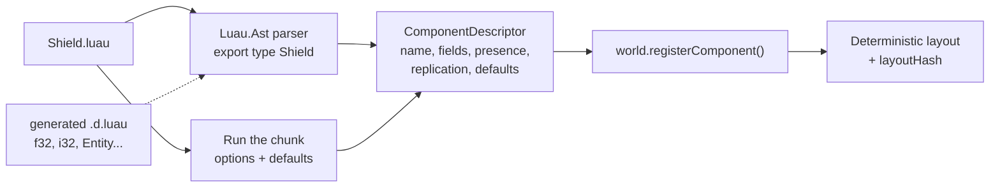

`game.Shield` after layout (size 16, alignment 8):

| Bytes | 0 – 7 | 8 – 11 | 12 – 15 |
|---|---|---|---|
| Field | `owner` | `regen` | `strength` |
| Type | `Entity` (u64) | `f32` | `f32` |

`owner` comes first because it has the largest alignment; `regen` and `strength` share an
alignment and are ordered by name. No padding is needed.

If parsing annotations proves impractical, the fallback is typed default values
(`strength = ecs.f32(50)`), which carry the type at runtime. Script components are always plain data:
no hooks and no methods.

### Systems: a Luau class

A system is a table with its declaration and a `run` method. It is registered through the type-erased
API with a `DynamicQuery` and an explicit access list.

```luau
-- ShieldRegen.luau
local ShieldRegen = ecs.system("game.ShieldRegen", {
    phase = "FixedUpdate",
    query = { write = { "game.Shield" }, without = { "rtype.Dead" } },
    after = { "rtype.movement" },
})

function ShieldRegen:run(ctx)
    for entity, shield in ctx.query do
        shield.strength = math.min(shield.strength + shield.regen * ctx.time.fixedDelta, 100)
    end
end

return ShieldRegen
```

Entities are created and destroyed through the system's commands:

```luau
function WaveSpawner:run(ctx)
    ctx.commands:spawn({
        ["rtype.Transform"] = { position = vec2(800, 300) },
        ["game.Shield"] = {},                -- defaults
    })
    ctx.commands:spawnPrefab("game.Bydo")
end
```

### Plugins: a Luau module

A game, or one feature of a game, is a Luau plugin: a table with a `build` method that registers
everything the feature needs. It is the Luau counterpart of a C++ `Plugin`, and the unit a game is
assembled from.

```luau
-- scripts/rtype/plugin.luau
local RtypePlugin = ecs.plugin("rtype.Game")

function RtypePlugin:build(app)
    -- Components and systems, from files laid out however the game prefers.
    app:load("components/Shield.luau")
    app:load("components/Bydo.luau")
    app:load("systems/ShieldRegen.luau")
    app:load("systems/WaveSpawner.luau")

    -- Other Luau plugins this one is built from.
    app:addPlugin("scripts/rtype/weapons/plugin.luau")

    -- Prefabs, spawned by name on the server and announced to clients by name.
    app:prefab("game.Bydo", {
        ["rtype.Transform"] = {},
        ["rtype.SpriteRenderer"] = { texture = asset("sprites/bydo.png") },
        ["game.Shield"] = { strength = 20 },
    })

    -- Game flow (see Scheduler: States).
    app:state("game.Phase", { "Menu", "Lobby", "Playing", "GameOver" })
end

return RtypePlugin
```

Files are referenced by **path** through `app:load()` rather than `require()`: cross-file `require` is a
non-goal of the Luau proposal, so the bridge loads each file itself, which also gives it what it needs
for hot reload.

### Rules of the boundary

- **Handles, not pointers.** Scripts hold `Entity` values; the bridge resolves them on every access,
  as in the proposal's *Handles* section. A component view (`shield` above) is only valid during `run`.
- **Nothing throws into Luau.** The type-erased API is `noexcept` and reports failure by return value;
  the bridge turns failures into `rtype::luau::Result` / `Error` (`ErrorKind::kRuntime`,
  `kTypeMismatch`...).
- **Hot reload.** Reloading a file re-registers its component if the `layoutHash` is unchanged;
  otherwise it is refused (or, in development, the component's data is migrated by field name).
  Systems can always be reloaded.
- **Where scripts run.** Luau plugins are loaded on **both** the server and the clients: both need the
  component layouts, prefabs and states. Each system declares a `side`:
  - `"server"` (the default): gameplay. Runs only on the server, which is authoritative.
  - `"client"`: presentation (effects, UI, animation). It may only **write** `kClientOnly` components;
    anything else would be overwritten by replication, so the bridge refuses it at registration.
  - `"both"`: logic that is not authoritative state, such as interpolation helpers.

**Details:** [`features/19-luau-bridge.md`](features/19-luau-bridge.md).

## Networking

The model is **inputs up, state down**: clients send their inputs, the server simulates and replicates
the result. There is no client prediction or rollback.

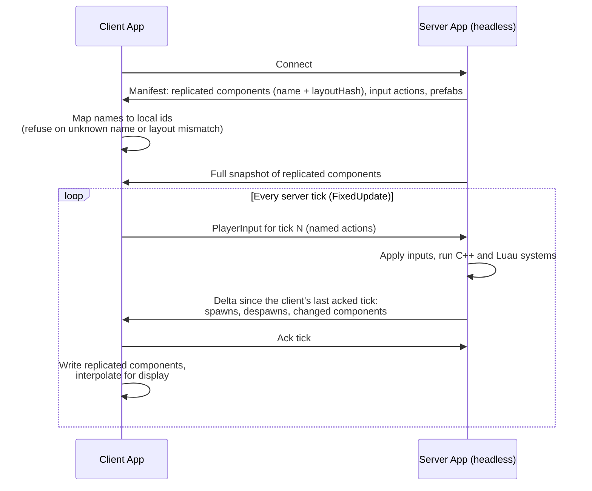

### Inputs up: reusing `Input` and `InputAction`

Ethan's `Input` already turns devices into **named actions** (`"move"`, `"fire"`), which is exactly
what should go over the network: the server never sees keys or gamepads. On the client, a
`PostUpdate` system reads the actions and fills a `PlayerInput` component on the local player; the
client plugin sends it every tick.

```c++
/// @brief One player's input for one tick. Replicated client -> server.
struct PlayerInput {
    std::uint32_t tick;
    std::uint32_t buttons;                         ///< One bit per button action, in manifest order.
    std::array<glm::vec2, kMaxInputAxes> vectors;  ///< kAxis / kVector2 actions, in manifest order.
};

void collectInput(rtype::ecs::Res<rtype::engine::input::Input> input,
                  rtype::ecs::Query<PlayerInput, rtype::ecs::With<LocalPlayer>> players) {
    for (auto [entity, playerInput] : players) {
        playerInput->vectors[0] = input->getAction("move").readVector();
        // buttons: getAction(name).isHeld() for each button action of the manifest
    }
}
```

On the server, `PlayerInput` arrives on the entity owned by that client (`Owner{clientId}`), and
gameplay systems read it like any other component.

### State down: replication

- **What is sent:** components whose `ReplicationMode` is not `kNone`; `kSpawnOnly` ones only when they appear. **What changed** comes from change ticks: for
  each replicated pool, every entity whose `changed` tick is newer than the client's last acknowledged
  tick. Despawns are recorded per tick.
- **How it is encoded:** by the reflection serializer (`FieldInfo`), so C++ and Luau components need
  no per-type network code.
- **Identity:** component ids are mapped through the manifest by name and checked with `layoutHash`.
  Entities get a `NetworkId` on the server; the client keeps `NetworkId → Entity`. `kEntity` fields are
  translated through it.
- **Assets:** replicated components reference assets by **`AssetId`**, a stable id derived from the
  asset path. Ethan's `Handle<Tag>` (such as `TextureId`) is a slot in one process's renderer: the
  server has no renderer and each client allocates slots in its own order, so it must **not** be
  replicated. The comment in `Handle.hpp` saying handles are safe to send over the network should be
  corrected.
- **Client-only data:** interpolation buffers, effects and render state are `kClientOnly` components on
  the same entities.

The transport (`rtype-network`: sockets, reliability, packet format) is outside the ECS and outside
this document.

**Details:** [`features/20-replication.md`](features/20-replication.md).

## Collisions: From Overlap to Event

Collisions are the busiest workload of an R-Type-like game: hundreds of bullets against dozens of
enemies, every tick. This section follows one tick of the `CollisionPlugin` (C++, server side) from
component data to `Collision` events read by gameplay, and lists what makes it fast.

### Data

```c++
/// @brief Axis-aligned box, relative to the entity's GlobalTransform.
struct Collider {
    glm::vec2 halfSize;
    glm::vec2 offset;
};

/// @brief Which layers the entity is on, and which layers it collides with.
struct CollisionLayers {
    std::uint32_t member;  ///< One bit per layer: kPlayer, kPlayerBullet, kEnemy, kEnemyBullet, kWall...
    std::uint32_t mask;    ///< Layers this entity wants to collide with.
};

/// @brief Sent once per overlapping pair per tick.
struct Collision {
    rtype::ecs::Entity a;
    rtype::ecs::Entity b;
};

RTYPE_ECS_COMPONENT(Collider, "rtype.Collider", halfSize, offset);
RTYPE_ECS_COMPONENT(CollisionLayers, "rtype.CollisionLayers", member, mask);
```

Bit masks were dropped for component options (see
[Why two enums instead of bit flags](#why-two-enums-instead-of-bit-flags)), but **they are the right
tool here**: they are read per pair, inside the hottest loop, and any combination of layers is
meaningful. Testing a pair is two `AND`s:
`(a.member & b.mask) != 0 && (b.member & a.mask) != 0`.

| Layer | Collides with |
|---|---|
| `kPlayer` | `kEnemy`, `kEnemyBullet`, `kWall`, `kPowerUp` |
| `kPlayerBullet` | `kEnemy`, `kWall` |
| `kEnemy` | `kPlayer`, `kPlayerBullet` |
| `kEnemyBullet` | `kPlayer`, `kWall` |

Bullets never test against bullets, and enemies never test against enemies: most potential pairs are
discarded by the masks alone.

### One tick, step by step

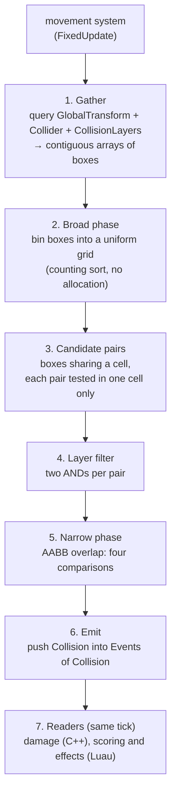

1. **Gather.** One query walks the three components and writes, for each collider, its world-space box
   (`minX`, `minY`, `maxX`, `maxY`), its layer bits and its entity into **separate contiguous arrays**
   (structure of arrays). Everything after this step reads only these arrays, never the pools.
2. **Broad phase: uniform grid.** The playfield is bounded (one screen), so a fixed grid fits well: with
   64-pixel cells, a 1920×1080 field is 30 × 17 = 510 cells. Boxes are binned with a **counting
   sort**: count the boxes per cell, compute a prefix sum, then fill one flat array. Two linear passes,
   no per-cell vectors and no allocation once the arrays have grown to size.
3. **Candidate pairs.** Two boxes are candidates if they share a cell. A box spanning several cells
   would produce the same pair several times; instead of a hash set to remove duplicates, a pair is only
   tested in the cell that contains the corner `(max(a.minX, b.minX), max(a.minY, b.minY))`, which is
   unique.
4. **Layer filter.** Two `AND`s, before any geometry.
5. **Narrow phase.** Four comparisons for two boxes. Other shapes (circles) can be added here without
   changing the rest.
6. **Emit.** Each overlapping pair is appended to the `Collision` event buffer (`push_back` into a
   vector that keeps its capacity between ticks). Pairs are emitted in a deterministic order (cell
   order, then box order), so the same inputs give the same events.
7. **Readers.** Systems ordered `after("rtype.collision")` read the events in the same tick.

### How the event queue works underneath

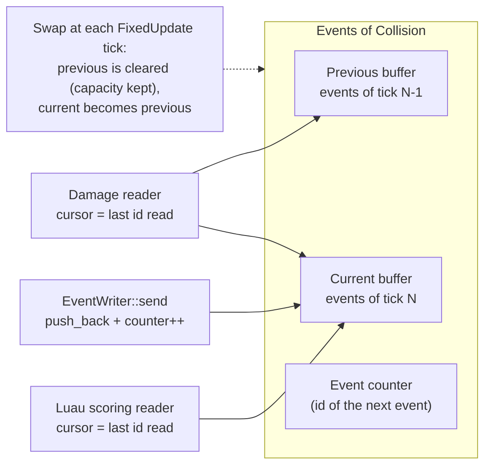

- **Writing** is a `push_back` into the current buffer and an increment of the event counter.
- **Each reader keeps a cursor**: the id of the last event it read. Reading walks the previous buffer,
  then the current one, skipping ids at or below the cursor, and moves the cursor to the end. Every
  reader sees every event exactly once, whatever its order relative to the writer.
- **The swap follows the phase that writes the event.** Collision events are written in `FixedUpdate`,
  so their queue is swapped once per **fixed tick**, not once per frame. Otherwise, a frame that runs
  `FixedUpdate` three times would mix three ticks of collisions, or drop some.
- **No allocation in steady state:** the buffers are cleared, not freed.

### What makes it fast

| Optimization | Effect |
|---|---|
| Layer masks before geometry | Removes bullet-vs-bullet and enemy-vs-enemy pairs, the large majority |
| Uniform grid instead of all pairs | 600 bullets + 60 enemies + 4 ships ≈ 660 boxes: about 220,000 pairs naively; with the grid, a few thousand candidates (an estimate; depends on how bullets cluster) |
| Counting sort into a flat array | Two linear passes, cache-friendly, no allocation |
| Structure of arrays for boxes | Contiguous floats; the compiler can vectorize the overlap test (4 or 8 boxes at once with SSE / AVX / NEON) |
| Unique cell per pair | No hash set to remove duplicate pairs |
| Reused buffers | Scratch arrays and event buffers keep their capacity between ticks |
| Static colliders apart | Walls and terrain go in their own grid, rebuilt only when `Changed<Transform>` says they moved |
| Damage applied in C++ | The C++ damage system reads every `Collision`; Luau only receives rarer, higher-level events (`game.EnemyKilled`), so the per-event C++ → Luau crossing stays small |
| Started / ended events (optional) | For long contacts (a laser beam), compare this tick's sorted pair list with the previous one and emit `CollisionStarted` / `CollisionEnded` instead of one event per tick |

Expected cost: a few microseconds to a few tens of microseconds per tick at R-Type scale, an order of
magnitude to measure with the benchmark harness rather than assume.

Other broad phases, for reference:

| Broad phase | Good for | Here |
|---|---|---|
| Uniform grid | Bounded area, similar sizes | **Chosen**: one screen, bullets and enemies of similar size |
| Sort and sweep (sort by `minX`, sweep) | Mostly 1D motion; order changes little between ticks (insertion sort) | Good alternative for a side-scroller |
| Quadtree / BVH | Large worlds, very different sizes | Unnecessary here |

### Fast bullets

At 60 ticks per second, a bullet moving 600 pixels per second moves 10 pixels per tick, less than its
size, so it cannot skip over a target. A projectile faster than its own size per tick needs a swept
box (the box covering its start and end positions) in the gather step.

### Collisions and the network

The collision system is a `server` system: only the server decides hits. Clients learn the result
through replication (health changes, despawns). A `kSpawnOnly` bullet keeps flying on the client until
its despawn arrives, about one round trip later, so it can visibly cross an enemy. A small `client`
system can hide a bullet locally as soon as it overlaps a target, by writing a `kClientOnly` component,
without deciding anything.

### From Luau

```luau
local EnemyKilledScore = ecs.system("game.EnemyKilledScore", {
    events = { "game.EnemyKilled" },        -- sent by the C++ damage system
    write = { resources = { "game.Score" } },
})

function EnemyKilledScore:run(ctx)
    for event in ctx.events["game.EnemyKilled"] do
        ctx.resources["game.Score"].value += event.points
    end
end

return EnemyKilledScore
```

A Luau game can also read `rtype.Collision` directly; that is the simplest start, and the place to
move to C++ if profiling shows the event volume is too high.

## The App on Top of the Engine Layer

Going Bevy-style now means the ECS owns the loop. Ethan's **interfaces stay**; what changes is the
**wiring** in `main.cpp` and how the pieces are reached.

| Existing code | Becomes |
|---|---|
| `main.cpp` loop | `App` + `DefaultPlugins` + game plugin; `app.run()` owns the loop |
| `BackendRegistry` + `Settings` | **Kept.** A `Startup` system of `WindowPlugin` / `RenderPlugin` calls `createBackend(settings)`, so the config still picks `glfw` / `vulkan`. The `prepare → init → init` order is unchanged. |
| `Backend` (platform + renderer) | Main-thread (`NonSend`) resource |
| `IPlatform::pollEvents()` | `PreUpdate` system that forwards each `Event` alternative to `Events<…>` |
| `Input` / `InputAction` | Resource updated by a `PreUpdate` system from window events; feeds `PlayerInput` |
| `IRenderer` | Called by `Render`-phase systems: `beginFrame` / `setCamera` / `draw` / `endFrame` |
| `graphics::Sprite` (with `position`) | **Kept as the renderer's draw command.** The ECS component is `SpriteRenderer` (`AssetId`, source rect, origin, color); the position comes from `Transform`. |
| `graphics::Camera` (with `position`) | ECS `Camera` component (projection, rotation) + `Transform`; the render system builds a `graphics::Camera` |
| `Texture` / `Resource<Tag, Owner>` | Owned by an `Assets<Texture>` resource, keyed by `AssetId`; components never own resources |
| `IAudio` | `AudioPlugin`, main-thread resource, sounds triggered by events |
| `Settings` | Resource, filled from the config file at startup |

```c++
void drawSprites(rtype::ecs::Query<const GlobalTransform, const SpriteRenderer> sprites,
                 rtype::ecs::Res<rtype::engine::assets::Assets<rtype::engine::graphics::Texture>> textures,
                 rtype::ecs::NonSendMut<rtype::engine::backend::Backend> backend) {
    rtype::engine::graphics::IRenderer& renderer = *backend->renderer;
    renderer.beginFrame(rtype::engine::graphics::Color{0.F, 0.F, 0.F, 1.F});
    for (auto [entity, transform, sprite] : sprites) {
        renderer.draw(rtype::engine::graphics::Sprite{
            .texture = textures->getId(sprite.texture),
            .source = sprite.source,
            .position = transform.position,
            .origin = sprite.origin,
            .color = sprite.color,
        });
    }
    renderer.endFrame();
}
```

### Pros and cons of the App now

| Pros | Cons |
|---|---|
| One model for everything: scripts, network and tools see engine state as components and resources | **Critical path:** nothing runs until the ECS core, `App` and scheduler exist |
| Headless server for free (`MinimalPlugins`, no window/renderer) | GLFW forces main-thread resources (`NonSend`), one more concept |
| Plugins are the reuse unit (R4): a new game picks plugins | Ordering lives in the schedule rather than in a readable `main`; harder to debug without good tooling (schedule dump) |
| Fixed timestep, events and input handled once, by the engine | `draw(const Sprite&)` per entity is one virtual call each; a batched `draw(std::span<const Sprite>)` will be wanted |
| Ethan's interfaces are untouched; only wiring moves | More design to agree on upfront across the team |

Mitigation for the critical path: `IPlatform`, `IRenderer` and `BackendRegistry` keep working without
the ECS (Ethan's examples, renderer development), so the renderer and the ECS can progress in parallel
and meet in `RenderPlugin`.

## Error Handling

| Situation | Behavior |
|---|---|
| Registration error: name reused with another layout, schedule cycle, unknown `after` target | Typed API: exception derived from `std::runtime_error`, in `ecs/exceptions/`. Type-erased API: `std::nullopt` / `false`. |
| Typed `get<T>` on a missing component or dead entity | `nullptr` (`const T*`) or an empty `Mut<T>` |
| Programmer error on a hot path | `assert` in debug builds |
| Anything called by the Luau bridge | Never throws; the bridge converts to `rtype::luau::Result` |

## Source Layout

`rtype-ecs` is its own **shared** library. Putting it in `engine-core` would not work: `engine-core`
is a static library linked into both the executable and `rtype-render-vulkan`, so each binary would get
its own copy of the registries.

**`src/rtype/ecs/`**: the `ecs` target (shared library `rtype-ecs`, `RTYPE_ECS_BUILD`, namespace
`rtype::ecs`).

| File | Contents |
|---|---|
| `xmake.lua` | `target("ecs")`, shared, basename `rtype-ecs` |
| `Export.hpp` | `RTYPE_ECS_API` |
| `Entity.hpp`, `EntityAllocator.hpp/.cpp` | Generational ids, free list, reservation |
| `ComponentInfo.hpp` | `ComponentId`, `StorageKind`, `Presence`, `ReplicationMode`, `FieldType`, `FieldInfo`, `ComponentInfo` |
| `ComponentTraits.hpp` | `RTYPE_ECS_COMPONENT`, compile-time name hash |
| `ComponentRegistry.hpp/.cpp` | Name → id, deterministic layout for descriptors, list of replicated ids |
| `World.hpp/.tpp/.cpp` | The world, typed and type-erased API |
| `Mut.hpp/.tpp` | Write access that stamps changed ticks |
| `Query.hpp/.tpp` | Typed queries and filters |
| `DynamicQuery.hpp/.cpp` | The single query engine |
| `Commands.hpp/.tpp/.cpp` | Deferred structural changes |
| `Events.hpp/.tpp` | Double-buffered event queues |
| `Resources.hpp/.tpp` | `Res`, `ResMut`, `NonSend`, `NonSendMut` |
| `System.hpp/.tpp` | Parameter deduction, access sets |
| `Scheduler.hpp/.cpp` | Phases, ordering, fixed timestep |
| `App.hpp/.tpp/.cpp`, `Plugin.hpp` | The App and the plugin interface |

**`src/rtype/ecs/storage/`** (namespace `rtype::ecs::storage`):

| File | Contents |
|---|---|
| `PagedSparseArray.hpp/.cpp` | Entity index → dense position, paged |
| `ByteColumn.hpp/.cpp` | Aligned, type-erased array of component bytes |
| `SparseSetStorage.hpp/.cpp` | The pool: sparse array + dense entities, bytes and ticks |
| `Table.hpp/.cpp` | Archetype tables (v3) |

**Elsewhere:**

| Path | Contents |
|---|---|
| `src/rtype/ecs/exceptions/EcsExceptions.hpp` | Registration and scheduling errors |
| `src/rtype/engine/plugins/` | `WindowPlugin`, `InputPlugin`, `RenderPlugin`, `AudioPlugin`, `AssetPlugin`, `TransformPlugin`, `CollisionPlugin`, `ScriptPlugin`, `LuauPlugin`, `ClientPlugin`, `ServerPlugin`, `StandalonePlugin`, plugin groups |
| `tests/ecs/` | gtest, same setup as `tests/luau` (`xmake f --Tests=y`) |

Namespaces mirror folders (`rtype::ecs`, `rtype::ecs::storage`, `rtype::engine::plugins`). The public
include path is `src/`: `#include <rtype/ecs/World.hpp>`.

## Roadmap

| Version | Content | Unlocks |
|---|---|---|
| **v1: core + App** | `Entity`, registry + `RTYPE_ECS_COMPONENT`, sparse sets, typed + type-erased API, queries, `Mut<T>` + ticks, commands, resources (incl. `NonSend`), events, phases + fixed timestep, `App` / `Plugin`, `WindowPlugin` + `InputPlugin` + `RenderPlugin` over Ethan's backends, `StandalonePlugin` (single player without a server), tests | A window showing sprites driven by systems |
| **v2: game features** | Luau components, systems and plugins, input actions declared from Luau, generated `.d.luau` for script components, prefabs, hierarchy, run conditions, States, `AssetPlugin`, `CollisionPlugin` (AABB, collision events), replication + `ClientPlugin` / `ServerPlugin`, `PlayerInput` | Multiplayer R-Type with scripted gameplay |
| **v3: generic engine** | Archetype tables, mixed-storage queries, parallel scheduler, observers, shared components, scenes | Reuse in other games |
| **Later** | Copy-on-write snapshots (replays, lag compensation), benchmarks-driven optimizations | |

A benchmark harness (spawn/despawn churn, 1/2/3-component iteration, delta size) should exist before
any v3 work, so changes are kept only when measurements support them.

## Open Questions

| Question | Owner |
|---|---|
| Can the `luau` xmake package expose `Luau.Ast` to parse `export type` annotations? Is the fallback (`ecs.f32(50)`) needed? | Charles |
| Which aliases does `generateTypes()` emit (`f32`, `i32`, `Entity`, `vec2`, `AssetId`)? | Charles + ECS |
| What must Luau plugins reach beyond components and systems (resources, events, States, assets, plugin dependencies)? | Charles + ECS |
| Which R-Type parts need a C++ game plugin for speed (collisions, bullet patterns)? Decide from benchmarks. | Team |
| `IRenderer` as a `NonSend` resource; a batched `draw(std::span<const Sprite>)` | Ethan |
| Naming: renderer `Sprite` (draw command) vs ECS `SpriteRenderer` | Ethan |
| Text rendering in `IRenderer` (score, menus, "Game Over") | Ethan |
| `CollisionPlugin` scope (AABB only, circles, layers) and whether it needs a spatial index | Team |
| `AssetPlugin` design: loading, `AssetId` from paths, hot reload of textures | Team |
| Transport (UDP + reliability layer?), tick rate, maximum players | Team |
| Default storage for C++ components once tables exist: `kTable` or `kSparseSet` | ECS |
| 32-bit ticks with clamping, or 64-bit | ECS |

## References

- Michele Caini (EnTT author), *ECS back and forth*: <https://skypjack.github.io/>
- Sander Mertens (flecs author), *Building an ECS*: <https://ajmmertens.medium.com/>
- flecs documentation: <https://www.flecs.dev/flecs/>
- Bevy ECS: <https://docs.rs/bevy_ecs>, Bevy app: <https://docs.rs/bevy_app>
- bevy_replicon (server-authoritative replication for Bevy): <https://crates.io/crates/bevy_replicon>
- Tim Ford, *Overwatch Gameplay Architecture and Netcode*, GDC 2017
- Unreal Engine, *MassEntity* documentation
- Repository: `docs/Backend.md`, `docs/Input.md` (Ethan), `docs/luau/api_proposal.md` (Charles)
