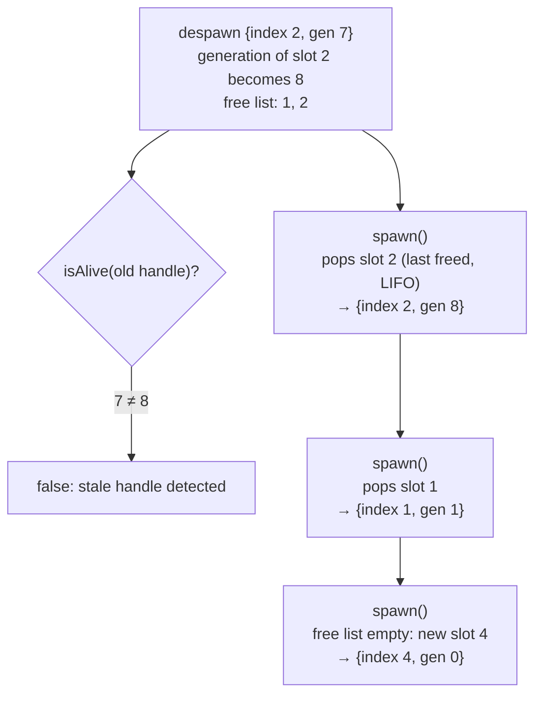

# 01 · Entity

## What it is

An entity is **an identifier, nothing else**. It has no data and no behavior: what an entity *is*
comes entirely from the components attached to it. A player ship is an entity with `Transform`,
`SpriteRenderer`, `Health` and `Player`; a bullet is an entity with `Transform`, `Velocity` and
`Bullet`.

The **entity allocator** hands out these identifiers, takes them back when entities are destroyed,
and recycles them.

## Why we need it

Every other feature refers to entities: pools store them, queries return them, commands create them,
scripts hold them, the network maps them.

- **R2 (Luau):** scripts keep entities across frames. They must be able to tell, safely, that an
  entity they hold has been destroyed.
- **R3 (network):** entity ids are local to a process, so the network needs its own identity.
- **R4 (generic):** a cheap, plain value that any part of any game can store.

## How others do it

| ECS | Entity | Notes |
|---|---|---|
| Tutorials | Plain `uint32_t` | A destroyed id reused later silently points to a different entity. |
| EnTT | Index + version in one integer (configurable widths) | Versions detect stale handles. |
| Bevy | 32-bit index + 32-bit generation | Same idea; reserved ids for commands. |
| flecs | 64-bit id; components and relationships are entities too | Very powerful, much more complex. |
| Unity DOTS | Index + version | Same idea. |

## Our choice

**64 bits: a 32-bit index and a 32-bit generation.** The index is a slot in the world; the generation
counts how many times that slot was freed. A handle whose generation does not match its slot is
**stale**, so `isAlive()` is reliable.

Entity ids are **local to one world**. Anything that crosses a process boundary uses a `NetworkId`
component instead (see [Replication](20-replication.md)).

## How it works

### The handle

| Bits | 63 … 32 | 31 … 0 |
|---|---|---|
| Field | generation | index |

```c++
namespace rtype::ecs {
/// @brief Generational handle to an entity. Trivially copyable, 8 bytes.
class Entity {
  public:
    constexpr Entity(std::uint32_t index, std::uint32_t generation) noexcept;

    [[nodiscard]] constexpr std::uint32_t getIndex() const noexcept;
    [[nodiscard]] constexpr std::uint32_t getGeneration() const noexcept;

    friend constexpr bool operator==(Entity lhs, Entity rhs) noexcept = default;

  private:
    std::uint64_t _bits;  ///< generation << 32 | index.
};
}  // namespace rtype::ecs
```

### The allocator

The allocator keeps one generation per slot and a **free list** of released slots.

| Slot index | 0 | 1 | 2 | 3 |
|---|---|---|---|---|
| Generation | 3 | 1 | 7 | 2 |
| Alive | yes | no (free list: `1`) | yes | yes |



| Operation | What happens | Cost |
|---|---|---|
| `spawn()` | Pop the free list, or grow the slot array | O(1) |
| `despawn(e)` | Check `e` is alive, bump `generation[index]`, push the index | O(1) |
| `isAlive(e)` | `generation[e.index] == e.generation` | O(1) |

**LIFO reuse** keeps recently freed slots warm in the cache. The downside is that a slot is reused
quickly, which is exactly what the generation protects against.

### Reserving ids for commands

A system that spawns through [commands](09-commands.md) needs the new entity's id **now** (to store it
in another component), even though the entity will only be created at the next flush.
`reserve()` hands out an id without creating anything; the flush makes it alive. Later, with a parallel
scheduler, `reserve()` becomes atomic so several systems can reserve at once.

### Entity vs NetworkId vs Handle

| Type | Identifies | Scope | Safe over the network? |
|---|---|---|---|
| `rtype::ecs::Entity` | An entity | One world | No |
| `NetworkId` (component) | A replicated entity | One game session | Yes |
| `Handle<Tag>` (Ethan's, e.g. `TextureId`) | A backend resource | One renderer / audio backend | No |
| `AssetId` | An asset file | Everywhere (derived from its path) | Yes |

All three handle types use the same index + generation idea, but they stay **distinct types** so a
texture handle can never be passed where an entity is expected.

## Connections

- Used by: [Pool](04-pool.md) (dense entity array), [Queries](07-queries.md),
  [Commands](09-commands.md) (`reserve()`), [Luau bridge](19-luau-bridge.md) (scripts hold entities),
  [Replication](20-replication.md) (`NetworkId` mapping).
- Component fields of type `kEntity` (see [Component registry](02-component-registry.md)) store
  entities inside other components.

## Pitfalls

- **Using an id after despawn.** Always check `isAlive()` or go through APIs that do (`get` returns
  `nullptr` for a dead entity).
- **Entity fields pointing to dead entities.** A `Bullet{owner}` may outlive its owner. The ECS clears
  `kEntity` fields whose target dies, so they read as "no entity" rather than as a reused slot.
- **Sending entities over the network.** Each process allocates slots in its own order; send
  `NetworkId`s.
- **Generation overflow.** After 2³² despawns of the same slot the generation wraps. That is
  unreachable in practice; the slot could simply be retired if it ever happens.

## Open questions

- Should a slot be retired (never reused) when its generation reaches the maximum, or wrap? (ECS)
