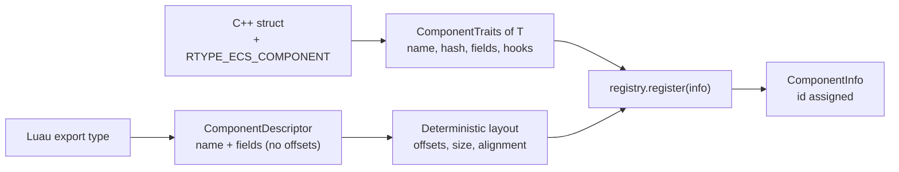

# 02 · Component Registry

## What it is

A component is **plain data** attached to an entity (`Position`, `Health`, `Shield`). The **registry**
is the catalog of every component type the world knows: for each one, its name, size, alignment, fields
and options. It gives each type a small numeric **`ComponentId`** used everywhere at runtime.

The registry is what lets the core work with components it has never seen at compile time: those
declared by Luau scripts.

## Why we need it

- **R2 (Luau):** script components only exist at runtime. The core must handle them by id and size,
  not by C++ type.
- **R3 (network):** the server and clients must agree on what each component is (name, fields, layout)
  even though their ids differ.
- **R4 (generic):** one description serves storage, queries, reflection, serialization and scripting.

Everything that stores or moves component data depends on it: [Pool](04-pool.md),
[Archetype tables](05-archetype-tables.md), [Reflection](15-reflection-and-serialization.md),
[Luau bridge](19-luau-bridge.md), [Replication](20-replication.md).

## How others do it

| ECS | Component types | Runtime definition? |
|---|---|---|
| EnTT | C++ types; ids from a per-type template counter | No |
| Bevy | Rust types; plus `ComponentDescriptor` for dynamic components | Limited |
| flecs | Every component is registered at runtime with size, alignment, hooks; `meta` adds fields | Yes, first-class |
| Unreal | `USTRUCT` reflected by the header tool; `UScriptStruct` at runtime | Yes (Blueprint structs) |
| Unity DOTS | C# structs; `TypeManager` assigns indices | No |

## Our choice

**A runtime registry (the flecs model) with a typed C++ layer on top.** Every component, from C++ or
Luau, is described by one `ComponentInfo`. The core only ever looks at `ComponentInfo`.

- **Ids are dense numbers local to a world** (0, 1, 2, ...), so they can index plain vectors.
- **Names are the stable identity** (`"rtype.Position"`, `"game.Shield"`): used by files, scripts and
  the network.

## How it works

### The description

```c++
namespace rtype::ecs {
using ComponentId = std::uint32_t;

enum class StorageKind : std::uint8_t { kSparseSet, kTable };
enum class Presence : std::uint8_t { kBoth, kServerOnly, kClientOnly };
enum class ReplicationMode : std::uint8_t { kNone, kEveryChange, kSpawnOnly };

enum class FieldType : std::uint8_t {
    kBool, kI8, kI16, kI32, kI64, kU8, kU16, kU32, kU64, kF32, kF64,
    kVec2, kVec3, kVec4, kEntity, kAssetId,
};

struct FieldInfo {
    std::string name;
    FieldType type;
    std::uint32_t offset;
    std::uint32_t count{1};  ///< Fixed array length.
};

struct ComponentInfo {
    ComponentId id;
    std::string name;
    std::size_t size;        ///< 0 for tags.
    std::size_t alignment;
    StorageKind storage;
    Presence presence;              ///< Server and clients, server only, or client only.
    ReplicationMode replication;    ///< Never sent, sent on every change, or sent once at spawn.
    ComponentHooks hooks;           ///< construct / destruct / move / copy, null when trivial
    std::vector<FieldInfo> fields;
    std::uint64_t layoutHash;
};
}  // namespace rtype::ecs
```

| Part | Used by |
|---|---|
| `size`, `alignment`, `hooks` | Storage: how to allocate, construct, move and destroy the bytes |
| `storage` | The world: which backend holds it |
| `fields` | Reflection, the Luau bridge, the serializer |
| `presence`, `replication` | Replication: what exists on which side, what is sent and how |
| `name`, `layoutHash` | Network manifest, hot reload, scene files |

### Two enums, not bit flags

`Presence` and `ReplicationMode` replace an earlier bit-flag enum (`kReplicated = 1U << 0U`,
`kServerOnly = 1U << 1U`, `kClientOnly = 1U << 2U`). The shifts cost nothing (the compiler folds them)
and these options are read per component *type*, never per entity, so speed was never the issue:

| Problem with bit flags | With two enums |
|---|---|
| Invalid combinations are representable (`kServerOnly \| kClientOnly`) | `Presence` holds exactly one value |
| One bit cannot say *how* to replicate (every change, spawn only) | `ReplicationMode` names the modes |
| `enum class` flags need hand-written `\|` / `&` operators and casts | Plain comparisons and exhaustive `switch` |

The only invalid pair left, `kClientOnly` with a replication mode other than `kNone`, is rejected at
registration. Replication's per-tick work loops over a **precomputed list of replicated component
ids** kept by the registry, so it never tests these enums per entity.

### Two ways in



**From C++**, the name and field list are written once, next to the struct:

```c++
struct Health {
    std::int32_t value;
    std::int32_t max;

    [[nodiscard]] bool isDead() const noexcept { return value <= 0; }  // pure helper: allowed
};

RTYPE_ECS_COMPONENT(Health, "rtype.Health", value, max);
```

The macro specializes `rtype::ecs::ComponentTraits<Health>`: the name, a compile-time hash of it, the
field list (names via `#field`, types and offsets via `&Health::field`) and hooks (null for trivially
copyable types).

**From Luau**, the bridge builds a `ComponentDescriptor` with names and types but **no offsets**; the
registry computes the layout (see [Luau bridge](19-luau-bridge.md)).

### Deterministic layout

The server and every client compute script layouts independently, and Luau does not guarantee table
order. So the registry sorts fields **by alignment (largest first), then by name**, and places them
in that order:

Declared as `game.Shield { strength: f32, regen: f32, owner: Entity }`, then sorted:

| Order | Field | Type | Alignment |
|---|---|---|---|
| 1 | `owner` | `Entity` (u64) | 8 |
| 2 | `regen` | `f32` | 4 (same as `strength`: ordered by name) |
| 3 | `strength` | `f32` | 4 |

Resulting layout (size 16, alignment 8):

| Bytes | 0 – 7 | 8 – 11 | 12 – 15 |
|---|---|---|---|
| Field | `owner` | `regen` | `strength` |

Sorting by alignment also minimizes padding.

### Layout hash

`layoutHash` hashes the name and every field (name, type, count). Two processes with the same hash
agree on the bytes. It is checked when a client connects ([Replication](20-replication.md)) and when a
script is hot-reloaded ([Luau bridge](19-luau-bridge.md)).

### From a C++ type to an id

The typed layer needs `ComponentId` for `T`. It looks up `ComponentTraits<T>::kHash` in the world's
`hash → id` map. Queries do it **once** when they are built; per-entity calls like `world.get<T>(e)`
do a hash-map lookup, which can be cached per world later if it ever shows in a profile.

## Connections

- Uses: nothing; it is a foundation.
- Used by: [Pool](04-pool.md), [Archetype tables](05-archetype-tables.md), [World](06-world.md),
  [Reflection](15-reflection-and-serialization.md), [Hooks](16-hooks-and-observers.md),
  [Luau bridge](19-luau-bridge.md), [Replication](20-replication.md).

## Pitfalls

- **Type ids across shared libraries.** The classic `static` counter per template gives *different*
  ids in each `.so` / `.dll` (and `rtype-ecs`, the renderer and the engine are separate binaries).
  Ids come from the world's registry, keyed by name hash, never from statics.
- **`typeid(T).name()`.** It differs between Clang and MSVC, so a Windows client and a Linux server
  would disagree. Names are always explicit.
- **Same name, different layout.** Registering an existing name succeeds only if the `layoutHash`
  matches (needed for hot reload); otherwise it is an error.
- **Logic in components.** Only pure `const` helpers are allowed. The macro can
  `static_assert(std::is_aggregate_v<T>)` to block constructors and private members.

## Open questions

- Should C++ components move to C++26 reflection once Clang, Apple Clang and MSVC all support it?
  (ECS, later)
- Strings in components: an interned `kStringId` field type? (ECS + Charles)
