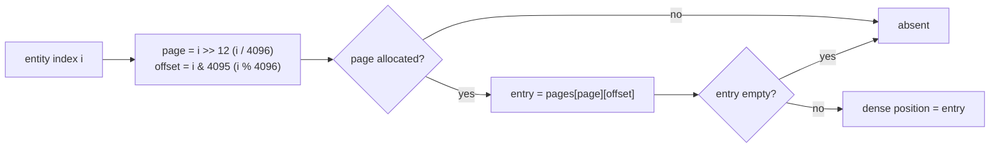

# 03 · Sparse Array

## What it is

The sparse array answers one question very fast: **"where is entity N's data in this pool?"** It maps
an entity's *index* to a position in the pool's packed (dense) arrays. It is "sparse" because most of
its slots are empty: a component like `Boss` exists on one entity out of thousands.

Each [pool](04-pool.md) owns one sparse array.

## Why we need it

- **Fast lookups:** `world.get<Health>(e)`, `contains`, and the joins inside [queries](07-queries.md)
  all start with a sparse-array lookup.
- **R2 / R4:** Luau games can declare many component types. A naive sparse array per type would cost
  memory proportional to *the highest entity index* for *every* type. Paging keeps that cost tied to
  where entities actually are.

## How others do it

| ECS | Entity → data lookup |
|---|---|
| EnTT | Paged sparse arrays inside each `sparse_set` (the model we follow) |
| Bevy (sparse-set components) | Sparse array per component |
| Bevy / flecs / Unity (tables) | One entity record → (table, row); no per-component sparse array |
| Tutorials | One flat array per component, sized to the maximum entity count |
| Specs | Hierarchical bitsets, plus storage-specific maps |

## Our choice

**A paged sparse array**: the index space is cut into pages of 4096 entries, and a page is allocated
only when an entity in its range gets the component. Each entry is a 32-bit dense index, or a
"none" value.

## How it works

| Entity indices | 0 – 4095 | 4096 – 8191 | 8192 – 12287 | … |
|---|---|---|---|---|
| Page | page 0 | not allocated | page 2 | … |
| Content | 4096 entries: dense position or empty | nothing | 4096 entries | … |

Lookup of entity index `i`:



Two arrays dereferenced, no hashing, no branching on hash collisions: a few nanoseconds.

### Why the generation is not stored here

The sparse array stores only the dense index. To reject a **stale** entity (same index, older
generation), the pool compares the full entity stored in its dense array:

```c++
bool contains(Entity e) {
    const std::optional<std::uint32_t> position = _sparse.get(e.getIndex());
    return position.has_value() && _dense[*position] == e;  // == compares the generation too
}
```

This keeps entries at 4 bytes and makes the dense array the single source of truth.

### Memory

| Situation | Flat array per component | Paged (4096-entry pages, 4 bytes each) |
|---|---|---|
| 200 component types, max entity index 50,000 | 200 × 50,000 × 4 B ≈ 40 MB | Only pages that contain entities: often a few pages per type, ~16 KB each |
| A component present on 1 entity | 50,000 entries | 1 page (16 KB) |

Pages are never freed while the pool lives, which avoids allocation churn when entities come and go.

### Page size

4096 entries × 4 bytes = 16 KB per page. Smaller pages waste less memory for very rare components but
add more page-table entries; 4096 is the common choice (EnTT uses the same order of magnitude). It is a
compile-time constant, easy to tune with benchmarks.

## Connections

- Uses: [Entity](01-entity.md) (the index).
- Used by: [Pool](04-pool.md), which owns one sparse array and keeps it in sync with its dense arrays.

## Pitfalls

- **Forgetting to update on swap-and-pop.** When the pool moves its last element into a hole, the
  moved entity's sparse entry must be rewritten. See [Pool](04-pool.md).
- **Trusting the entry without the generation check.** An entry only says "this index has data"; the
  dense entity comparison says whether it is *this* entity.
- **Huge entity indices.** The page table itself grows with the highest index. With LIFO reuse in the
  [allocator](01-entity.md), indices stay compact.

## Open questions

- Page size: keep 4096 or tune per component (rare vs common) after benchmarks? (ECS)
