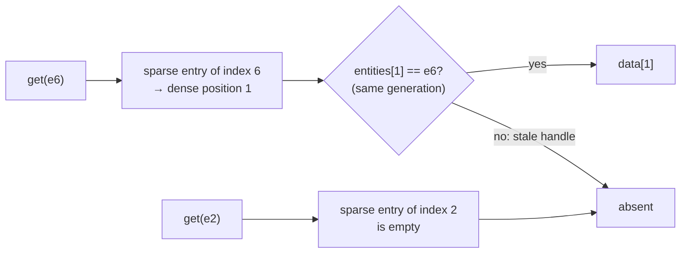
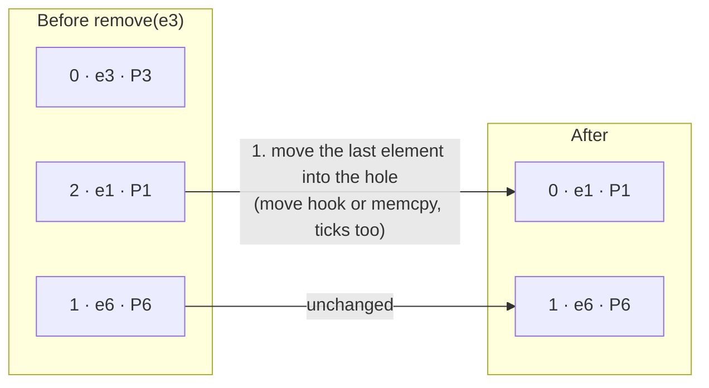

# 04 · Pool

## What it is

A pool stores **every instance of one component type**, packed together. It is the sparse-set storage
of the ECS: a [sparse array](03-sparse-array.md) to find an entity, and dense arrays holding the
entities, their component bytes and their change ticks, all in the same order.

In code it is `rtype::ecs::storage::SparseSetStorage`, built on a `ByteColumn` (a growable, aligned
array of raw bytes).

## Why we need it

- **Fast iteration:** systems walk the dense arrays linearly, which is what CPUs are fastest at.
- **Cheap structural changes:** adding or removing a component is O(1). R-Type adds and removes
  constantly (bullets, tags like `Invincible`, script components).
- **R2 (Luau):** the pool stores **raw bytes** described by a [`ComponentInfo`](02-component-registry.md),
  so it works for components that have no C++ type.
- **R3 (network):** the tick columns are what [change detection](08-change-detection.md) and
  replication read.

## How others do it

| ECS | Per-component storage |
|---|---|
| EnTT | `basic_storage`: sparse set + packed components, typed (templates) |
| Bevy | `ComponentSparseSet` for sparse components, type-erased (`BlobVec`), with tick columns |
| flecs | Columns inside archetype tables; sparse storage option in recent versions |
| Unity / Unreal Mass | Columns inside chunks |

## Our choice

**A type-erased sparse set with tick columns**, like Bevy's `ComponentSparseSet`. One pool per
component of storage kind `kSparseSet` (every component in v1).

## How it works

### Layout

Example: a `Position` pool holding `e3`, `e6` and `e1`.

**Sparse array** (page 0; later pages not allocated), indexed by entity index:

| Entity index | 0 | 1 | 2 | 3 | 4 | 5 | 6 |
|---|---|---|---|---|---|---|---|
| Dense position | – | 2 | – | 0 | – | – | 1 |

**Dense arrays**, packed and in the same order:

| Dense position | 0 | 1 | 2 |
|---|---|---|---|
| Entity | `e3` | `e6` | `e1` |
| Data (`Position` bytes) | P3 | P6 | P1 |
| Added tick | 12 | 40 | 40 |
| Changed tick | 50 | 41 | 40 |



```c++
namespace rtype::ecs::storage {
/// @brief Type-erased sparse-set pool for one component.
class RTYPE_ECS_API SparseSetStorage {
  public:
    explicit SparseSetStorage(const ComponentInfo& info);

    [[nodiscard]] bool contains(Entity entity) const noexcept;
    [[nodiscard]] void* get(Entity entity) noexcept;   ///< nullptr if absent.
    void* emplace(Entity entity, Tick tick);          ///< Default-constructs, returns the bytes.
    bool remove(Entity entity) noexcept;               ///< Swap-and-pop.

    [[nodiscard]] std::span<const Entity> getEntities() const noexcept;

  private:
    const ComponentInfo* _info;  ///< Owned by the registry.
    PagedSparseArray _sparse;    ///< Entity index -> dense index.
    std::vector<Entity> _dense;  ///< Entities, packed.
    ByteColumn _data;            ///< Component bytes, aligned.
    std::vector<Tick> _added;    ///< When each component was added.
    std::vector<Tick> _changed;  ///< When each component was last written.
};
}  // namespace rtype::ecs::storage
```

### The byte column

`ByteColumn` is a `std::vector`-like buffer of `size × count` bytes, allocated with the component's
alignment. It never knows the C++ type; it calls the [hooks](16-hooks-and-observers.md) from
`ComponentInfo` when it must construct, move or destroy elements, or uses `memcpy` / nothing when the
hooks are null (plain data, and every Luau component).

### Operations

**emplace(e):**

1. Append `e` to the dense entity array.
2. Grow the data column by one element: `construct` hook, or zero-fill when it is null.
3. Append the current tick to the added and changed tick arrays.
4. Set the sparse entry of `e`'s index to the new dense position (`size - 1`).

**remove(e)**, swap-and-pop:



2. Update the moved entity's sparse entry: index 1 → position 0.
3. Clear the removed entity's sparse entry: index 3 → empty.
4. Pop the back of every array, destroying the old last element if it has a `destruct` hook.

| Operation | Cost |
|---|---|
| `contains`, `get` | O(1): one sparse lookup + one comparison |
| `emplace` | Amortized O(1) (vector growth) |
| `remove` | O(1): one move + pops |
| Iterate | Linear over `getEntities()` and the data column |

### Tags

A tag (`size == 0`, e.g. `Dead`) has **no data column**: its pool is only the entity set and the
ticks. Tags are therefore almost free, which encourages using them for states.

### Iteration order

The dense order is the insertion order, disturbed by swap-and-pop. It is **not** stable and not
meaningful; systems that need an order (draw layers) sort explicitly.

## Connections

- Uses: [Entity](01-entity.md), [Component registry](02-component-registry.md) (size, alignment,
  hooks), [Sparse array](03-sparse-array.md), [Hooks](16-hooks-and-observers.md).
- Used by: [World](06-world.md) (one pool per sparse-set component), [Queries](07-queries.md) (driver
  pool and `contains` checks), [Change detection](08-change-detection.md) (tick columns),
  [Replication](20-replication.md) (scans changed ticks per pool).

## Pitfalls

- **Pointer and reference invalidation.** `emplace` can reallocate the column; `remove` moves the last
  element. Never keep a `T*` or `T&` across structural changes. This is why structural changes inside
  systems go through [commands](09-commands.md), and why scripts hold entities, not pointers.
- **Forgetting a parallel array.** Every operation must update entities, data, both tick arrays and the
  sparse entry together; keep them behind one function each.
- **Alignment.** A `ByteColumn` of `glm::vec4`s must be 16-byte aligned; allocate with the component's
  alignment, not `alignof(std::max_align_t)`.

## Open questions

- Shrink policy: never shrink, or shrink when a pool drops below a quarter of its capacity? (ECS)
