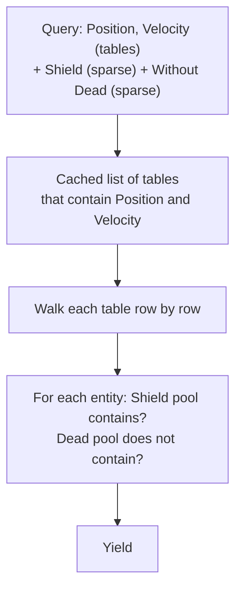

# 05 · Archetype Tables (v3)

## What it is

An alternative storage for components that are **stable and read together** (`Transform`, `Velocity`,
`SpriteRenderer`). Instead of one [pool](04-pool.md) per component, entities that have exactly the
same set of table components share a **table**, with one column per component. Iterating a query over
those components walks the columns in lockstep, perfectly linearly.

This is a v3 feature. v1 accepts `StorageKind::kTable` on a component but stores it in a sparse set.

## Why we need it

- **R4 (generic):** other games may have tens of thousands of entities with stable composition (crowds,
  particles, tiles), where tables iterate faster than sparse-set joins.
- R-Type itself does not need it: its counts are moderate and its composition changes often.

## How others do it

| ECS | Model |
|---|---|
| Unity DOTS | Archetypes split into 16 KB chunks |
| Unreal Mass | Archetypes in chunks; shared and chunk fragments |
| flecs | Archetype tables, a graph of add/remove edges between tables, cached queries |
| Bevy | Tables for components by default, sparse sets as a per-component option |
| EnTT | No archetypes; *groups* reorder pools to get similar contiguity |

## Our choice

**Per-component choice, like Bevy.** Each component's `ComponentInfo::storage` says `kTable` or
`kSparseSet`. Only `kTable` components define an entity's archetype; sparse-set components (tags,
states, most script components) never move it between tables.

## How it works

### Tables

```
table {Position, Velocity}                   table {Position, Velocity, Sprite}
┌────────┬──────────┬──────────┐             ┌────────┬──────────┬──────────┬────────┐
│ entity │ Position │ Velocity │             │ entity │ Position │ Velocity │ Sprite │
├────────┼──────────┼──────────┤             ├────────┼──────────┼──────────┼────────┤
│ e4     │ ...      │ ...      │             │ e2     │ ...      │ ...      │ ...    │
│ e7     │ ...      │ ...      │   add       │ e9     │ moved    │ moved    │ new    │
│ e9 ────┼──────────┼──────────┼─ Sprite ──▶ └────────┴──────────┴──────────┴────────┘
└────────┴──────────┴──────────┘   to e9: its whole row moves to the other table
```

Each column is a `ByteColumn` with its tick arrays, the same building block as a pool.

### Entity records

Each entity slot records where its table data is:

```c++
struct EntityRecord {
    std::uint32_t generation;
    TableId table;      ///< The empty table when the entity has no table component.
    std::uint32_t row;
};
```

### Adding or removing a table component

1. Find the destination table (the current set ± the component). An **edge cache** on each table
   (`add Sprite → table 7`) avoids recomputing the set every time, as flecs does.
2. Move the entity's row: each shared column moves its element; the new column constructs, or the
   removed column destroys.
3. Swap-and-pop the hole in the source table, and update the record of the entity that moved into it.
4. Update the entity's record.

Cost: one move per table component of the entity, which is why frequently toggled components stay in
sparse sets.

### Queries over mixed storage



When a new table is created, every cached query checks once whether it matches and adds it to its list.

### Why sparse components stay out of the archetype

If tags were part of the archetype, every combination of `Invincible`, `Charging`, `Stunned`,
`OnFire`... would create its own table, splitting entities into many small tables (**fragmentation**)
and moving rows on every toggle. Keeping them in sparse sets makes toggling free and keeps tables big.

## Connections

- Uses: [Component registry](02-component-registry.md) (`storage` kind), the `ByteColumn` from
  [Pool](04-pool.md), [Entity](01-entity.md) (records per slot).
- Used by: [World](06-world.md), [Queries](07-queries.md).

## Pitfalls

- **Choosing `kTable` for a component that is added and removed often.** Every toggle moves a row.
- **Query caches going stale.** New tables must be offered to existing queries.
- **Changing storage kind later.** It must not change behavior, only performance, which is guaranteed
  because nothing outside the storage sees pools or tables.

## Open questions

- Default storage for C++ components once tables exist: `kTable` (Bevy's default) or `kSparseSet`? (ECS)
- Chunked tables (Unity-style 16 KB chunks) for parallel iteration, or whole tables? (ECS, v3)
