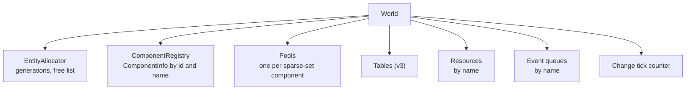

# 06 · World

## What it is

The world is **the container of a simulation**. It owns the entities, the component registry, every
storage, the resources, the event queues and the change-tick counter. Every other feature works *on* a
world.

## Why we need it

- **R3 (network):** a listen server runs a server world and a client world in the same process; a
  dedicated server runs **one world per game room**.
- **R4 (generic):** tests, editors and tools create worlds freely, independent of any engine.
- **R2 (Luau):** the bridge needs one object to call, by id, for everything.

## How others do it

| ECS | Container | Several per process? |
|---|---|---|
| EnTT | `entt::registry` (+ context variables for singletons) | Yes |
| Bevy | `World` (+ sub-apps with their own worlds, e.g. the render world) | Yes |
| flecs | `ecs_world_t` (+ stages for multithreading) | Yes |
| Unity DOTS | `World` | Yes |

## Our choice

A `World` class with **two API surfaces** over the same data:

- **Typed** (templates): convenient and checked at compile time, for C++ code.
- **Type-erased** (by `ComponentId`, `noexcept`, failure by return value): for the Luau bridge, the
  serializer and the network.

Several worlds can exist at once. Each has its own registry, so **ids are per world**; names are shared
across worlds and processes.

## How it works

### What it owns



The [scheduler](13-scheduler.md) and the systems are owned by the [App](14-app-and-plugins.md), not
the world: a world is pure data plus the operations on it, which keeps it easy to create in tests.

### Typed and type-erased

```c++
rtype::ecs::World world;

// Typed
const rtype::ecs::Entity ship = world.spawn();
world.add(ship, Position{.x = 10.F, .y = 20.F});
if (const Position* position = world.get<Position>(ship); position != nullptr) {
    // ...
}

// Type-erased (what the Luau bridge and the replication plugin use)
const std::optional<rtype::ecs::ComponentId> id = world.findComponent("rtype.Position");
const bool added = world.add(ship, *id, &bytes);   // false if the entity is dead or the id unknown
const void* raw = world.get(ship, *id);            // nullptr if absent
```

| Operation | Typed | Type-erased |
|---|---|---|
| Spawn / despawn | `spawn()`, `despawn(e)` | same |
| Add / remove | `add<T>(e, value)`, `remove<T>(e)` | `add(e, id, bytes)`, `remove(e, id)` |
| Read | `get<T>(e)` → `const T*` | `get(e, id)` → `const void*` |
| Write | `getMut<T>(e)` → `Mut<T>` | `getMut(e, id)` → `void*` (marks changed) |
| Register | `component<T>()` | `registerComponent(descriptor)` |

Typed calls are thin wrappers that resolve `T` to an id and forward to the type-erased path, so there is
one implementation to test.

### Despawning

`despawn(e)` removes `e` from every pool (and its table row in v3), bumps the slot's generation, and
clears `kEntity` fields that pointed to it. To avoid scanning every pool, the world can keep a small
per-entity list of the pools it is in; that is an implementation detail to settle with benchmarks.

### Several worlds

| Situation | Worlds |
|---|---|
| Dedicated server | One per game room, plus a lobby world |
| Client | One |
| Listen server / local test | A server world and a client world, connected by an in-memory transport |
| Unit tests | As many as needed, created and destroyed per test |

Worlds never share entities or ids. They communicate only through the network layer (or its in-memory
version).

## Connections

- Uses: [Entity](01-entity.md), [Component registry](02-component-registry.md), [Pool](04-pool.md),
  [Archetype tables](05-archetype-tables.md).
- Used by: [Queries](07-queries.md), [Commands](09-commands.md), [Resources](10-resources.md),
  [Events](11-events.md), [App](14-app-and-plugins.md), [Luau bridge](19-luau-bridge.md),
  [Replication](20-replication.md).

## Pitfalls

- **Mixing ids between worlds.** `ComponentId` 5 in the server world is not 5 in the client world. Cross
  worlds by name only.
- **Structural changes during iteration.** Calling `world.add` / `despawn` while a query iterates the
  same pool invalidates it. Inside systems, use [commands](09-commands.md).
- **Global state.** The world must not rely on statics (see the DLL pitfall in
  [Component registry](02-component-registry.md)); everything lives in the world instance.

## Open questions

- Per-entity "pools I am in" list, or scan all pools on despawn? Decide with benchmarks. (ECS)
