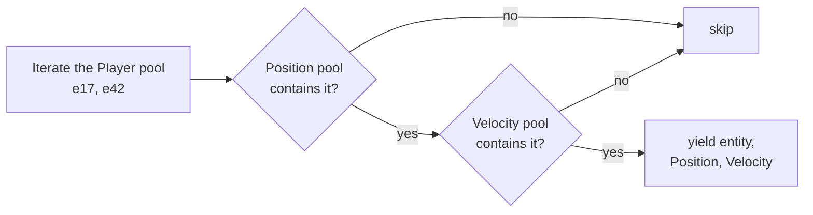

# 07 · Queries

## What it is

A query is **"every entity that has these components and matches these filters, with access to their
data"**. It is how systems find the entities they work on: "all entities with `Position` and
`Velocity`", "all enemies that are not `Dead`".

## Why we need it

Queries are the main way systems read and write the world.

- **R2 (Luau):** scripts cannot name C++ types, so queries must also work with `ComponentId`s
  (**dynamic queries**).
- **R3 (network):** `Changed<T>` filters let replication find what changed.
- **R4 (generic):** the query is the boundary that hides storage, so sparse sets and tables can coexist.

## How others do it

| ECS | Query style |
|---|---|
| EnTT | `registry.view<A, B>(entt::exclude<C>)`; groups for faster combinations |
| Bevy | `Query<(&mut A, &B), (With<C>, Without<D>, Changed<A>)>` as a system parameter |
| flecs | Query builder and a query language with variables, relationships, optional terms |
| Unity DOTS | `SystemAPI.Query<RefRW<A>, RefRO<B>>().WithNone<C>()` |

## Our choice

- **Typed queries** for C++, Bevy-style: non-`const` components are written, `const` ones are read.
- **Dynamic queries** for Luau and tools, built from ids.
- **One engine underneath:** typed queries compile down to a dynamic query, so there is one iteration
  algorithm to test and optimize.

## How it works

### Typed

```c++
void movement(rtype::ecs::Query<Position, const Velocity> query, rtype::ecs::Res<Time> time) {
    for (auto [entity, position, velocity] : query) {
        position->x += velocity.x * time->fixedDelta;  // Mut<Position>: writing marks it changed
        position->y += velocity.y * time->fixedDelta;
    }
}

void cleanup(rtype::ecs::Query<const Transform, rtype::ecs::With<Enemy>, rtype::ecs::Without<Dead>> query,
             rtype::ecs::Commands& commands);
```

| Term | Meaning | Yields |
|---|---|---|
| `T` | required, written | `Mut<T>` (see [Change detection](08-change-detection.md)) |
| `const T` | required, read | `const T&` |
| `Optional<T>` | may be absent | `const T*` / `Mut<T>` that may be empty |
| `With<T>` / `Without<T>` | presence / absence, no access | nothing |
| `Added<T>` / `Changed<T>` | added / written since this system last ran | nothing |

### Dynamic

```c++
rtype::ecs::DynamicQuery query = world.queryBuilder()
    .write(shieldId)
    .read(positionId)
    .without(deadId)
    .build();

query.each([](rtype::ecs::Entity entity, std::span<void* const> components) {
    // components[0] -> game.Shield bytes, components[1] -> rtype.Position bytes
});
```

The [Luau bridge](19-luau-bridge.md) wraps this so a script iterates `for entity, shield, position in
ctx.query do`.

### The join: smallest pool first

Example: `Query<Position, const Velocity, With<Player>>`.

| Pool | Entities | Role |
|---|---|---|
| `Position` | 1200 | checked with `contains` |
| `Velocity` | 900 | checked with `contains` |
| `Player` | 2 (`e17`, `e42`) | **driver**: 2 iterations instead of 1200 |



1. Among the **required** components, pick the pool with the fewest entities: the **driver**.
2. Iterate the driver's dense entity array.
3. For each entity, check the other required pools (`contains`), the `Without` pools (must not contain),
   and the tick filters.
4. Yield the entity and pointers to its components.

`Without`, `Optional` and filters never drive iteration. A query with no required component (only
`Optional`) is rejected: it would mean "every entity".

With [archetype tables](05-archetype-tables.md) (v3), table components are matched by walking the cached
list of matching tables, and sparse components are checked per entity.

### Building once

Resolving `T` to ids, checking access conflicts and (v3) matching tables happen **when the query is
built**, which for a system is when it is registered. Per frame, only the iteration runs.

### Access and conflicts

A query's access set (reads and writes per component) is what the [scheduler](13-scheduler.md) uses to
order systems, and later to run disjoint ones in parallel. Two terms that write the same component in
one query are rejected at build time.

## Connections

- Uses: [World](06-world.md), [Pool](04-pool.md), [Archetype tables](05-archetype-tables.md),
  [Change detection](08-change-detection.md).
- Used by: [Systems](12-systems.md), [Luau bridge](19-luau-bridge.md), [Replication](20-replication.md)
  (dynamic queries over replicated components).

## Pitfalls

- **Structural changes while iterating.** Adding or removing components of a pool being iterated moves
  elements under the iterator. Use [commands](09-commands.md).
- **Assuming an order.** Iteration follows the driver pool's dense order, which changes with
  swap-and-pop. Sort explicitly when order matters (draw layers).
- **Writing through a read-only term.** `const T` gives `const T&`; for Luau the bridge enforces it by
  refusing writes to components declared as `read`.
- **Marking everything changed.** Iterating `Query<Position>` without writing must not stamp ticks;
  `Mut<T>` only stamps on mutable access.

## Open questions

- EnTT-style groups (keeping two pools aligned) for very hot pairs, before v3 tables exist? Only if
  benchmarks ask for it. (ECS)
