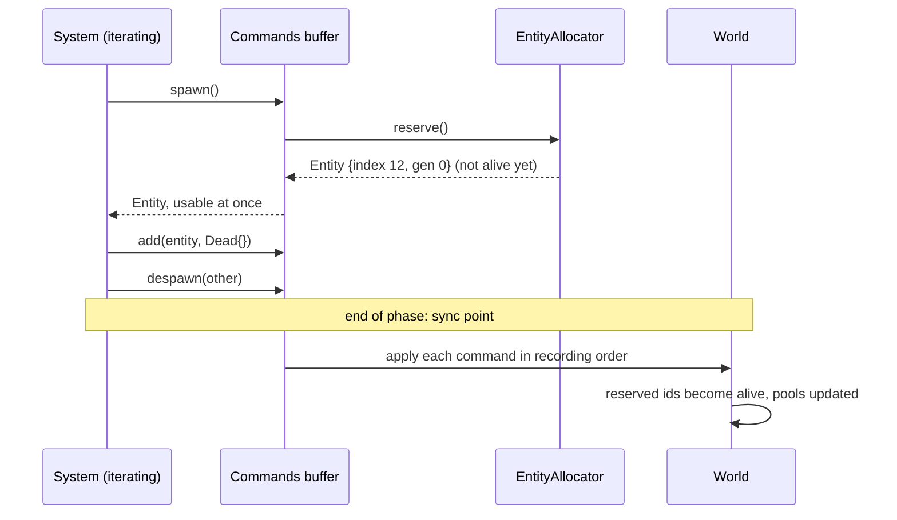

# 09 · Commands

## What it is

Commands are **structural changes recorded now and applied later**: spawn, despawn, add a component,
remove a component. A system writes them into a buffer while it iterates; the buffer is applied at the
next **sync point**, between phases.

## Why we need it

A system iterating `Query<Position, Health>` that despawns a dead enemy would, if applied immediately,
swap-and-pop the very pools it is walking (see [Pool](04-pool.md)). Deferring the change keeps
iteration safe.

- **R2 (Luau):** scripts spawn bullets, enemies and effects from inside their systems.
- **R4 (generic):** the same rule applies to every game: read and write data freely, change structure
  through commands.

## How others do it

| ECS | Mechanism |
|---|---|
| Bevy | `Commands` system parameter, applied at sync points; entity ids reserved immediately |
| flecs | Deferred mode: operations inside systems are queued and merged after the system |
| Unity DOTS | `EntityCommandBuffer`, played back at a chosen system group |
| Unreal Mass | `FMassCommandBuffer`, flushed by the processing phase |
| EnTT | No built-in buffer; changes are immediate (users write their own) |

## Our choice

A `Commands` buffer given to each system that asks for it, **flushed in recording order at the end of
each phase**. `spawn()` returns a **reserved** entity right away.

## How it works

```c++
void shoot(rtype::ecs::Query<const Transform, const Weapon, const PlayerInput> players,
           rtype::ecs::Commands& commands) {
    for (auto [entity, transform, weapon, input] : players) {
        if (input.isHeld(Action::kFire)) {
            commands.spawn()
                .add(Transform{.position = transform.position + glm::vec2{16.F, 0.F}})
                .add(Velocity{.value = {weapon.bulletSpeed, 0.F}})
                .add(Bullet{.owner = entity});
        }
    }
}

void killDead(rtype::ecs::Query<const Health, rtype::ecs::Without<Dead>> query, rtype::ecs::Commands& commands) {
    for (auto [entity, health] : query) {
        if (health.isDead()) {
            commands.add(entity, Dead{});
            commands.despawnAfter(entity, 0.5F);  // a helper that adds a timer component
        }
    }
}
```



### Rules

- **Order is preserved.** `add(e, A)` then `remove(e, A)` leaves `e` without `A`.
- **Commands on dead entities are skipped**, not errors: a bullet may have been despawned by another
  system earlier in the same flush.
- **Values are moved into the buffer** (type-erased bytes + `ComponentId`), so the buffer can be applied
  without knowing C++ types; Luau commands use the same path.
- **Flush points:** after each phase (see [Scheduler](13-scheduler.md)), and on demand in tests. A
  system cannot see its own commands' effects until the next phase.

### From Luau

```luau
function WaveSpawner:run(ctx)
    local enemy = ctx.commands:spawnPrefab("game.Bydo")
    ctx.commands:add(enemy, "game.Shield", { strength = 20 })
end
```

## Connections

- Uses: [Entity](01-entity.md) (`reserve()`), [World](06-world.md), [Component registry](02-component-registry.md)
  (ids, sizes, hooks).
- Used by: [Systems](12-systems.md), [Scheduler](13-scheduler.md) (flush points),
  [Prefabs](18-prefabs-and-scenes.md) (`spawnPrefab`), [Luau bridge](19-luau-bridge.md),
  [Replication](20-replication.md) (applying received spawns and despawns on the client).

## Pitfalls

- **Expecting immediate effects.** A system that spawns then queries in the same run will not find the
  new entity. That is by design; split the work across phases if needed.
- **Unbounded buffers.** A buggy system spawning every frame fills memory quickly; debug builds can warn
  above a threshold.
- **Reserved but never applied.** If a buffer is discarded (an error in a Luau system), its reserved ids
  must be returned to the allocator.

## Open questions

- Flush only between phases, or also allow explicit sync points inside a phase (Bevy's
  `apply_deferred`)? (ECS)
