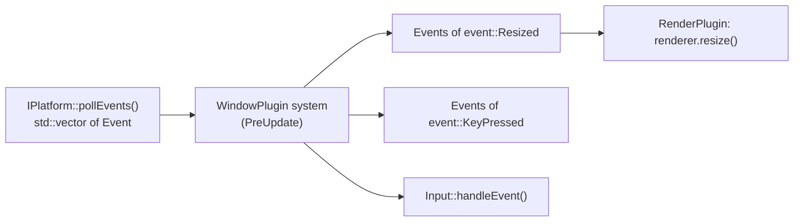

# 11 · Events

## What it is

Events are **typed messages between systems that do not know each other**: "these two entities
collided", "the window was resized", "a client connected". A system writes events into a queue; other
systems read them later in the same frame or the next.

## Why we need it

- **Decoupling (R4):** the collision system does not need to know about damage, sound or score; each
  listener reads `Collision` events.
- **R1:** platform events (Ethan's `Event` variant) enter the ECS as events.
- **R2:** Luau declares and sends its own events (`game.BossDefeated`).
- **R3:** the network plugins announce `ClientConnected` / `ClientDisconnected` as events.

## How others do it

| ECS | Mechanism |
|---|---|
| Bevy | `Events<T>` resource, double-buffered; `EventWriter<T>` / `EventReader<T>` with per-reader cursors |
| Bevy / flecs | Observers and triggers: callbacks run immediately when an event fires |
| EnTT | `entt::dispatcher` (queued or immediate) |
| Unity DOTS | No built-in events; usually entities or buffers used as messages |

## Our choice

**Double-buffered queues, as Bevy does.** Observers (immediate callbacks) are left for later, see
[Hooks and observers](16-hooks-and-observers.md): queued events keep all logic inside scheduled systems,
in a predictable order.

## How it works

### Double buffering

```
frame N    : writers push into buffer B          readers see A (from N-1) + B (so far)
end of N   : swap -> A is dropped, B becomes the "previous" buffer
frame N+1  : writers push into the new buffer    readers see B + new
```

An event is therefore readable **during the frame it was sent and the next one**, then dropped. Each
reader keeps a **cursor**, so it sees each event exactly once even if it runs before the writer in one
frame and after it in the next.

```c++
struct Collision {
    rtype::ecs::Entity a;
    rtype::ecs::Entity b;
};

void detectCollisions(/* queries... */ rtype::ecs::EventWriter<Collision> collisions) {
    collisions.send({.a = bullet, .b = enemy});
}

void applyDamage(rtype::ecs::EventReader<Collision> collisions, rtype::ecs::Query<Health> health) {
    for (const Collision& collision : collisions) {
        // ...
    }
}
```

### Platform events

Ethan's `rtype::engine::Event` is a `std::variant` of `event::Resized`, `event::KeyPressed`,
`event::Closed`... The window plugin's `PreUpdate` system calls `IPlatform::pollEvents()` and sends each
alternative to its own queue (`Events<event::Resized>`, ...). A system interested only in resizes reads
only that queue.



### From Luau

```luau
app:event("game.BossDefeated", { type = "BossDefeated" })   -- fields described by a Luau type

function BossHealth:run(ctx)
    for entity, health in ctx.query do
        if health.value <= 0 then
            ctx.events:send("game.BossDefeated", { boss = entity })
        end
    end
end
```

### Events and the network

Events are **local** to a world. Something the clients must know (an explosion to display) is either
replicated state (a short-lived entity) or an explicit network message from a plugin; events are not
replicated automatically, so gameplay never depends on whether a message arrived.

## Connections

- Uses: [World](06-world.md), [Resources](10-resources.md) (queues are stored like resources).
- Used by: [Systems](12-systems.md) (`EventReader` / `EventWriter` in access sets),
  [App and plugins](14-app-and-plugins.md) (platform events), [Luau bridge](19-luau-bridge.md),
  [Replication](20-replication.md) (connection events).

## Pitfalls

- **Reading too late.** A system that runs only every few frames (a run condition) misses events older
  than two frames.
- **Using events for state.** "Is the boss dead?" is state (a component or resource); "the boss just
  died" is an event.
- **Order between writer and reader.** If the reader runs before the writer in the same frame, it sees
  the event next frame. Order them in the [scheduler](13-scheduler.md) when one frame of delay matters.

## Open questions

- Should some events be replicated (server → clients) by the network plugin, for cosmetic effects only?
  (Team)
