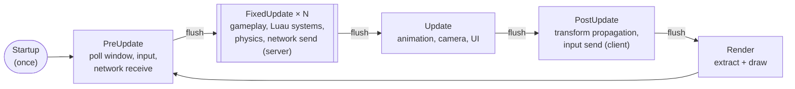
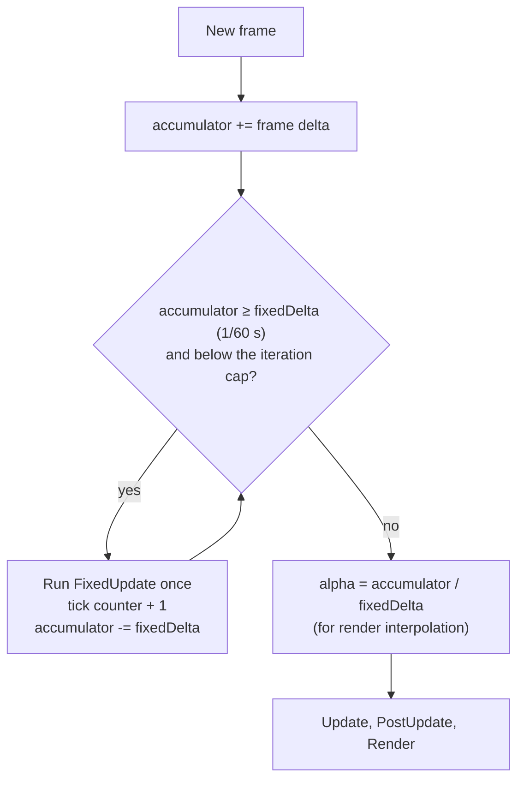
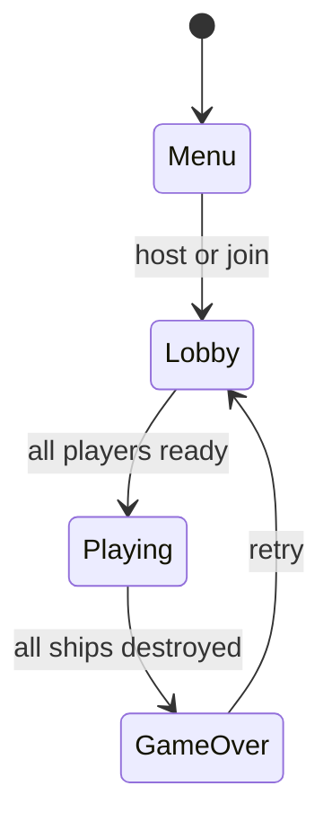

# 13 · Scheduler

## What it is

The scheduler decides **when each system runs**: in which phase of the frame, in which order inside the
phase, how many times (fixed timestep), and whether it runs at all (run conditions and game states).

## Why we need it

- **R1:** with the ECS owning the loop, the scheduler *is* the frame: poll the window, run gameplay,
  send network packets, draw.
- **R3:** the simulation must advance in **fixed ticks** (60 per second), independent of the frame rate,
  so server and clients count ticks the same way.
- **R4:** games add systems from many plugins; explicit ordering keeps that predictable.

## How others do it

| ECS | Scheduling |
|---|---|
| Bevy | Schedules (`Startup`, `PreUpdate`, `FixedUpdate`, `Update`, `PostUpdate`), system sets, `before` / `after`, run conditions, `States` with `OnEnter` / `OnExit`, automatic parallelism |
| flecs | Pipelines of phases (`OnLoad`, `PreUpdate`, `OnUpdate`, `PostUpdate`, `OnStore`), multithreading |
| Unity DOTS | System groups with `UpdateBefore` / `UpdateAfter`, fixed-step group |
| Unreal Mass | Processing phases and execution groups with ordering |

## Our choice

Bevy's model, in two steps: **phases + ordering + fixed timestep** in v1, **run conditions + States** in
v2. Sequential execution first; access sets are recorded from the start so a parallel version can come
later.

## How it works

### Phases



[Commands](09-commands.md) are flushed after each phase. The dedicated server runs only `PreUpdate`,
`FixedUpdate` and `PostUpdate`.

### Fixed timestep



A slow frame runs `FixedUpdate` several times; a fast one may run it zero times. A cap on iterations per
frame avoids the "spiral of death" when the machine cannot keep up.

### Ordering inside a phase

```c++
app.addSystem(rtype::ecs::Phase::kFixedUpdate, "rtype.movement", &movement);
app.addSystem(rtype::ecs::Phase::kFixedUpdate, "rtype.collision", &detectCollisions).after("rtype.movement");
app.addSystem(rtype::ecs::Phase::kFixedUpdate, "rtype.damage", &applyDamage).after("rtype.collision");
```

When the schedule is built, `before` / `after` constraints become a graph that is sorted
topologically:

- a **cycle** is an error, reported with the names of the systems involved;
- an `after` naming an unknown system is an error;
- two systems with **conflicting access** (both write `Health`) and **no order** between them are
  reported as ambiguous, because their result would depend on registration order.

### Run conditions (v2)

```c++
app.addSystem(rtype::ecs::Phase::kFixedUpdate, "game.spawnWaves", &spawnWaves)
    .runIf(&rtype::ecs::inState<GamePhase::kPlaying>);
```

A run condition is a small read-only function evaluated before the system; if it returns false the
system is skipped (its `lastRun` does not move).

### States (v2)

A `State<T>` resource holds the current value of a game-flow enum; changing it runs the `OnExit` systems
of the old value and the `OnEnter` systems of the new one, at a defined point of the frame.



```luau
app:state("game.Phase", { "Menu", "Lobby", "Playing", "GameOver" })

local SpawnFirstWave = ecs.system("game.SpawnFirstWave", { onEnter = { "game.Phase", "Playing" } })
```

On the server, each room's world has its own state, which is how lobby → game → game over is handled
per room.

### Parallelism (later)

Each system's access set (reads/writes per component and resource, main-thread flag) is known. A
parallel scheduler can run systems of the same phase concurrently when their access sets do not conflict
and no ordering constraint links them. Nothing in the systems changes.

## Connections

- Uses: [Systems](12-systems.md) (access sets, sides), [Commands](09-commands.md) (flushes),
  [Resources](10-resources.md) (`Time`, `State<T>`, main-thread flags).
- Used by: [App and plugins](14-app-and-plugins.md) (owns the schedule and runs it).

## Pitfalls

- **Gameplay in `Update`.** Anything that affects the simulation belongs in `FixedUpdate`; `Update` runs
  at the frame rate, which differs per machine.
- **Implicit order.** Relying on registration order works until a plugin is added. Declare `after`.
- **Too many phases.** Prefer ordering inside a phase over inventing new phases.

## Open questions

- Fixed tick rate for R-Type: 60 Hz, or 30 Hz to halve network traffic? (Team)
- Maximum `FixedUpdate` iterations per frame before dropping time. (ECS)
