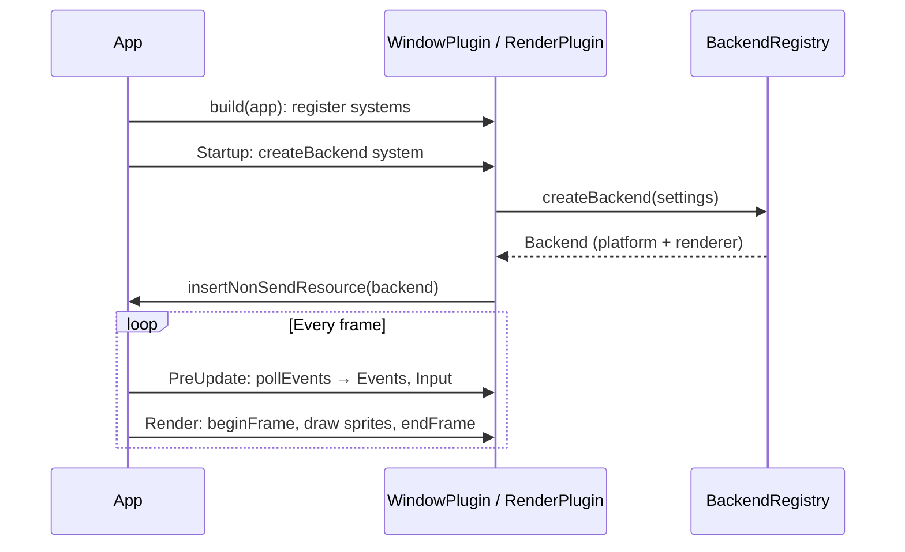

# 14 · App and Plugins

## What it is

The **App** is the entry point of a game: it owns the [world](06-world.md), the
[schedule](13-scheduler.md) and the main loop. A **plugin** is a reusable bundle that registers
components, resources, events, systems and other plugins into the App. A game is an App plus a list of
plugins.

## Why we need it

- **R1:** this is the Bevy-style engine: window, input, rendering, audio, assets, scripting and
  networking are each a plugin.
- **R2:** games are written as **Luau plugins** whenever possible.
- **R3:** a client and a dedicated server are the same game plugins with different engine plugins.
- **R4:** plugins are the unit of reuse between games.

## How others do it

| ECS / engine | Mechanism |
|---|---|
| Bevy | `App` + `Plugin` trait + plugin groups (`DefaultPlugins`, `MinimalPlugins`); sub-apps for rendering |
| flecs | Modules (`world.import<Module>()`) |
| Unreal | Modules + subsystems; Mass processors registered by modules |
| Godot / Unity | Not ECS-based: scenes and scripts, with editor-driven composition |

## Our choice

Bevy's model: `rtype::ecs::App`, `rtype::ecs::Plugin`, and plugin groups. Plus two things specific to
us: **Luau plugins** loaded through `LuauPlugin`, and a **standalone mode** that runs server and client
sides in one App.

## How it works

### The plugin interface

```c++
namespace rtype::ecs {
/// @brief A reusable bundle of components, resources, events and systems.
class RTYPE_ECS_API Plugin {
  public:
    virtual ~Plugin() = default;
    // copy/move deleted, see CLAUDE.md

    [[nodiscard]] virtual std::string_view getName() const noexcept = 0;
    virtual void build(App& app) = 0;
};
}  // namespace rtype::ecs
```

`build` registers things; it does not run gameplay. Adding the same plugin twice is ignored (by name),
so plugins can safely depend on each other (`RenderPlugin` adds `WindowPlugin` if missing).

### Three ways to start

```c++
// Client
app.addPlugins(rtype::engine::plugins::DefaultPlugins{})   // window, input, render, audio, assets, script
    .addPlugin(rtype::engine::plugins::ClientPlugin{"127.0.0.1", 4242})
    .addPlugin(rtype::engine::plugins::LuauPlugin{"scripts/rtype/plugin.luau"})
    .run();

// Dedicated server (headless)
app.addPlugins(rtype::engine::plugins::MinimalPlugins{})   // time, assets metadata, script
    .addPlugin(rtype::engine::plugins::ServerPlugin{4242})
    .addPlugin(rtype::engine::plugins::LuauPlugin{"scripts/rtype/plugin.luau"})
    .run();

// Standalone (single player, tests)
app.addPlugins(rtype::engine::plugins::DefaultPlugins{})
    .addPlugin(rtype::engine::plugins::StandalonePlugin{})
    .addPlugin(rtype::engine::plugins::LuauPlugin{"scripts/rtype/plugin.luau"})
    .run();
```

The game plugin is **the same file in all three**.

### Standalone mode

Single player should not require running a server. `StandalonePlugin` makes one App run **both
sides**: server systems (gameplay) and client systems (presentation) in the same world, with
`PlayerInput` filled directly from local input instead of from the network. Because gameplay reads
`PlayerInput` and never the keyboard, nothing in the game changes.

| Mode | Server systems | Client systems | `PlayerInput` comes from |
|---|---|---|---|
| Client | no | yes | local input → sent to the server |
| Server | yes | no | the network |
| Standalone | yes | yes | local input, directly |

### Default plugin groups

| Group | Plugins |
|---|---|
| `MinimalPlugins` | `TimePlugin`, `AssetPlugin` (metadata only), `ScriptPlugin` |
| `DefaultPlugins` | `MinimalPlugins` + `WindowPlugin`, `InputPlugin`, `RenderPlugin`, `AudioPlugin`, `TransformPlugin`, `HierarchyPlugin` |
| Opt-in | `ClientPlugin`, `ServerPlugin`, `StandalonePlugin`, `CollisionPlugin` |

### Wiring Ethan's backends

`WindowPlugin` and `RenderPlugin` reuse `BackendRegistry` unchanged: a `Startup` system reads the
`Settings` resource, calls `registry.createBackend(settings)` (which keeps the `prepare → init → init`
order) and inserts the resulting `Backend` as a [main-thread resource](10-resources.md).



### Luau plugins

`LuauPlugin` is a C++ plugin that loads a Luau plugin file and forwards its registrations to the App
(see [Luau bridge](19-luau-bridge.md)):

```luau
local RtypePlugin = ecs.plugin("rtype.Game")

function RtypePlugin:build(app)
    app:load("components/Shield.luau")
    app:load("systems/ShieldRegen.luau")
    app:addPlugin("scripts/rtype/weapons/plugin.luau")
    app:prefab("game.Bydo", { --[[ ... ]] })
end

return RtypePlugin
```

A C++ game plugin is added beside it when part of the game needs native speed
(`rtype::game::CollisionPlugin`).

### The loop

`app.run()` runs `Startup` once, then repeats the phases until a system requests exit (the window
plugin does so on `event::Closed`; the server on a signal). With several worlds (server rooms), the App
runs each world's schedule in turn.

## Connections

- Uses: [World](06-world.md), [Scheduler](13-scheduler.md), [Resources](10-resources.md),
  [Events](11-events.md).
- Used by: every plugin, [Luau bridge](19-luau-bridge.md), [Replication](20-replication.md),
  [Hierarchy](17-hierarchy.md).

## Pitfalls

- **Doing work in `build`.** `build` only registers; loading files or opening windows belongs in
  `Startup` systems, so registration stays fast and order-independent.
- **Plugins reaching into each other.** Plugins communicate through components, resources and events,
  never by calling each other's functions.
- **Mode-specific game code.** If game code checks "am I the server?", it is in the wrong place; use
  system sides.

## Open questions

- Should rooms on the server be separate Apps (each with its own schedule) or one App with several
  worlds? (ECS + network)
- `CollisionPlugin` scope: AABB only, or circles too? (Team)
