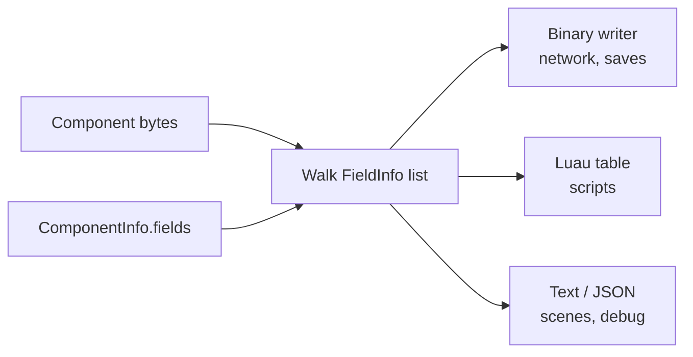

# 15 · Reflection and Serialization

## What it is

**Reflection** is knowing, at runtime, the fields of a component: their names, types and positions in
memory. **Serialization** uses that knowledge to turn component bytes into a portable form (a network
packet, a save file, a Luau table) and back.

## Why we need it

One description of the fields, many users:

| User | Needs |
|---|---|
| [Replication](20-replication.md) (R3) | Write any replicated component into a packet, compactly |
| [Luau bridge](19-luau-bridge.md) (R2) | Convert between component bytes and Luau tables; read and write single fields |
| [Prefabs and scenes](18-prefabs-and-scenes.md) | Store component values by field name |
| Debug tools (R4) | Show and edit any component in an inspector |

Without reflection, each of these would need hand-written code per component, and Luau components would
not work at all.

## How others do it

| ECS / engine | Reflection |
|---|---|
| flecs | `meta` addon: field descriptions registered at runtime; JSON serialization built in |
| Bevy | `#[derive(Reflect)]` derive macro; `bevy_reflect` serializers |
| Unreal | `UPROPERTY` macros parsed by the Unreal Header Tool; drives editor, saves, replication, Blueprint |
| EnTT | `entt::meta`, registered by hand |
| C++26 | Static reflection (P2996), not yet available on all our compilers |

## Our choice

**One `FieldInfo` list per component**, stored in its [`ComponentInfo`](02-component-registry.md):

- from C++, written once by `RTYPE_ECS_COMPONENT(Type, "name", field1, field2, ...)`;
- from Luau, read from the component's `export type` (see [Luau bridge](19-luau-bridge.md)).

**One generic serializer** walks the field list. Nothing is serialized per type by hand.

## How it works

### Field descriptions

```c++
struct Transform {
    glm::vec2 position;
    float rotation;
    glm::vec2 scale;
};

RTYPE_ECS_COMPONENT(Transform, "rtype.Transform", position, rotation, scale);
```

Resulting description of `rtype.Transform` (size 20, alignment 4):

| Field | `FieldType` | Offset | Size |
|---|---|---|---|
| `position` | `kVec2` | 0 | 8 |
| `rotation` | `kF32` | 8 | 4 |
| `scale` | `kVec2` | 12 | 8 |

### The serializer



The serializer has one loop over fields and several **writers** (binary, Luau table, text). Each writer
knows how to write each `FieldType`. Adding a format means adding a writer; adding a component means
nothing.

### Network options per field

Replication wants fewer bytes than the in-memory form. Fields can carry options:

| Option | Example | Effect |
|---|---|---|
| Quantization | `position` as fixed-point `i16`, 1/8 pixel precision | 8 bytes → 4 bytes |
| Range | `rotation` in [0, 2π) on 10 bits | 4 bytes → ~1.3 bytes |
| Skip | client-only fields | not sent |

```c++
app.component<Transform>()
    .replicate(rtype::ecs::ReplicationMode::kEveryChange)
    .quantize("position", rtype::ecs::Quantize::fixedPoint(16, 1.F / 8.F));
```

### `kEntity` and `kAssetId` fields

Two field types are not copied as raw numbers:

- **`kEntity`**: written as the target's `NetworkId` (or "none"), and translated back to a local
  `Entity` on the receiving side.
- **`kAssetId`**: already stable across processes (derived from the asset path), written as is.

### Determinism

Field order comes from the layout rules in [Component registry](02-component-registry.md) (alignment,
then name), so two processes serialize the same component the same way. The `layoutHash` guards against
mismatches.

## Connections

- Uses: [Component registry](02-component-registry.md) (`FieldInfo`, layout).
- Used by: [Prefabs and scenes](18-prefabs-and-scenes.md), [Luau bridge](19-luau-bridge.md),
  [Replication](20-replication.md), debug tooling.

## Pitfalls

- **Forgetting a field in the macro.** It will not be replicated or visible to Luau. The macro can
  `static_assert` that the listed fields cover `sizeof(T)` (allowing for padding).
- **Pointers and containers in components.** `std::vector` or raw pointers cannot be reflected as
  `FieldType`s. Keep replicated components to plain fields and fixed arrays.
- **Endianness.** The binary writer fixes one byte order (little-endian), so mixed platforms agree.

## Open questions

- A `kStringId` field type (interned strings) for names and labels? (ECS + Charles)
- Per-field change masks to serialize only changed fields? (see [Change detection](08-change-detection.md))
