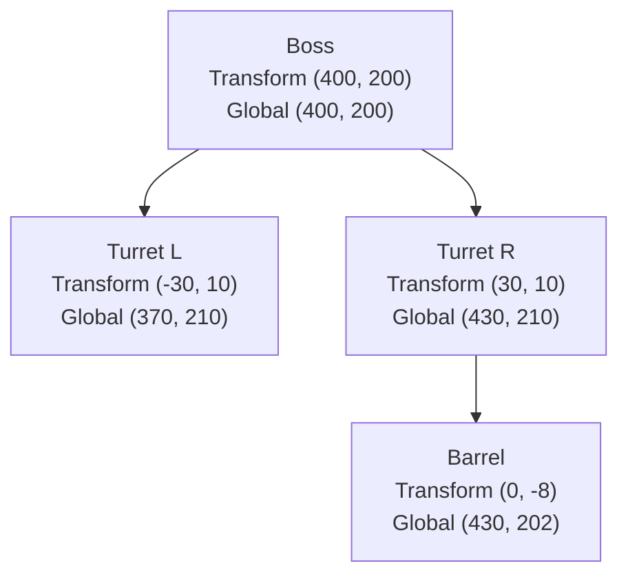

# 17 · Hierarchy (v2)

## What it is

A hierarchy links entities as **parent and children**: the R-Type "Force" pod attached to the player
ship, turrets on a boss, a UI panel and its buttons. A child's position is relative to its parent, and
despawning the parent despawns the children.

## Why we need it

- **R1:** UI, cameras following targets and attached effects all need it.
- **R4:** every generic engine has scene hierarchies.
- R-Type: bosses made of parts, ships with attachments.

## How others do it

| ECS / engine | Hierarchy |
|---|---|
| Bevy | `ChildOf(parent)` and `Children` components (relationships), `GlobalTransform` computed by a propagation system |
| flecs | `(ChildOf, parent)` pairs, a general relationship feature; hierarchy is one case |
| Unity DOTS | `Parent`, `Child` buffer, `LocalTransform` → `LocalToWorld` |
| Unreal | Actor attachment, scene components |
| EnTT | Nothing built in; usually parent/child components |

## Our choice

**Two components and a propagation system**, as Bevy and Unity do. General relationships (flecs pairs)
are left aside: they are powerful but a large feature, and a hierarchy covers the needs we know.

## How it works

### Components

| Component | Fields | Meaning |
|---|---|---|
| `Parent` | `entity: kEntity` | This entity's parent |
| `Children` | fixed array of `kEntity` + count | This entity's children (maintained by the plugin) |
| `Transform` | position, rotation, scale | Relative to the parent (or to the world without a parent) |
| `GlobalTransform` | position, rotation, scale | Absolute; computed, never written by gameplay |

Gameplay only sets `Parent` (through commands); `HierarchyPlugin` keeps `Children` in sync.

### Propagation

A `PostUpdate` system walks from roots (entities without `Parent`) down, computing
`Global = parent.Global × local`. Only subtrees where a `Transform` changed (see
[Change detection](08-change-detection.md)) need to be recomputed.

Rendering and collisions read `GlobalTransform`; gameplay writes `Transform`.

### Despawn

Despawning a parent despawns its children, recursively, in the same command flush. Removing `Parent`
from a child makes it a root, keeping its current global position.

### Over the network

`Parent` is a `kEntity` field, so it replicates through `NetworkId` like any entity reference.
`GlobalTransform` is not replicated: clients recompute it.

## Connections

- Uses: [Components](02-component-registry.md) (`kEntity` fields), [Commands](09-commands.md),
  [Change detection](08-change-detection.md), [Scheduler](13-scheduler.md) (`PostUpdate`).
- Used by: rendering (via `GlobalTransform`), [Prefabs](18-prefabs-and-scenes.md) (prefabs with
  children), [Replication](20-replication.md).

## Pitfalls

- **Cycles.** Setting an entity's parent to one of its descendants is rejected.
- **Deep chains.** Propagation is a tree walk; very deep hierarchies cost more, but R-Type needs two or
  three levels.
- **Writing `GlobalTransform`.** It is overwritten every frame; gameplay must write `Transform`.
- **Children array size.** A fixed array keeps the component reflectable and replicable; entities with
  more children than the limit need a different layout (open question).

## Open questions

- Fixed-capacity `Children` (reflectable, replicable) vs a variable-size list (needs a non-reflected
  component)? (ECS)
- General relationships (flecs-style pairs) in v3, or never? (ECS)
