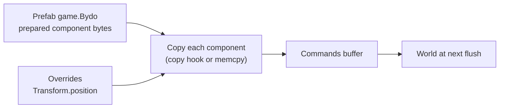

# 18 · Prefabs and Scenes

## What it is

A **prefab** is a named template of an entity: the list of components and values that make up, say, a
`game.Bydo` enemy or a `game.Bullet`. Spawning a prefab creates an entity with all of them at once.

A **scene** is a saved set of entities (with their components), such as a level layout, that can be
loaded into a world.

## Why we need it

- **Convenience (R2):** `spawnPrefab("game.Bydo")` instead of adding five components by hand in every
  system that creates an enemy.
- **R3 (network):** the server can tell a client "spawn `game.Bullet` here" in a few bytes instead of
  sending every component (see the `kSpawnOnly` mode in [Replication](20-replication.md)).
- **R4:** data-driven content: designers define enemy types without touching systems.

## How others do it

| ECS / engine | Templates | Saved sets |
|---|---|---|
| flecs | Prefabs are entities; instances inherit (share) their components via `IsA` | flecs script, JSON |
| Bevy | Bundles (code-only templates); scenes as serialized entity lists | `DynamicScene`, `.scn.ron` files |
| Unity | Prefabs (editor assets), baked to entities in DOTS | Scenes / subscenes |
| Unreal Mass | Entity configs (traits) | Levels |

## Our choice

- **Prefabs (v2):** a named list of `(component name, field values)`, registered from C++ or Luau,
  instantiated by copying values (no inheritance). Simple, and it serializes trivially.
- **Scenes (v3):** files listing entities and their component values by name, read and written with the
  [reflection serializer](15-reflection-and-serialization.md).

## How it works

### Declaring a prefab

```luau
app:prefab("game.Bydo", {
    ["rtype.Transform"] = {},                                       -- defaults
    ["rtype.SpriteRenderer"] = { texture = asset("sprites/bydo.png") },
    ["rtype.Collider"] = { size = vec2(24, 24) },
    ["game.Health"] = { value = 3 },
    ["game.Enemy"] = {},
})
```

```c++
app.prefab("game.Bullet")
    .with(Transform{})
    .with(Velocity{.value = {600.F, 0.F}})
    .with(Bullet{});
```

The prefab is stored as **component bytes per component id**, prepared once at registration with the
field values applied over each component's defaults.

### Spawning

```luau
local enemy = ctx.commands:spawnPrefab("game.Bydo", {
    ["rtype.Transform"] = { position = vec2(820, 140) },   -- overrides
})
```



Spawning goes through [commands](09-commands.md), so it is safe inside systems and returns the reserved
entity at once.

### Prefabs with children

A prefab can list child prefabs with their `Transform` relative to the root (a boss and its turrets).
Spawning creates the whole tree and sets `Parent` on each child (see [Hierarchy](17-hierarchy.md)).

### Over the network

Prefab names are part of the connection **manifest**, mapped to short ids. A spawn message for a
`kSpawnOnly` entity is: prefab id + `NetworkId` + overrides (position, velocity) + spawn tick. The client
spawns the same prefab locally. See [Replication](20-replication.md).

### Scenes (v3)

What a scene holds, for example `level1` (the file format is still open, see below):

| Entity | Prefab | Components (values by field name) |
|---|---|---|
| 1 | — | `rtype.Transform { position = (0, 0) }`, `game.Background { … }` |
| 2 | `game.Bydo` | `rtype.Transform { position = (820, 140) }` (override) |
| … | … | … |

A scene can reference prefabs, so levels stay short. Loading a scene spawns its entities through
commands; saving one walks the world with the serializer.

## Connections

- Uses: [Component registry](02-component-registry.md) (ids, defaults), [Reflection](15-reflection-and-serialization.md),
  [Commands](09-commands.md), [Hooks](16-hooks-and-observers.md) (`copy`), [Hierarchy](17-hierarchy.md).
- Used by: [Luau bridge](19-luau-bridge.md) (`app:prefab`, `spawnPrefab`), [Replication](20-replication.md)
  (spawn by prefab id).

## Pitfalls

- **Prefabs that drift between server and client.** Both load the same Luau plugin, and the manifest
  carries a hash per prefab to catch differences.
- **Editing a prefab after spawning.** Instances are copies; changing the prefab affects only future
  spawns (no inheritance, by design).
- **Server-only data in prefabs.** Components flagged `kServerOnly` are skipped when the client spawns
  the prefab.

## Open questions

- Scene file format: Luau tables (reusing the scripting parser) or a dedicated text/binary format?
  (Team, v3)
