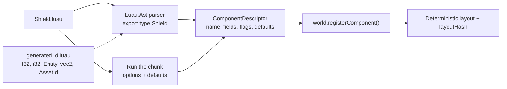

# 19 · Luau Bridge (v2)

## What it is

The bridge is the layer that lets **Luau scripts declare and run game code on the ECS**: components
(as Luau types), systems (as Luau classes), plugins, prefabs, events, resources, input actions and
entities. It sits between Charles's `rtype-luau` runtime and the ECS's type-erased API, in the engine's
`ScriptPlugin` / `LuauPlugin`.

This doc is the **contract** the ECS offers; the binding code itself belongs to the scripting side
(Charles).

## Why we need it

- **R2:** games are written in Luau first. Everything a C++ plugin can register, a Luau plugin must be
  able to register too.
- **R3:** script components must replicate exactly like C++ ones, so they need a real layout, not
  arbitrary Luau tables.

## How others do it

| Engine | Scripting model |
|---|---|
| Bevy | No official scripting; community crates (`bevy_mod_scripting`) expose reflected components to Lua/Rhai |
| flecs | flecs script (its own language) declares components, entities, prefabs; bindings for many languages |
| Unity | C# `MonoBehaviour` (object model), or DOTS `ISystem` in C# |
| Unreal | Blueprint: classes and structs created in the editor, reflected like C++ ones |
| Roblox | Luau scripts on an object tree (not an ECS) |

## Our choice

- **Components = Luau types**, read from the source with the Luau parser, so they get a fixed binary
  layout.
- **Systems = Luau classes** with declared access.
- **Plugins = Luau modules** with a `build(app)` method.
- Everything goes through the ECS's **type-erased, non-throwing API**; errors come back to Luau through
  `rtype::luau::Result` / `Error`.

## How it works

### Components from types

```luau
-- Shield.luau
export type Shield = {
    strength: f32,
    regen: f32,
    owner: Entity,
}

return ecs.component("game.Shield", {
    replicated = true,
    defaults = { strength = 50, regen = 2 },
})
```



- Luau erases types at runtime and has a single `number` type, so the bridge **parses** the file with
  `Luau.Ast` (the parser the compiler already uses, not the full type checker) and maps annotations to
  [`FieldType`s](02-component-registry.md).
- The aliases `f32`, `i32`, `u8`, `Entity`, `vec2`, `AssetId`... are declared in the `.d.luau` file
  produced by Charles's `Runtime::generateTypes()` (`type f32 = number`), so editors accept them.
- **Automatic type linking:** when the file exports exactly one type, or one type whose name matches
  the last part of the component name (`Shield` for `game.Shield`), the bridge links them without a
  `type = "Shield"` option.
- **Fallback** if annotation parsing is not possible: typed defaults (`strength = ecs.f32(50)`).

### Generated declarations for script components

`generateTypes()` is extended to emit declarations for **script-defined** components, resources,
events and prefabs, after loading the plugins:

```luau
-- generated: game.d.luau
declare class ShieldComponent
    strength: number
    regen: number
    owner: Entity
end

type ComponentName = "rtype.Transform" | "rtype.SpriteRenderer" | "game.Shield" | "game.Health"
type PrefabName = "game.Bydo" | "game.Bullet"
```

Editors then autocomplete component fields, and the type checker flags a typo like
`"game.Sheild"` in a query or prefab before the game runs.

### Systems

```luau
local ShieldRegen = ecs.system("game.ShieldRegen", {
    phase = "FixedUpdate",             -- default
    side = "server",                   -- default; see the side rule
    query = { write = { "game.Shield" }, without = { "rtype.Dead" } },
    after = { "rtype.movement" },
})

function ShieldRegen:run(ctx)
    for entity, shield in ctx.query do
        shield.strength = math.min(shield.strength + shield.regen * ctx.time.fixedDelta, 100)
    end
end

return ShieldRegen
```

The bridge turns the declaration into a [dynamic query](07-queries.md) and an access set, and registers
a type-erased system whose body calls `run`. `shield` is a **view** over the component bytes, valid only
during `run`; writing a field stamps the changed tick.

### Plugins

```luau
local RtypePlugin = ecs.plugin("rtype.Game")

function RtypePlugin:build(app)
    app:load("components/Shield.luau")       -- by path: no require() across files
    app:load("systems/ShieldRegen.luau")
    app:addPlugin("scripts/rtype/weapons/plugin.luau")
    app:prefab("game.Bydo", { --[[ ... ]] })
    app:state("game.Phase", { "Menu", "Lobby", "Playing", "GameOver" })
    app:event("game.BossDefeated", { type = "BossDefeated" })
    app:resource("game.Score", { type = "Score", replicated = true })
end

return RtypePlugin
```

Files are loaded **by path** because cross-file `require` is a non-goal of the Luau proposal; it also
gives the bridge every file it must watch for hot reload.

### Input actions from Luau

Gameplay reads `PlayerInput`, which is filled from Ethan's named `InputAction`s. A Luau plugin declares
those actions and their default bindings:

```luau
app:inputAction("move", "vector2", {
    keys = { up = "W", down = "S", left = "A", right = "D" },
    gamepad = "LeftStick",
})
app:inputAction("fire", "button", { key = "Space", gamepad = "South" })
```

The bridge forwards them to `Input::addAction()` / `InputAction::bind...()` on clients, and lists them
in the network manifest so the server knows the layout of `PlayerInput`.

### Rules of the boundary

| Rule | Why |
|---|---|
| Scripts hold `Entity` values, resolved on every access | Pool pointers move (see [Pool](04-pool.md)); matches the proposal's *Handles* |
| Nothing throws into Luau | The type-erased API returns failures; the bridge raises a Luau error with an `ErrorKind` |
| Component views are only valid during `run` | Same reason as handles |
| Writes to read-only terms are refused | Keeps access sets truthful for the scheduler |
| `client` systems may only write `kClientOnly` components | Replication would overwrite anything else |
| Hot reload re-registers a component only if its `layoutHash` is unchanged | Existing data keeps its meaning |

### Where scripts run

Luau plugins load on the **server and the clients** (both need layouts, prefabs and input actions).
System sides decide what runs where: `server` (gameplay, default), `client` (presentation), `both`
(identical simulation such as bullet motion). In standalone mode both sides run in one App.

## Connections

- Uses: [Component registry](02-component-registry.md), [Queries](07-queries.md),
  [Systems](12-systems.md), [Commands](09-commands.md), [Events](11-events.md),
  [Resources](10-resources.md), [Prefabs](18-prefabs-and-scenes.md), [Reflection](15-reflection-and-serialization.md),
  [App and plugins](14-app-and-plugins.md).
- External: Charles's `rtype::luau::Runtime`, `Result`, `Error`, `generateTypes()`; Ethan's `Input` /
  `InputAction`.

## Pitfalls

- **Per-entity overhead.** Each `run` crosses the C++/Luau boundary; iterating thousands of entities in
  Luau every tick (bullets) can be too slow. That is where a C++ game plugin takes over (collisions,
  bullet motion).
- **Table-per-entity temptation.** Storing arbitrary Luau tables on entities would bypass queries,
  replication and the data/logic split; not supported.
- **Layout drift.** Server and client running different script versions are caught by `layoutHash` at
  connection.

## Open questions

- Can the `luau` xmake package expose `Luau.Ast`? If not, use the typed-defaults fallback. (Charles)
- Exact list of aliases emitted by `generateTypes()`. (Charles + ECS)
- Hot reload in development: migrate component data by field name when the layout changes? (ECS)
