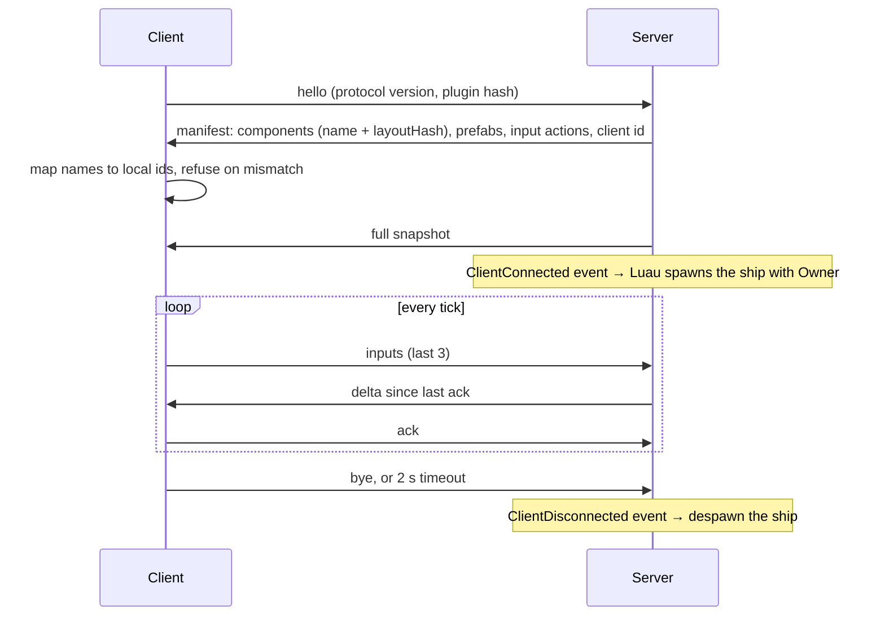

# 20 · Replication (v2)

## What it is

Replication is how the **server's world is mirrored on the clients**. The model is **inputs up, state
down**: clients send their inputs; the authoritative server simulates and sends back what changed.
There is no client-side prediction or rollback.

This doc describes the network plugins for an **R-Type-like game**: one shared screen, a few players
(typically up to 4), and many short-lived bullets and enemies.

## Why we need it

- **R3:** multiplayer with an authoritative server is a core requirement.
- **R2:** script-defined components must replicate with no per-type network code.
- **R4:** the plugins are generic: any game marks components as replicated and reads `PlayerInput`.

## How others do it

| Engine / library | Model |
|---|---|
| Quake 3 | Snapshots delta-compressed against the last acknowledged snapshot, over UDP |
| Unreal | Replicated properties on actors, relevancy, RPCs; Iris (data-oriented, dirty tracking, quantization) |
| bevy_replicon | Server-authoritative component replication for Bevy, change ticks, client entity mapping |
| Overwatch | ECS-based netcode with prediction and rollback (beyond our scope) |

## Our choice

Quake 3-style **deltas from the last acknowledged tick**, driven by the ECS's
[change detection](08-change-detection.md) and [reflection](15-reflection-and-serialization.md), with a
per-component **replication mode** suited to R-Type's bullets.

## How it works

### Three layers

```
┌──────────────────────────────────────────────────────────────┐
│ Game (Luau)          replicated flags, spawn a ship on       │
│                      ClientConnected, read PlayerInput       │
├──────────────────────────────────────────────────────────────┤
│ ECS plugins (C++)    ServerPlugin / ClientPlugin             │
│                      + shared ReplicationPlugin              │
├──────────────────────────────────────────────────────────────┤
│ rtype-network        UDP sockets, packets, acks,             │
│ (no ECS)             reliable channel, connections           │
└──────────────────────────────────────────────────────────────┘
```

`rtype-network` knows nothing about the ECS. Socket I/O runs on a **network thread** and exchanges
messages with the ECS through two thread-safe queues; only the plugins' systems touch the queues, so the
ECS stays single-threaded.

### What lives in the ECS

| Kind | Name | Role |
|---|---|---|
| Component | `NetworkId` | Stable identity of a replicated entity (assigned by the server) |
| Component | `Owner{clientId}` | Which client controls the entity |
| Component | `PlayerInput` | Named action states for one tick |
| Component (client-only) | `Interpolated` | Last two received states, for smooth display |
| Resource (server) | `ServerState` | Clients: address, last acked tick, input buffer |
| Resource (client) | `ClientState` | Connection, latest server tick, `NetworkId → Entity` map, snapshot buffer |
| Event | `ClientConnected` / `ClientDisconnected` | For the game to spawn or remove ships |

### One server tick, one client frame

```
SERVER (headless, FixedUpdate at 60 Hz)
PreUpdate    net.receive       drain queue → input buffers, acks, connect/disconnect events
FixedUpdate  net.applyInputs   input buffer[tick] → PlayerInput on the owner's ship
             ...gameplay...    Luau + C++ systems
PostUpdate   net.assignIds     NetworkId for new replicated entities
             net.snapshot      per client: delta since that client's last acked tick
             net.send          push packets to the network thread

CLIENT (every frame)
PreUpdate    net.receive       apply snapshots: spawn / despawn / write, via NetworkId → Entity
Update       net.interpolate   display state at (latest server tick − ~100 ms)
PostUpdate   net.collectInput  Input actions → PlayerInput
             net.sendInput     send the last 3 inputs (redundancy against loss)
Render       ...draw...
```

**Deltas from the last acknowledged snapshot** make UDP manageable: the server never resends lost
packets, it always sends "what changed since the snapshot you confirmed". A lost packet only makes the
next delta larger.

### Replication modes

R-Type has hundreds of bullets whose motion is predictable. Each component chooses a mode:

| Mode | Sent | Example |
|---|---|---|
| `kEveryChange` | Whenever its change tick is newer than the client's ack | Player ships, health, score, boss state |
| `kSpawnOnly` | Once, at spawn; the client simulates the rest with a `both`-side system | Bullets, enemies on fixed paths |
| `kNone` | Never | Server-only AI state |

A bullet costs about 20 bytes once (prefab id, `NetworkId`, position, velocity, spawn tick) instead of
8 bytes × 60 times per second. The server sends a despawn when it hits something.

Combined with **quantized fields** (positions as fixed-point `i16`, see
[Reflection](15-reflection-and-serialization.md)) and **no interest management** (the whole level is
on one screen, everyone sees everything), traffic stays small.

### Inputs up

`PlayerInput` holds the game's named actions (declared by the Luau plugin with `app:inputAction`, see
[Luau bridge](19-luau-bridge.md)), in manifest order: one bit per button action, a quantized vector per
axis action. Clients send the last three inputs in every packet, so one lost packet costs nothing. The
server keeps a small input buffer per client and applies the input of the current tick (repeating the
last one if it is missing).

### Packet layout (binary)

```
header      [ protocol id u16 | type u8 | tick u32 | ack u32 | ack bits u32 ]
input       [ last 3 × (tick u32, buttons u32, axes i16×2×n) ]                     client → server
snapshot    [ baseTick u32 | spawns[] | despawns[] | updates[] ]                   server → client
  spawn     [ networkId u32 | prefab id u16 | count u8 | (component id u16, fields...)... ]
  update    [ networkId u32 | component id u16 | field mask | fields... ]
```

Component and prefab ids are the short numbers from the **manifest**. Fields are written by the
reflection serializer, so Luau components need no network code.

### Connection



The manifest and the handshake use a small **reliable channel** (resent until acknowledged); snapshots
and inputs use the unreliable one.

### Rooms

The server runs **one world per game room**, plus a lobby world for matchmaking. Each room has its own
`State` (`Lobby → Playing → GameOver`, see [Scheduler](13-scheduler.md)) and its own client list. The
network thread routes packets to the right room by client id.

### What the game writes

```luau
local OnJoin = ecs.system("game.OnJoin", { events = { "net.ClientConnected" } })

function OnJoin:run(ctx)
    for event in ctx.events["net.ClientConnected"] do
        ctx.commands:spawnPrefab("game.Ship", { ["net.Owner"] = { client = event.client } })
    end
end

return OnJoin
```

Plus `replicated = "everyChange"` or `"spawnOnly"` on its components. That is all the networking the
game code sees; the same systems run in standalone mode, where `PlayerInput` comes from local input.

### Build order

1. `rtype-network`: UDP socket on a thread, packet header, acks; test with two processes.
2. Connection + manifest + full snapshot: the client sees the server world.
3. Inputs up: the ship moves on the server and appears on the client.
4. Deltas from the last ack + `kSpawnOnly`: scales to many bullets.
5. Interpolation, quantization, rooms.

## Connections

- Uses: [Change detection](08-change-detection.md), [Reflection](15-reflection-and-serialization.md),
  [Prefabs](18-prefabs-and-scenes.md), [Events](11-events.md), [Resources](10-resources.md),
  [App and plugins](14-app-and-plugins.md) (`ServerPlugin`, `ClientPlugin`, `StandalonePlugin`),
  [Entity](01-entity.md) (`NetworkId` vs `Entity`).
- External: Ethan's `Input` / `InputAction` (source of `PlayerInput`).

## Pitfalls

- **Replicating renderer handles.** `TextureId` and other `Handle<Tag>`s are local slots; replicated
  components use `AssetId`.
- **Client systems writing replicated state.** Overwritten at the next snapshot; the side rule rejects
  it (see [Systems](12-systems.md)).
- **Divergent `kSpawnOnly` simulation.** The client's motion must match the server's (same system,
  `both` side, fixed timestep). Anything less predictable must be `kEveryChange`.
- **Trusting the client.** The server only accepts inputs, never state.

## Open questions

- Transport details: reliability layer design, packet size limit, encryption or not. (Team)
- Tick rate: 60 Hz or 30 Hz? (Team)
- Rooms as separate Apps or one App with several worlds? (ECS + network)
- Does the Epitech subject impose specifics (UDP for gameplay, binary protocol, a protocol RFC
  document)? Check the subject version. (Team)
