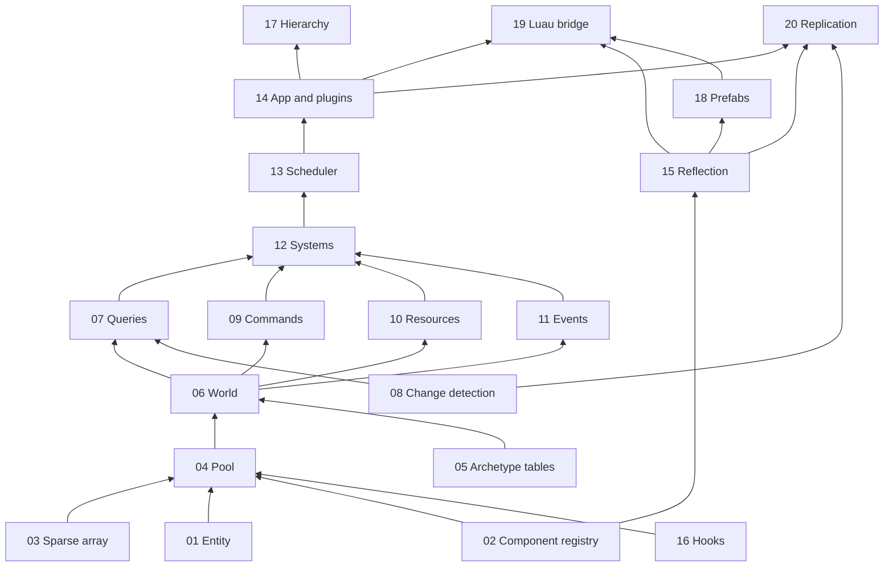

# ECS Feature Docs

These documents zoom in on each feature of the ECS described in [`../design.md`](../design.md). The
design gives the big picture (requirements, choices, how the ECS sits on top of the engine layer);
each feature doc explains one part on its own, so it can be understood, discussed and later
implemented separately.

They are **concept explainers**: what the feature is, why we need it, how other ECSs do it, what we
chose, how it works, and what can go wrong. Snippets are illustrative and omit the Epitech header and
the rule-of-five members; the real code follows `CLAUDE.md`.

The requirements are the ones from the design:

| # | Requirement |
|---|---|
| R1 | Bevy-style engine: the ECS owns the loop, engine features are plugins. |
| R2 | Luau-first games: components, systems, entities and plugins written in Luau. |
| R3 | Multiplayer with an authoritative server: inputs up, state down. |
| R4 | Generic and reusable beyond R-Type. |

## Reading order

| # | Doc | In one line | Version |
|---|---|---|---|
| 01 | [Entity](01-entity.md) | Generational ids and the allocator that recycles them | v1 |
| 02 | [Component registry](02-component-registry.md) | How every component (C++ or Luau) is described, named and laid out | v1 |
| 03 | [Sparse array](03-sparse-array.md) | Paged map from entity index to a position in a pool | v1 |
| 04 | [Pool](04-pool.md) | Packed storage of one component: entities, bytes, ticks | v1 |
| 05 | [Archetype tables](05-archetype-tables.md) | Optional table storage for stable, hot components | v3 |
| 06 | [World](06-world.md) | The container that owns everything; several per process | v1 |
| 07 | [Queries](07-queries.md) | Finding entities by components, typed and dynamic | v1 |
| 08 | [Change detection](08-change-detection.md) | Added/changed ticks and `Mut<T>` | v1 |
| 09 | [Commands](09-commands.md) | Deferred spawn, despawn, add, remove | v1 |
| 10 | [Resources](10-resources.md) | Singletons, including main-thread-only ones | v1 |
| 11 | [Events](11-events.md) | Double-buffered messages between systems | v1 |
| 12 | [Systems](12-systems.md) | Logic, declared access, C++ functions and Luau classes | v1 |
| 13 | [Scheduler](13-scheduler.md) | Phases, ordering, fixed timestep, run conditions, States | v1 / v2 |
| 14 | [App and plugins](14-app-and-plugins.md) | The main loop, plugins, standalone mode | v1 |
| 15 | [Reflection and serialization](15-reflection-and-serialization.md) | Field lists and the one generic serializer | v1 / v2 |
| 16 | [Hooks and observers](16-hooks-and-observers.md) | Lifecycle callbacks: memory only, observers later | v1 / v3 |
| 17 | [Hierarchy](17-hierarchy.md) | Parent/child entities and transform propagation | v2 |
| 18 | [Prefabs and scenes](18-prefabs-and-scenes.md) | Named entity templates and saved sets of entities | v2 / v3 |
| 19 | [Luau bridge](19-luau-bridge.md) | How scripts declare components, systems, plugins and inputs | v2 |
| 20 | [Replication](20-replication.md) | The network plugins for an R-Type-like game | v2 |

## How the features depend on each other

An arrow means "is used by". The bottom of the graph (entity, registry, sparse array, pool) has no
dependency on the rest and can be built and tested first.

## Template

Every doc follows the same outline:

1. **What it is**: the feature in plain words.
2. **Why we need it**: the requirements it serves and the features that depend on it.
3. **How others do it**: EnTT, flecs, Bevy, Unity DOTS, Unreal Mass, where relevant.
4. **Our choice**: the decision and why.
5. **How it works**: diagrams and a few snippets.
6. **Connections**: links to the features it uses and is used by.
7. **Pitfalls**: what goes wrong and how the design avoids it.
8. **Open questions**: only the ones specific to the feature.
